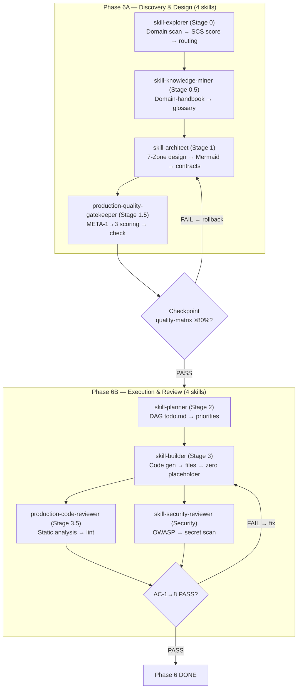

# Scope Document — Phase 6: 8 Main Pipeline Skills (6A + 6B)

**Date**: 2026-07-11
**Status**: Initial
**Skill**: context-before-fix v1.0.0
**Input Sources**:
- `Temps/spec/roadmaps/06-skill-build-main-pipeline.md` (678 dòng)
- `Temps/spec/architects/` (P1, P3, P4, P6, P7, shared — 20+ files)
- `docs/plans/plan-checklist.2026-07-07.md` (1193 dòng)
- `docs/context-to-work/phase-5-remaining-scope/scope.2026-07-11.md` (541 dòng)
- `docs/context-to-work/phase-5-audit/phase5-ba-pipeline-test-report.2026-07-11.md` (178 dòng)
- Filesystem audit: 3 explore subagents quét song song skills/ver-3/, .claude/skills/, .claude/agents/, .skill-context/

---

## §1: Problem Summary

Phase 6 (Rebuild 8 Main Pipeline Skills) là giai đoạn lớn nhất trong lộ trình 8-phase — phải build 8 skills từ Stage 0 đến Stage 3.5 + Security, chạy theo 8-Stage Pipeline.

**Trạng thái thực tế**: Directory scaffolding của cả 8 skills đều tồn tại ở cả `skills/ver-3/` và `.claude/skills/`, **nhưng toàn bộ đều là vỏ rỗng (empty shells)**:
- SKILL.md = 0 bytes (trống hoàn toàn)
- Mọi subdirectory (knowledge/, templates/, scripts/, loop/, data/, assets/) chỉ chứa `.gitkeep`
- `data/drc.yaml` KHÔNG tồn tại ở bất kỳ skill nào
- Tổng cộng: 8 skills × 7 files/skill = 56 files cần được tạo từ đầu

Trong khi đó:
- **Shared infrastructure** (schemas, validators, templates, fixtures) tại `skills/ver-3/_shared/` ĐÃ HOÀN CHỈNH — 14 schemas, 3 validators, 28 fixtures
- **Pipeline agents** (pipeline-orchestrator, design-validator, quality-scorer, ...) ĐÃ DEPLOY — 9 agents
- **Pipeline wiring** trong skills-registry.json ĐÃ ĐỊNH NGHĨA — stage sequence, I/O contracts

---

## §2: Entry Point

| Field | Value |
|:------|:------|
| **Primary spec** | `Temps/spec/roadmaps/06-skill-build-main-pipeline.md` (678 dòng) |
| **Architect specs** | `Temps/spec/architects/P1-scs-router-and-gatekeeper/` (5 files) |
| | `Temps/spec/architects/P6-deconstructor-and-miner/` (5 files) |
| | `Temps/spec/architects/P3-drift-detector-and-plan-gate/` (5 files) |
| | `Temps/spec/architects/P4-orchestrator-and-assembler/` (7 files) |
| | `Temps/spec/architects/P7-delta-planning-and-builder/` (5 files) |
| | `Temps/spec/architects/shared/` (4 files) |
| **Dependency status** | Phase 5 (BA Pipeline) ≈ 80% DONE — còn 4 P0 items trước khi formal DONE |
| | Phase 3 (Agents) — DONE — 9 agents deployed |
| | Phase 4 (Schemas) — DONE — 14 schemas + validators |
| **Lifecycle tracking** | `docs/plans/plan-checklist.2026-07-07.md` §11-12 |

---

## §3: Scope Definition

### 3.1 Problem Area

```yaml
phase_6_scope:
  description: "Build 8 main pipeline skills từ Stage 0 → Stage 3.5 + Security"
  sub_splits:
    - 6A: Discovery & Design cluster (4 skills: explorer, miner, architect, gatekeeper)
    - 6B: Execution & Review cluster (4 skills: planner, builder, reviewer, security)
  checkpoint: "quality-matrix.yaml aggregate ≥80% trước 6B"
  estimated_total_files: 56+ (8 skills × 7 file types)
```

### 3.2 Boundary

```yaml
in_scope:
  - 8 skills build — directory scaffolding đã có, cần populate content
  - SKILL.md frontmatter + body (≤700 tokens) per skill
  - knowledge/ — domain-specific reference docs per skill
  - templates/ — output artifact templates per skill
  - scripts/ — executable helper scripts per skill
  - loop/ — self-verification checklists per skill
  - data/drc.yaml — DRC contract per skill
  - assets/.gitkeep — giữ nguyên (không cần content)
  - AC-1→8 verification sau khi build (subset + full)
  - Deploy từ skills/ver-3/ → .claude/skills/
  - Checkpoint 6A→6B tại aggregate quality gate

out_of_scope:
  - Phase 7 skills (sandbox-tester, indexer) — kế tiếp
  - Phase 8 hardening — kế tiếp
  - BA pipeline skills (Phase 5) — đã build
  - Shared infrastructure (_shared/) — đã complete
  - Agent definitions (Phase 3) — đã deploy
  - Hook framework (Phase 2) — đã deploy
```

---

## §4: Current Status Baseline (Verified)

### 4.1 Phase 6 Skills — Filesystem Audit

Tất cả 8 skills đều ở trạng thái **SCAFFOLDED** (vỏ rỗng):

| # | Skill | Stage | SKILL.md | knowledge/ | templates/ | scripts/ | loop/ | data/drc.yaml | Status |
|:-:|-------|-------|----------|-----------|-----------|---------|------|-------------|--------|
| 1 | `skill-explorer` | 0 | 0 bytes | `.gitkeep` only | `.gitkeep` | `.gitkeep` | `.gitkeep` | **MISSING** | SCAFFOLDED |
| 2 | `skill-knowledge-miner` | 0.5 | 0 bytes | `.gitkeep` | `.gitkeep` | `.gitkeep` | `.gitkeep` | **MISSING** | SCAFFOLDED |
| 3 | `skill-architect` | 1 | 0 bytes | `.gitkeep` | `.gitkeep` | `.gitkeep` | `.gitkeep` | **MISSING** | SCAFFOLDED |
| 4 | `production-quality-gatekeeper` | 1.5 | 0 bytes | `.gitkeep` | `.gitkeep` | `.gitkeep` | `.gitkeep` | **MISSING** | SCAFFOLDED |
| 5 | `skill-planner` | 2 | 0 bytes | `.gitkeep` | `.gitkeep` | `.gitkeep` | `.gitkeep` | **MISSING** | SCAFFOLDED |
| 6 | `skill-builder` | 3 | 0 bytes | `.gitkeep` | `.gitkeep` | `.gitkeep` | `.gitkeep` | **MISSING** | SCAFFOLDED |
| 7 | `production-code-reviewer` | 3.5 | 0 bytes | `.gitkeep` | `.gitkeep` | `.gitkeep` | `.gitkeep` | **MISSING** | SCAFFOLDED |
| 8 | `skill-security-reviewer` | Sec | 0 bytes | `.gitkeep` | `.gitkeep` | `.gitkeep` | `.gitkeep` | **MISSING** | SCAFFOLDED |

### 4.2 What EXISTS (không cần build)

| Component | Status | Chi tiết |
|-----------|--------|----------|
| `skills/ver-3/_shared/schemas/` | ✅ COMPLETE | 14 full schemas (exploration, criteria, design, quality-matrix, todo, build-log, review-report, audit-metrics, verification, security-review, elicitation, analysis, synthesis, domain-handbook) |
| `skills/ver-3/_shared/validators/` | ✅ COMPLETE | `schema_validator.py` (173 dòng), `artifact_lifecycle.py` (201 dòng) |
| `skills/ver-3/_shared/scripts/` | ✅ COMPLETE | `drc_resolver.py` (202 dòng), `run_tests.sh` |
| `skills/ver-3/_shared/templates/` | ✅ COMPLETE | `drc_contract_template.yaml` (36 dòng), `skill_readme_template.md`, `skill_skeleton.md` (51 dòng) |
| `skills/ver-3/_shared/fixtures/` | ✅ COMPLETE | 28 fixtures (14 valid + 14 broken pairs) |
| `skills/ver-3/_shared/artifact_registry.yaml` | ✅ COMPLETE | 18 artifacts (thiếu 4 BA entries pending Phase 5) |
| `.claude/agents/pipeline-orchestrator.md` | ✅ DONE | 273 dòng — 9-stage dispatcher |
| `.claude/agents/external-code-reviewer.md` | ✅ DONE | 281 dòng — Γ-1 fix |
| `.claude/agents/quality-scorer.md` | ✅ DONE | 233 dòng — META scoring (NEEDS_FIX: 2 edits) |
| `.claude/agents/design-validator.md` | ✅ DONE | 199 dòng — schema validation |
| `.claude/agents/drift-detector.md` | ✅ DONE | 209 dòng — drift detection |
| `.claude/agents/ba-pipeline-runner.md` | ✅ DONE | 285 dòng — BA chain runner |
| `.claude/agents/branch-orchestrator.md` | ✅ DONE | 246 dòng — Branch B |
| `.claude/agents/subagent-forge.md` | ✅ DONE | 295 dòng — agent forge |
| `.claude/agents/user-knowledge-ingestor.md` | ✅ DONE | Knowledge ingestion |
| `skills-registry.json` | ✅ CONFIGURED | Cả 8 skills registered với stage, I/O contracts, pipeline DAG |
| `.agent/skills/skills-registry.json` | ✅ CONFIGURED | Chi tiết zone mapping per skill |

### 4.3 Phase 5 Prerequisite Status

Phase 5 hiện tại **≈ 80% DONE** — formally `in_progress`, còn 4 P0 items:

| Item | Status | Blocking Phase 6? |
|:-----|:------:|:-----------------:|
| BA skills deployed (ba-elicitor, analyst, synthesizer) | ✅ DONE | Không (business-analysis.md đã được sản xuất) |
| ba-pipeline-runner E2E clean test (AC-9) | ⚠️ PENDING — bugs đã fix, cần invoke | Không (quan trọng nhưng không block) |
| quality-scorer audit ≥70% (AC-8) | ⏸️ MANUAL — cần invoke | Không (skill functions without audit) |
| 4 BA entries trong artifact_registry.yaml | ❌ PENDING | Medium — Phase 6 AC sẽ fail nếu registry incomplete |
| Clean up stale artifacts | 🟡 PENDING | Low — 2 bug reports stale, orphan dir |

**Đánh giá**: Phase 6 **CÓ THỂ bắt đầu** vì:
- BA skills deployed và functional — business-analysis.md đã được tạo (quality_score 92% cho upvote-board)
- 4 P0 items là closing work, không phải foundational gaps
- Phase 6A có thể chạy trong khi Phase 5 final tasks được hoàn thành parallel

---

## §5: Impact Analysis

### 5.1 Direct Impact — Phạm vi Phase 6

#### 6A: Discovery & Design Cluster (4 skills)

| Skill | Stage | Core Role | Files Needed | Key Specs |
|-------|-------|-----------|:-----------:|-----------|
| **skill-explorer** | 0 | Domain exploration, SCS scoring, routing decision | **7 files**: SKILL.md, knowledge/scs_reference_table.yaml, templates/exploration_template.md, templates/criteria_template.md, loop/scs_audit_checklist.md, scripts/compute_scs.py, data/drc.yaml | Hysteresis check (Γ-3), SCS 1.0-5.0, re-eval cap=1, Branch A/B routing |
| **skill-knowledge-miner** | 0.5 | Domain knowledge mining, domain-handbook.md | **7 files**: SKILL.md, knowledge/ docs, templates/, loop/, scripts/mine_for_terms.py, scripts/find_antipatterns.py, data/drc.yaml | ≥10 glossary terms, ≥3 anti-patterns, ≥1 exemplar |
| **skill-architect** | 1 | 7-Zone design, data contracts, state machine | **7 files**: SKILL.md, knowledge/, templates/, loop/, scripts/, data/drc.yaml | 7-Zone mapping, ≥1 Mermaid diagram, ≥5 must_not/phase |
| **production-quality-gatekeeper** | 1.5 | META-1→3 scoring, quality gates, external validator | **7 files**: SKILL.md, knowledge/, templates/, loop/, scripts/, data/drc.yaml | 16 criteria × 0-100, aggregate ≥85%, external validator invoke |

**6A Total**: **28 files** (4 skills × 7 files)

#### 6B: Execution & Review Cluster (4 skills)

| Skill | Stage | Core Role | Files Needed | Key Specs |
|-------|-------|-----------|:-----------:|-----------|
| **skill-planner** | 2 | DAG task decomposition, todo.md | **7 files**: SKILL.md, knowledge/, templates/, loop/, scripts/, data/drc.yaml | DAG structure, PRIORITY assigned, PLAN-1→5, < 1200 tokens |
| **skill-builder** | 3 | Code generation, file writing, build-log | **7 files**: SKILL.md, knowledge/, templates/, loop/, scripts/, data/drc.yaml | Zero placeholder, 7-Zone populated, build-log sha256 |
| **production-code-reviewer** | 3.5 | Static analysis, placeholder check, external review | **7 files**: SKILL.md, knowledge/, templates/, loop/, scripts/, data/drc.yaml | Lint, cyclomatic complexity, placeholder_density=0 |
| **skill-security-reviewer** | Sec | OWASP top 10, secret scan, unsafe patterns | **7 files**: SKILL.md, knowledge/, templates/, loop/, scripts/, data/drc.yaml | A01-A10, secret regex, unsafe patterns detection |

**6B Total**: **28 files** (4 skills × 7 files)

#### Điểm Checkpoint 6A → 6B

```
┌─────────────────────────────────────────────────────────────┐
│ CHECKPOINT: quality-matrix.yaml aggregate score ≥ 80%       │
│                                                             │
│ PASS → Advance to Phase 6B (planner → builder → review)    │
│ FAIL → Rollback 6A, revise designs → re-run gatekeeper     │
│                                                             │
│ Verification: aggregate-quality-gatekeeper hoặc             │
│ quality-scorer agent evaluate 4 quality-matrix.yaml files   │
└─────────────────────────────────────────────────────────────┘
```

### 5.2 Indirect Impact

| Component | Affected By | Mức độ |
|-----------|-------------|:------:|
| Phase 7 (sandbox-tester, indexer) | Phase 6 output là input cho sandbox | **Blocking** — chờ 6A+6B xong |
| Phase 8 (integration hardening) | Phase 6 skills cần được tích hợp | **Blocking** — chờ 6A+6B xong |
| `skills-registry.json` status | Cần update lifecycle → `installed` | Medium |
| `.skill-context/_state.yaml` | Cần ghi nhận Phase 6 completion | Medium |
| `pipeline-orchestrator` agent | Phase 6 skills là execution targets | **Direct** — orchestrator gọi các skills này |
| `quality-scorer` agent | NEEDS_FIX (2 edits) trước khi dùng cho checkpoint | **Direct** — cần fix cho AC-8 |
| `external-code-reviewer` agent | Phase 6 code-reviewer sẽ invoke nó | Medium |
| BA pipeline artifacts | Phase 6 explorer consuming business-analysis.md | Medium |

---

## §6: Call Chain (Pipeline Flow)



---

## §7: Data Flow

### 7.1 Input (Phase 5 → Phase 6)

```
Phase 5 Output (BA Pipeline)          → Phase 6 Consumer
━━━━━━━━━━━━━━━━━━━━━━━━━━━           ━━━━━━━━━━━━━━━━━
business-analysis.md                   → skill-explorer (Stage 0)
criteria.md (BA-derived)               → skill-explorer (Stage 0)
thought-cache.yaml                     → skill-architect (Stage 1)
elicitation-report.md                  → skill-knowledge-miner (Stage 0.5)
```

### 7.2 Inter-Skill Artifact Flow (Phase 6 Internal)

```
Skill Output                          → Consumer
━━━━━━━━━━━━━━━━━━                    ━━━━━━━━━━━━━
skill-explorer → exploration.md       → skill-knowledge-miner, skill-architect
skill-explorer → criteria.md          → skill-planner, production-code-reviewer
skill-knowledge-miner → domain-handbook.md → skill-architect
skill-architect → design.md           → production-quality-gatekeeper, skill-planner
production-quality-gatekeeper → quality-matrix.yaml → skill-planner, CHECKPOINT
skill-planner → todo.md               → skill-builder
skill-builder → build-log.md          → production-code-reviewer, skill-security-reviewer
production-code-reviewer → review-report.md + audit-metrics.yaml → deployment
skill-security-reviewer → security-review-report.md → deployment
```

### 7.3 Dependencies

```yaml
runtime_dependencies:
  - Phase 5: business-analysis.md phải có real content
  - Phase 3: pipeline-orchestrator agent
  - Phase 4: schemas + validators + DRC resolver
  - Shared: skill_skeleton.md template

build_time_dependencies:
  - _shared/schemas/*.yaml — artifact validation
  - _shared/validators/schema_validator.py — mechanical verification
  - _shared/scripts/drc_resolver.py — contract validation
  - _shared/templates/skill_skeleton.md — SKILL.md template
  - _shared/templates/drc_contract_template.yaml — DRC template
```

---

## §8: Affected Components

### 8.1 Files (cần tạo)

**skills/ver-3/ — Source cho 8 skills (56 files):**

| Skill | SKILL.md | knowledge/ | templates/ | scripts/ | loop/ | data/drc.yaml |
|-------|:--------:|:---------:|:---------:|:-------:|:----:|:------------:|
| skill-explorer | ✅ 1 | 1+ | 2 | 1 | 1 | 1 |
| skill-knowledge-miner | ✅ 1 | 1+ | 1+ | 2 | 1 | 1 |
| skill-architect | ✅ 1 | 1+ | 1+ | 1+ | 1 | 1 |
| production-quality-gatekeeper | ✅ 1 | 1+ | 1+ | 1+ | 1 | 1 |
| skill-planner | ✅ 1 | 1+ | 1+ | 1+ | 1 | 1 |
| skill-builder | ✅ 1 | 1+ | 1+ | 1+ | 1 | 1 |
| production-code-reviewer | ✅ 1 | 1+ | 1+ | 1+ | 1 | 1 |
| skill-security-reviewer | ✅ 1 | 1+ | 1+ | 1+ | 1 | 1 |

**Total minimum**: **56 files** (có thể nhiều hơn nếu knowledge/ và templates/ có multiple files)

**.claude/skills/ — Deploy target:** Tương tự 56 files sau khi sync

### 8.2 Files (cần sửa)

| File | What to change | Why |
|:-----|:--------------|:----|
| `.claude/agents/quality-scorer.md` | Fix hook format `hook:`→`hooks:` + `{skill}`→`[^/]+` | NEEDS_FIX eval blocker |
| `skills-registry.json` | Update lifecycle → `installed` cho 8 skills | Sau deploy |

### 8.3 Functions/Components

| Component | Tác động |
|-----------|----------|
| `pipeline-orchestrator` agent | Gọi các skills này trong pipeline — cần verify invocation |
| `schemas` (14) | Đã có, Phase 6 artifacts sẽ được validate |
| `schema_validator.py` | Validate mọi artifact output từ Phase 6 |
| `drc_resolver.py` | Verify DRC contracts cho Phase 6 skills |
| `quality-scorer` agent | Cần fix 2 edits trước khi dùng cho checkpoint 6A→6B |

---

## §9: Skill-by-Skill Content Requirements (chi tiết)

### 9.1 skill-explorer — Stage 0

**Spec reference**: Phase 6 roadmap L63-161, architects P1/scs-routing.md

**Key requirements**:
- Frontmatter: `name: skill-explorer`, `stage: "Stage 0"`, `target_variable: target_skill`
- Workflow phases: domain_scan → complexity_assessment → hysteresis_check → routing_decision → criteria_gene → emit
- Hysteresis zone [2.7, 3.3], re-eval cap = 1 (eval v1 patch)
- SCS factors: feature_count, integration_points, state_storage, branching_depth, security_surface
- Branch A (SCS < 3.0): Fast Track; Branch B (SCS ≥ 3.0): Full OMSP
- Output: exploration.md + criteria.md

**Files needed**:
1. `SKILL.md` — frontmatter + 6 workflow phases + acceptance criteria + failure modes
2. `knowledge/scs_reference_table.yaml` — SCS calculation factors with weights
3. `templates/exploration_template.md`
4. `templates/criteria_template.md`
5. `loop/scs_audit_checklist.md`
6. `scripts/compute_scs.py` — Python helper cho SCS computation
7. `data/drc.yaml` — per template

### 9.2 skill-knowledge-miner — Stage 0.5

**Spec reference**: Phase 6 roadmap L163-207, architects P6/miner-analyzer.md

**Key requirements**:
- Frontmatter: `stage: "Stage 0.5"`, `output_contract: ".skill-context/{target_skill}/drc-skill-knowledge-miner.yaml"`
- Workflow: scan_workspace → extract_terms → extract_antipatterns → extract_exemplars → emit
- Glossary ≥ 10 terms, anti-patterns ≥ 3, exemplars ≥ 1
- Input: exploration.md + business-analysis.md (if available)

**Files needed**:
1. `SKILL.md`
2. `knowledge/` (mining patterns, source scanning strategies)
3. `templates/` (domain-handbook template)
4. `loop/` (quality checklist)
5. `scripts/mine_for_terms.py`
6. `scripts/find_antipatterns.py`
7. `data/drc.yaml`

### 9.3 skill-architect — Stage 1

**Spec reference**: Phase 6 roadmap L209-252, architects P1/scs-routing.md, P7/delta-planning.md

**Key requirements**:
- Frontmatter: `stage: "Stage 1"`, `output_contract: ".skill-context/{target_skill}/drc-skill-architect.yaml"`
- 7-Zone mapping table → concrete file structure
- Data contracts: input_schema + output_schema per zone transition
- Mermaid state machine: initial → invoked → completed → escalated
- Must_not rules ≥ 5 per phase (META-2.1 S1)
- Reverse questions ≥ 4 per aspect (META-2.2 S2)

**Files needed**:
1. `SKILL.md`
2. `knowledge/` (7-zone patterns, data contract standards)
3. `templates/` (design.md template with 7-zone layout)
4. `loop/` (design quality checklist)
5. `scripts/` (zone validation helpers)
6. `data/drc.yaml`

### 9.4 production-quality-gatekeeper — Stage 1.5

**Spec reference**: Phase 6 roadmap L256-305, architects P1/spec-gatekeeper.md, P1/meta-criteria.md

**Key requirements**:
- Frontmatter: `stage: "Stage 1.5"`, `output_contract: ".skill-context/{target_skill}/drc-gatekeeper.yaml"`
- META-1.1 domain anchor, META-1.2 phase deconstruction
- META-2.1 4 signals AND gate (S1 must_not≥5, S2 reverse Q, S3 multi-stakeholder, S4 constraint anchoring)
- META-3.1 mechanical pass/fail, META-3.2 negative space, META-3.3 sandbox
- Aggregate score < 85% OR any signal FAIL → feedback to architect (F3)
- External validator invoke (Γ-1 fix)

**Files needed**:
1. `SKILL.md`
2. `knowledge/` (META criteria reference, scoring rubrics)
3. `templates/` (quality-matrix.yaml, evaluation-report.md, feedback.yaml templates)
4. `loop/` (gate evaluation checklist)
5. `scripts/` (score aggregation, feedback generation)
6. `data/drc.yaml`

### 9.5 skill-planner — Stage 2

**Spec reference**: Phase 6 roadmap L309-359, architects P3/plan-quality-gate.md, P7/delta-planning.md

**Key requirements**:
- Frontmatter: `stage: "Stage 2"`, `output_contract: ".skill-context/{target_skill}/drc-skill-planner.yaml"`
- DAG structure decomposition (not flat list)
- Task IDs, description, back-link to design.md zone
- Tasks PRIORITY ≥ HIGH: must_not rules
- PLAN-1→5 quality gate
- Token count < 1200 (PLAN-2.0)

**Files needed**:
1. `SKILL.md`
2. `knowledge/` (DAG patterns, task decomposition strategies)
3. `templates/` (todo.md template)
4. `loop/` (plan quality checklist)
5. `scripts/` (DAG verification, token count)
6. `data/drc.yaml`

### 9.6 skill-builder — Stage 3

**Spec reference**: Phase 6 roadmap L364-419, architects P4/orchestrator-agent-spec.md, P7/in-place-builder.md

**Key requirements**:
- Frontmatter: `stage: "Stage 3"`, `output_contract: ".skill-context/{target_skill}/drc-skill-builder.yaml"`
- Zero placeholder rule (BUILD-2.1)
- All 7 zones populated (≥ .gitkeep if unused)
- Build-log.md with sha256 hash per artifact
- Self-audit via production-code-reviewer
- SKILL.md ≤ 700 tokens

**Files needed**:
1. `SKILL.md`
2. `knowledge/` (build patterns, zone population standards)
3. `templates/` (build-log.md template)
4. `loop/` (build verification checklist)
5. `scripts/` (placeholder scanner, sha256 hasher)
6. `data/drc.yaml`

### 9.7 production-code-reviewer — Stage 3.5

**Spec reference**: Phase 6 roadmap L423-466, architects P7/shared

**Key requirements**:
- Frontmatter: `stage: "Stage 3.5"`, `output_contract: ".skill-context/{target_skill}/drc-code-reviewer.yaml"`
- Static lint: pyflakes (Python), eslint (JS), bash -n (shell)
- Cyclomatic complexity check (radon/heuristic)
- Placeholder scan: (TODO|FIXME|mock|pass #) — zero tolerance
- External validator invoke (Γ-1 fix)
- audit-metrics.yaml: files_reviewed, errors_critical, errors_minor, placeholder_density, complexity_avg

**Files needed**:
1. `SKILL.md`
2. `knowledge/` (review standards, complexity thresholds)
3. `templates/` (review-report.md, audit-metrics.yaml templates)
4. `loop/` (review checklist)
5. `scripts/` (static analysis runners, complexity calculator)
6. `data/drc.yaml`

### 9.8 skill-security-reviewer — Cross-cutting

**Spec reference**: Phase 6 roadmap L470-512

**Key requirements**:
- Frontmatter: `stage: "Security Stage"`, `output_contract: ".skill-context/{target_skill}/drc-security-reviewer.yaml"`
- OWASP top 10: A01 Access Control, A02 Crypto, A03 Injection, A04 Design, A05 Misconfig, A06 Components, A07 Auth, A08 Integrity, A09 Logging, A10 SSRF
- Secret scan: API keys, JWTs, AWS creds regex
- Unsafe patterns: Python eval/exec/system, JS eval/Function, bash sudo/eval

**Files needed**:
1. `SKILL.md`
2. `knowledge/` (OWASP reference, unsafe patterns guide)
3. `templates/` (security-review-report.md template)
4. `loop/` (security checklist)
5. `scripts/` (OWASP scanner, secret detector)
6. `data/drc.yaml`

---

## §10: Verification Checklist (AC cho Phase 6)

### AC-6A (sau 6A) — 4 Discovery Skills

| AC | Check | Method |
|:---|:------|:--------|
| AC-6A-1 | 4 skills deploy: explorer, miner, architect, gatekeeper | `test -f` each SKILL.md |
| AC-6A-2 | Frontmatter valid + 700-token limit | body < 3500 chars |
| AC-6A-3 | ≥4 of 7 Zones populate per skill | Zone directory scan |
| AC-6A-4 | DRC valid per skill | `python3 drc_resolver.py` |
| AC-6A-5 | SCS hysteresis flag present | grep "hysteresis_triggered" trong exploration.md |
| AC-6A-6 | re_eval_count ≤ 1 enforced | grep audit |
| **AC-6A-CP** | **Checkpoint: quality-matrix aggregate ≥80%** | **quality-scorer invoke** |

### AC-6B (sau 6B) — 4 Execution Skills

| AC | Check | Method |
|:---|:------|:--------|
| AC-6B-1 | 4 skills deploy: planner, builder, reviewer, security | `test -f` each SKILL.md |
| AC-6B-2 | Frontmatter valid + 700-token limit | body < 3500 chars |
| AC-6B-3 | ≥4 of 7 Zones populate per skill | Zone directory scan |
| AC-6B-4 | DRC valid per skill | `python3 drc_resolver.py` |

### AC-Full (6A + 6B combined)

| AC | Check | Method |
|:---|:------|:--------|
| AC-1 | 8 skills deployed | `test -f` all 8 SKILL.md |
| AC-2 | Frontmatter valid + 700-token | Script scan all 8 |
| AC-3 | ≥4/7 Zones populate | Script scan all 8 |
| AC-4 | DRC valid | `drc_resolver.py --all` |
| AC-5 | E2E pipeline test với mock "mock-prompt-cleaner" | 13 artifacts exist |
| AC-6 | Schema validator pass | `schema_validator.py --all` |
| AC-7 | External validator invoked | grep audit log |
| AC-8 | Pipeline runner works 8 stages | Sequential invoke |

---

## §11: Evidence

```xml
<evidence>
  <file>skills/ver-3/roadmaps/06-skill-build-main-pipeline.md</file>
  <line>1-678</line>
  <finding>Full spec: 8 skills, sub-split 6A/6B, checkpoint ≥80%, build order explorer→security-reviewer</finding>
</evidence>

<evidence>
  <file>skills/ver-3/skill-explorer/SKILL.md</file>
  <line>0</line>
  <finding>EMPTY — 0 bytes, cần build từ đầu</finding>
</evidence>

<evidence>
  <file>skills/ver-3/skill-explorer/data/</file>
  <line>0</line>
  <finding>Chỉ .gitkeep — data/drc.yaml MISSING</finding>
</evidence>

<evidence>
  <file>skills/ver-3/skill-explorer/knowledge/</file>
  <line>0</line>
  <finding>Chỉ .gitkeep — knowledge/ EMPTY</finding>
</evidence>

<evidence>
  <file>skills/ver-3/skill-explorer/templates/</file>
  <line>0</line>
  <finding>Chỉ .gitkeep — templates/ EMPTY</finding>
</evidence>

<evidence>
  <file>skills/ver-3/skill-explorer/scripts/</file>
  <line>0</line>
  <finding>Chỉ .gitkeep — scripts/ EMPTY</finding>
</evidence>

<!-- Pattern tương tự cho 7 skills còn lại — all SCAFFOLDED -->

<evidence>
  <file>skills-registry.json</file>
  <finding>8 skills registered với stage sequence + I/O contracts — pipeline wiring DONE</finding>
</evidence>

<evidence>
  <file>.claude/agents/pipeline-orchestrator.md</file>
  <line>1-273</line>
  <finding>Pipeline orchestrator agent deployed — có thể dispatch 8 stages</finding>
</evidence>

<evidence>
  <file>skills/ver-3/_shared/schemas/</file>
  <finding>14 full schemas — infrastructure DONE</finding>
</evidence>

<evidence>
  <file>docs/context-to-work/phase-5-remaining-scope/scope.2026-07-11.md</file>
  <line>1-541</line>
  <finding>Phase 5 ≈80% DONE — còn 4 P0 items, không block Phase 6 start</finding>
</evidence>

<evidence>
  <file>docs/plans/plan-checklist.2026-07-07.md</file>
  <line>623-754</line>
  <finding>Phase 6A/B checklist với tasks, ACs, DoD — pending 0%</finding>
</evidence>

<evidence>
  <file>Temps/spec/architects/P1-scs-router-and-gatekeeper/scs-routing.md</file>
  <line>1-36</line>
  <finding>SCS routing: 1.0-2.9 → Branch A, 3.0-5.0 → Branch B</finding>
</evidence>

<evidence>
  <file>Temps/spec/architects/P1-scs-router-and-gatekeeper/meta-criteria.md</file>
  <line>1-34</line>
  <finding>META-1→3 criteria: structural integrity, semantic depth (4 signals AND), mechanical quality</finding>
</evidence>
```

---

## §12: Confidence Assessment

```yaml
overall_confidence: 90%

breakdown:
  filesystem_audit_accuracy: 98%
    # 3 explore agents quét song song, cross-verified
  spec_understanding: 95%
    # Phase 6 roadmap (678 dòng) + architects (20+ files) đã đọc đầy đủ
  dependency_accuracy: 90%
    # Phase 5 status đã verify kỹ, còn 4 P0 items nhỏ
  effort_estimation: 85%
    # 56 files minimum — actual có thể nhiều hơn do multi-file zones
  skill_content_definition: 88%
    # Spec có D6-x-x IDs nhưng một số chi tiết cần đọc supplement architect files

uncertainty_flags:
  - "data/drc.yaml content — cần theo dõi drc_contract_template.yaml format mới nhất"
  - "quality-scorer fix (2 edits) cần verify trước checkpoint 6A→6B"
  - "AC-5 (E2E mock test) cần pipeline-orchestrator agent connected — verify sau build"
  - "Script content: compute_scs.py, mine_for_terms.py, etc chưa có spec implementation detail"
```

---

## §13: Open Questions

| # | Question | Priority | Phase | Status |
|---|----------|----------|-------|--------|
| 1 | quality-scorer fix (hook format, regex literal) — làm trước hay trong Phase 6? | Medium | 6A | Open — khuyến nghị fix trước checkpoint |
| 2 | AC-5 mock skill "mock-prompt-cleaner" spec ở roadmap — dùng template có sẵn? | Medium | Full | Open |
| 3 | Có cần update `_state.yaml` Phase 5 completion mark trước Phase 6 start? | Low | 5→6 | Open — khuyến nghị không cần |
| 4 | Phase 6 checkpoint ≥80% — quality-scorer agent đã đủ, hay cần thêm design-validator? | Medium | 6A | Open — quality-scorer alone sufficient per evidence |
| 5 | Deploy script cho 8 skills: manual cp hay script? | Low | Full | Open — manual cp acceptable |
| 6 | skills-registry.json update lifecycle → `installed` sau deploy — có automation? | Low | Full | Open |

---

## §14: Summary — Phạm vi Triển Khai

### Phase 6A: Discovery & Design (4 skills) — Sequence khuyến nghị

```
Build order: skill-explorer → skill-knowledge-miner → skill-architect → production-quality-gatekeeper

Per skill pattern (×4):
  1. Author SKILL.md (frontmatter + workflow body) [~200-350 tokens]
  2. Author knowledge/ files [1-2 docs per skill]
  3. Author templates/ [1-2 artifact templates per skill]
  4. Author scripts/ [1-2 executable helpers per skill]
  5. Author loop/ [self-verification checklist per skill]
  6. Author data/drc.yaml [per DRC template]
  7. Run local validator (script or schema check)
  8. Deploy skills/ver-3/ → .claude/skills/
  9. Run AC-6A-1→6

Checkpoint: quality-matrix.yaml aggregate ≥ 80%
```

### Phase 6B: Execution & Review (4 skills) — Sequence khuyến nghị

```
Build order: skill-planner → skill-builder → production-code-reviewer → skill-security-reviewer

Per skill pattern (×4):
  (Giống Phase 6A pattern)
```

### Tổng công sức ước tính

| Sub-phase | Skills | Files | Công sức (sessions) |
|:----------|:------:|:----:|:-------------------:|
| 6A | 4 | 28 | 4-6 |
| 6B | 4 | 28 | 3-5 |
| Checkpoint + AC verify | — | — | 1 |
| Quality-scorer pre-fix | — | 1 file | 0.5 |
| **Total Phase 6** | **8** | **56+** | **8-12 sessions** |

---

**Document Status**: Context Complete — No Code Changes Made
**NO CODE CHANGES MADE** — Document only per context-before-fix skill guardrails

```text
✓ Problem Analysis Complete
✓ All 8 skills status verified (SCAFFOLDED — 0 bytes each)
✓ Phase 5 dependency assessed (≈80% DONE, not blocking)
✓ Per-skill content requirements mapped
✓ AC checkpoints defined (6A-subset, 6B-subset, Full)
✓ Evidence traced to specific files
✓ Confidence assessment: 90%
✓ Open questions documented
```

---

**Document**: `docs/context-to-work/phase-6-main-pipeline-skills/scope.2026-07-11.md`
**Generated by**: context-before-fix v1.0.0
**Language**: Vietnamese
**Date**: 2026-07-11
