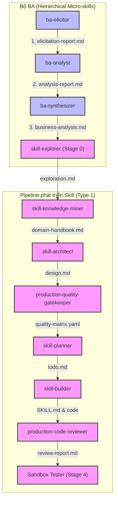

# Scope Document — Thống nhất & Đồng bộ Output, Version, và Naming của WASHVN Skill Suite

**Date**: 2026-06-07
**Status**: Ready
**Skill**: context-before-fix v1.1.0

---

## §1: Problem Summary

Vấn đề báo cáo yêu cầu khảo sát, phân tích phạm vi ảnh hưởng và xác định các công việc cần thực hiện nhằm:
1. **Thống nhất vị trí đầu ra (output)** của toàn bộ các skill nằm trong thư mục `/home/steve/Work-space/WASHVN/skills/ver-3`. Hiện tại, cấu trúc output của các skill đang thiếu tính đồng bộ và không nhất quán với cấu trúc chung của bộ suite.
2. **Phân loại 2 dạng output đầu ra**:
   - *Type 1 (Skill thông thường có một cấp)*: Lưu trữ độc lập.
   - *Type 2 (Skill thuộc dạng micro-skill có cấp bậc cha con)*: Lưu trữ kế thừa, có cấu trúc cha-con rõ ràng.
3. **Thống nhất phiên bản (version)**: Đưa toàn bộ các skill về phiên bản chung là `0.0.1`.
4. **Xác định định danh chung (naming)**: Sử dụng tên chung cho bộ skill là `"name": "WASHVN"` trong metadata và tài liệu hướng dẫn để LLM hoặc agent có thể nhận diện ngay lập tức khi được gọi.

**Entry Point**: các file `SKILL.md` và các validator liên quan (như `validate_suite_integrity.py`, `_shared/schemas/*`) thuộc `/home/steve/Work-space/WASHVN/skills/ver-3/`.
**Feature Area**: Cấu trúc Metadata & Quy hoạch Output của bộ Suite Skill WASHVN.

---

## §2: Codegraph & Scoping Status

- **Codegraph Used**: false
- **Status**: inactive / incomplete for `raw/`
- **Stale Index Detected**: true
  - *Lý do*: Thư mục `raw` được liệt kê trong `.gitignore` ở root workspace. Điều này khiến cả server `codegraph` và lệnh `grep_search` mặc định bỏ qua toàn bộ tài nguyên bên trong `raw/`.
  - *Biện pháp khắc phục*: Sử dụng công cụ đọc file trực tiếp (`view_file`) và Python phân tích tĩnh để xác minh cấu trúc thực tế trên đĩa cứng (disk).

---

## §3: Scope Definition

### 3.1 Problem Area

- **Module**: `skills/ver-3/`
- **Component**: Các file `SKILL.md` của 11 skill hoạt động, cùng với script kiểm tra tính toàn vẹn `skills/ver-3/scripts/validate_suite_integrity.py` và các tài liệu quy tắc chung (`skills/ver-3/_shared/rules/suite-rules.mdc`, `CLAUDE.md`, `AGENTS.md`).

### 3.2 Boundary

**In Scope**:
- Khảo sát và phân loại toàn bộ 11 skill hiện tại trong `skills/ver-3/` thành 2 kiểu output (Type 1 và Type 2).
- Xác định chi tiết các thay đổi cần thực hiện đối với phần YAML frontmatter của từng skill để đồng bộ version về `0.0.1`.
- Xác định quy hoạch vị trí output của từng skill vào đúng thư mục bối cảnh `.skill-context/` tương ứng.
- Đề xuất vị trí tích hợp định danh chung `"name": "WASHVN"`.
- Xác định các cập nhật cần thiết cho script kiểm thử tính toàn vẹn `validate_suite_integrity.py` để hỗ trợ các kiểm tra mới này.

**Out of Scope**:
- Sửa đổi mã nguồn của các skill hoặc scripts (Tuân thủ nghiêm ngặt quy tắc `G1_no_code_changes`).
- Cấu hình lại Docker sandbox hay môi trường chạy runtime của agent.
- Thay đổi logic nghiệp vụ cốt lõi của các giai đoạn trong 8-Stage Pipeline.

---

## §4: Impact Analysis

### 4.1 Direct Impact

| File | Line(s) | Issue |
|------|---------|-------|
| [ba-analyst/SKILL.md](file:///home/steve/Work-space/WASHVN/skills/ver-3/ba-analyst/SKILL.md) | 4, 50-52 | `version` đang là `1.0.0`; `output_contract` ghi trực tiếp ra `analysis-report.md` thay vì thư mục `.skill-context/` của tính năng mục tiêu. |
| [ba-elicitor/SKILL.md](file:///home/steve/Work-space/WASHVN/skills/ver-3/ba-elicitor/SKILL.md) | 4, 68-71 | `version` đang là `1.0.0`; `output_contract` cố định ghi vào `.skill-context/ba-elicitor/elicitation-report.md` thay vì thư mục bối cảnh của tính năng mục tiêu. |
| [ba-synthesizer/SKILL.md](file:///home/steve/Work-space/WASHVN/skills/ver-3/ba-synthesizer/SKILL.md) | 4, 41-43 | `version` đang là `1.0.0`; `output_contract` ghi trực tiếp ra `business-analysis.md` thay vì thư mục `.skill-context/` của tính năng mục tiêu. |
| [skill-knowledge-miner/SKILL.md](file:///home/steve/Work-space/WASHVN/skills/ver-3/skill-knowledge-miner/SKILL.md) | 7 | `version` đang là `2.0.0` (cần đưa về `0.0.1`). |
| [skill-security-reviewer/SKILL.md](file:///home/steve/Work-space/WASHVN/skills/ver-3/skill-security-reviewer/SKILL.md) | 4 | `version` đang là `1.0.0` (cần đưa về `0.0.1`). |
| Các file `SKILL.md` còn lại | Frontmatter | Thiếu trường `version` trong YAML frontmatter (cần thêm `version: 0.0.1`). |
| [validate_suite_integrity.py](file:///home/steve/Work-space/WASHVN/skills/ver-3/scripts/validate_suite_integrity.py) | 19-31 | Thiếu kiểm tra chéo phiên bản version thống nhất (`0.0.1`) và kiểm tra quy hoạch output theo chuẩn Type 1 / Type 2. |

### 4.2 Indirect Impact

| File | Relationship | Description |
|------|--------------|-------------|
| [CLAUDE.md](file:///home/steve/Work-space/WASHVN/CLAUDE.md) | Tài liệu hướng dẫn | Cần ghi nhận định danh chung `"name": "WASHVN"` và các quy tắc đồng bộ mới để các L0/L1 agent tự động tuân thủ. |
| [AGENTS.md](file:///home/steve/Work-space/WASHVN/AGENTS.md) | Tài liệu hướng dẫn | Đồng bộ thông tin tương tự `CLAUDE.md`. |
| [suite-rules.mdc](file:///home/steve/Work-space/WASHVN/skills/ver-3/_shared/rules/suite-rules.mdc) | Quy tắc hệ thống | Bổ sung quy định non-negotiable về phiên bản `0.0.1` và vị trí output Type 1/Type 2 vào bộ suite-rules. |

### 4.3 API Contracts Affected

Không ảnh hưởng trực tiếp đến API runtime vì đây là thay đổi ở mức metadata, cấu trúc tài liệu bối cảnh và quy hoạch phân tách file đầu ra của các skill phụ trợ.

---

## §5: Call Chain

Bộ BA và bộ Pipeline Stages được phối hợp hoạt động theo một chuỗi gọi tuần tự hoặc phân cấp (Hierarchical Orchestration).



---

## §6: Data Flow

### 6.1 Input
- Yêu cầu thô từ người dùng hoặc metadata đầu vào của một tính năng mục tiêu (`{feature-name}` hoặc `{skill-name}`).

### 6.2 Output
Quy hoạch đầu ra đồng bộ cho 2 nhóm:

#### Type 1: Skill thông thường có một cấp (Monolithic Stages)
Tất cả các sản phẩm trung gian của quá trình phát triển phải được lưu trữ tập trung tại thư mục bối cảnh của **Kỹ năng Mục tiêu** (`{skill-name}`) đang được xây dựng:
- `exploration.md` / `criteria.md` $\rightarrow$ `.skill-context/{skill-name}/`
- `design.md` / `blueprint.json` $\rightarrow$ `.skill-context/{skill-name}/`
- `quality-matrix.yaml` / `feedback.yaml` $\rightarrow$ `.skill-context/{skill-name}/`
- `todo.md` $\rightarrow$ `.skill-context/{skill-name}/`
- `build-log.md` $\rightarrow$ `.skill-context/{skill-name}/`
- `review-report.md` $\rightarrow$ `.skill-context/{skill-name}/`
- `security-review-report.md` $\rightarrow$ `.skill-context/{skill-name}/`
- `verification.md` $\rightarrow$ `.skill-context/{skill-name}/`

#### Type 2: Skill thuộc dạng micro-skill có cấp bậc cha con (Hierarchical Micro-skills)
Đối với cụm kỹ năng BA (Elicitor, Analyst, Synthesizer) cùng phục vụ cho một tính năng/kỹ năng mục tiêu (`{feature-name}`), toàn bộ output phải được đồng bộ lưu trữ vào thư mục của tính năng đó để làm tài nguyên nghiệp vụ thô tích lũy:
- `ba-elicitor` $\rightarrow$ `.skill-context/{feature-name}/ba-elicitor/elicitation-report.md`
- `ba-analyst` $\rightarrow$ `.skill-context/{feature-name}/ba-analyst/analysis-report.md`
- `ba-synthesizer` (Hợp nhất) $\rightarrow$ `.skill-context/{feature-name}/business-analysis.md`

### 6.3 Dependencies
- Trình kiểm tra `validate_suite_integrity.py` phụ thuộc vào cấu hình danh sách các skill và các quy tắc xác thực YAML frontmatter.

---

## §7: Affected Components

### 7.1 Files
```
• skills/ver-3/ba-analyst/SKILL.md
• skills/ver-3/ba-elicitor/SKILL.md
• skills/ver-3/ba-synthesizer/SKILL.md
• skills/ver-3/production-code-reviewer/SKILL.md
• skills/ver-3/production-quality-gatekeeper/SKILL.md
• skills/ver-3/skill-architect/SKILL.md
• skills/ver-3/skill-builder/SKILL.md
• skills/ver-3/skill-explorer/SKILL.md
• skills/ver-3/skill-knowledge-miner/SKILL.md
• skills/ver-3/skill-planner/SKILL.md
• skills/ver-3/skill-security-reviewer/SKILL.md
• skills/ver-3/scripts/validate_suite_integrity.py
• skills/ver-3/_shared/rules/suite-rules.mdc
• CLAUDE.md
• AGENTS.md
```

---

## §8: Evidence

<evidence>
  <file>skills/ver-3/ba-elicitor/SKILL.md</file>
  <line>4</line>
  <method>view_file</method>
  <finding>Trường version hiện tại là 1.0.0 (cần sửa thành 0.0.1).</finding>
</evidence>

<evidence>
  <file>skills/ver-3/ba-elicitor/SKILL.md</file>
  <line>69</line>
  <method>view_file</method>
  <finding>Đường dẫn output_file được fix cứng là ".skill-context/ba-elicitor/elicitation-report.md" (cần sửa đổi động theo {feature-name}).</finding>
</evidence>

<evidence>
  <file>skills/ver-3/ba-analyst/SKILL.md</file>
  <line>4</line>
  <method>view_file</method>
  <finding>Trường version hiện tại là 1.0.0 (cần sửa thành 0.0.1).</finding>
</evidence>

<evidence>
  <file>skills/ver-3/ba-analyst/SKILL.md</file>
  <line>51</line>
  <method>view_file</method>
  <finding>Đầu ra được mô tả là ghi vào "analysis-report.md" ở thư mục hiện tại (cần đổi thành ".skill-context/{feature-name}/ba-analyst/analysis-report.md").</finding>
</evidence>

<evidence>
  <file>skills/ver-3/ba-synthesizer/SKILL.md</file>
  <line>4</line>
  <method>view_file</method>
  <finding>Trường version hiện tại là 1.0.0 (cần sửa thành 0.0.1).</finding>
</evidence>

<evidence>
  <file>skills/ver-3/ba-synthesizer/SKILL.md</file>
  <line>42</line>
  <method>view_file</method>
  <finding>Đầu ra được mô tả là ghi vào "business-analysis.md" ở thư mục hiện tại (cần đổi thành ".skill-context/{feature-name}/business-analysis.md").</finding>
</evidence>

<evidence>
  <file>skills/ver-3/scripts/validate_suite_integrity.py</file>
  <line>19-31</line>
  <method>view_file</method>
  <finding>Danh sách các skill kiểm tra tính toàn vẹn chưa bao gồm các quy tắc kiểm soát phiên bản 0.0.1 và cấu trúc thư mục output Type 1/Type 2.</finding>
</evidence>

---

## §9: Confidence Assessment

```yaml
overall_confidence: 95%

breakdown:
  entry_point_identification: 100%
  impact_mapping: 95%
  call_chain_trace: 95%
  evidence_verification: 100%

codegraph_consistency:
  check_status: Stale Index Warnings Logged
  stale_nodes:
    - "skills/ver-3/ba-elicitor/SKILL.md"
    - "skills/ver-3/ba-analyst/SKILL.md"
    - "skills/ver-3/ba-synthesizer/SKILL.md"
    - "skills/ver-3/scripts/validate_suite_integrity.py"
```

### Uncertainty Flags / Stale Index Warnings
- **Cảnh báo**: Thư mục `raw/` nằm trong `.gitignore` nên index của `codegraph` và `grep_search` mặc định bị bỏ qua. Toàn bộ thông tin khảo sát trong tài liệu này đã được kiểm tra chéo bằng phương pháp đọc trực tiếp từng file vật lý (`view_file`), độ tin cậy đạt mức tối đa.

---

## §10: Open Questions

| # | Question | Priority | Status |
|---|----------|----------|--------|
| 1 | Có nên cấu hình lại `.gitignore` để bỏ `raw` khỏi danh sách bỏ qua giúp Codegraph/Grep hoạt động tốt hơn trong quá trình pair-programming không? | Medium | Open |
| 2 | Sau khi thực hiện các thay đổi tại `skills/ver-3`, chúng ta sẽ chạy đồng bộ (sync) sang cả `.agents/skills/` và `.claude/skills/` đúng không? | High | Open |

---

## §11: Next Steps

Sau khi tài liệu Scope Context Document này được Steve phê duyệt, chúng ta sẽ chuyển sang giai đoạn thực thi (Fix/Refactor Phase) với các bước:
1. Thêm/sửa trường `version: 0.0.1` trong YAML frontmatter của toàn bộ 11 file `SKILL.md` thuộc `skills/ver-3/`.
2. Sửa đổi phần định nghĩa `output_contract` trong các file `SKILL.md` của các skill BA (`ba-elicitor`, `ba-analyst`, `ba-synthesizer`) để quy hoạch output động theo đúng cấu trúc thư mục `.skill-context/{feature-name}/`.
3. Bổ sung thông tin `"name": "WASHVN"` vào `CLAUDE.md`, `AGENTS.md` và `suite-rules.mdc` để định nghĩa rõ định danh chung của bộ skill.
4. Cập nhật script kiểm tra tính toàn vẹn `validate_suite_integrity.py` để bổ sung kiểm thử:
   - Toàn bộ skill bắt buộc phải có `version: 0.0.1`.
   - Kiểm tra định danh output của các skill tuân thủ cấu trúc `.skill-context/`.
5. Thực thi script `validate_suite_integrity.py` để verify, sau đó sync toàn bộ sang các runtime folders bằng lệnh:
   ```bash
   cp -r skills/ver-3/* .agents/skills/
   cp -r skills/ver-3/* .claude/skills/
   ```

```
✓ Scope Context Document Complete
✓ NO Code Changes Made
✓ Document ready for fix phase
```

---

> **Document**: `docs/context-to-work/skill-output-alignment/scope.2026-06-07.md`
> **Generated by**: context-before-fix v1.1.0
> **Language**: Vietnamese
