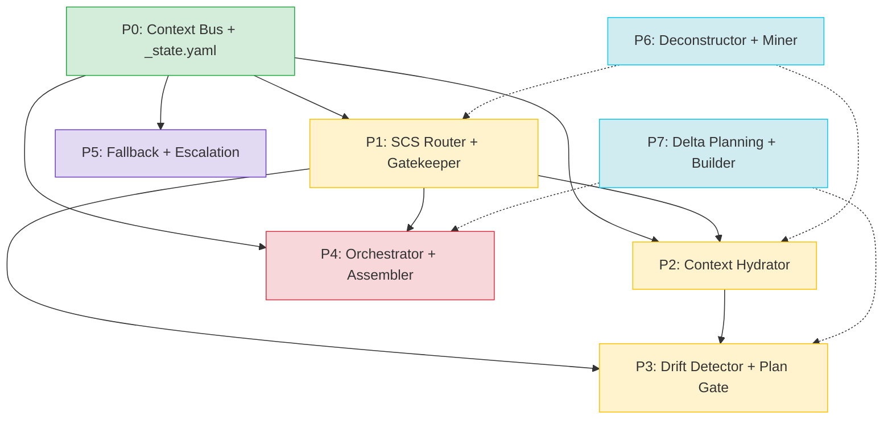

# Scope Document — Phân tách Tài liệu Thiết kế thành Spec triển khai theo Phase

**Date**: 2026-06-29
**Status**: Initial

---

## §1: Problem Summary

Kho tài liệu thiết kế kiến trúc hệ thống Build-Workflow hiện tại gồm **5 file** với tổng dung lượng **~1,764 dòng**, tổ chức theo **component** (architecture-design.md làm hub, 4 file spec tách biệt). Cấu trúc này không tối ưu cho triển khai theo phase vì:

- **Mỗi phase triển khai (P0-P7) phải đọc nhiều file**: VD: P0 (Context Bus + `_state.yaml`) cần architecture-design.md §7, §9 + protocols-and-state-spec.md §7, §9 + quality-gates-matrix.md (YAML-RES-1.0)
- **Không có ranh giới phase rõ ràng**: Kiến trúc sư / dev implement phải tự filter context phù hợp với từng giai đoạn
- **Overlap nội dung**: `_state.yaml` protocol xuất hiện ở cả architecture-design.md và protocols-and-state-spec.md với các góc nhìn khác nhau
- **Cross-cutting components khó cô lập**: YAML Resilience Layer, Fallback matrix ảnh hưởng nhiều phase nhưng nằm rải rác

**Mục tiêu**: Phân tách bộ tài liệu hiện tại thành **các spec riêng cho từng phase triển khai (P0-P7)**, mỗi phase có một tài liệu self-contained, tập trung, đủ context để implement mà không cần đọc tài liệu khác.

---

## §2: Entry Point

**Entry**: `/home/stveve/Documents/workspace/build-workflow/WASHVN/Temps/clean/` — thư mục chứa 5 tài liệu thiết kế gốc.

### Danh sách tài liệu đầu vào

| STT | File | Dòng | Mô tả |
|:---|:---|:---|:---|
| 1 | `architecture-design.md` | 1,041 | Hub kiến trúc — 5 Layer, 8 Stage, 2 Branch, Deployment Priority |
| 2 | `orchestrator-agent-spec.md` | 107 | Đặc tả Micro-Skill Orchestrator subagent |
| 3 | `protocols-and-state-spec.md` | 515 | Context Bus schema, Fallback matrix (F1-F19), `_state.yaml` protocol, YAML Resilience Layer |
| 4 | `quality-gates-matrix.md` | 44 | Ma trận Quality Gates theo từng Stage |
| 5 | `skill-migration-spec.md` | 57 | Dual-Mode pipeline (CREATE/UPDATE/REBUILD), Deconstructor Adapters |

**Tổng cộng**: ~1,764 dòng tài liệu kỹ thuật.

---

## §3: Scope Definition

### 3.1 Problem Area

Phân tích cấu trúc hiện tại, xác định các **cross-cutting concerns** và **overlap** giữa các tài liệu để thiết kế cấu trúc spec phase mới.

### 3.2 Boundary

**Trong scope**:
- Toàn bộ 5 tài liệu trong `/home/stveve/Documents/workspace/build-workflow/WASHVN/Temps/clean/`
- Các artifact mapping: Context Bus, `_state.yaml`, SCS, Hydrator, Drift Detector, Orchestrator, YAML Resilience, Fallback matrix, Quality Gates, Dual-Mode
- Thứ tự ưu tiên triển khai P0→P7 từ architecture-design.md § "Tóm tắt Triển khai"

**Ngoài scope**:
- Codebase hiện tại (WASHVN skills) — không phân tích code
- `supplements/` directory (phase-compression-spec, depth-gate-criteria, sampling-audit-spec)
- Implementation detail của từng skill stage

### 3.3 Target Output Structure

```
/home/stveve/Documents/workspace/build-workflow/WASHVN/Temps/spec/architects/
├── README.md                          # Bản đồ tổng thể: nav, dependency graph
├── P0-context-bus-and-state.yaml.md   # Context Bus + _state.yaml protocol
├── P1-scs-router-and-gatekeeper.md    # SCS Router + Spec Gatekeeper
├── P2-context-hydrator.md             # Context Hydrator
├── P3-drift-detector-and-plan-gate.md # Drift Detector + Plan Quality Gate
├── P4-orchestrator-and-assembler.md   # Micro-Skill Orchestrator + Integration Assembler
├── P5-fallback-and-escalation.md      # Fallback matrix + Escalation protocol
├── P6-deconstructor-and-miner.md      # Deconstructor Adapters + Miner Analyzer
├── P7-delta-planning-and-builder.md   # Delta Planning + In-place Builder
└── shared/
    ├── quality-gates-reference.md     # Quality gates matrix (reference cho mọi phase)
    ├── glossary.md                    # Thuật ngữ chung
    └── architecture-overview.md       # 5-Layer overview (context nền)
```

---

## §4: Impact Analysis

### 4.1 Direct Impact — Tài liệu bị phân tách trực tiếp

| File gốc | Số phase bị ảnh hưởng | Lý do |
|:---|:---|:---|
| **architecture-design.md** (1,041 dòng) | 7/8 phase (P0-P7) | Là hub chứa thông tin của mọi component |
| **protocols-and-state-spec.md** (515 dòng) | 5/8 phase (P0, P1, P2, P3, P5) | Context Bus, Fallback, YAML Resilience |
| **orchestrator-agent-spec.md** (107 dòng) | 1 phase (P4) | Chỉ liên quan Orchestrator |
| **quality-gates-matrix.md** (44 dòng) | 8/8 phase (cross-cutting) | Reference cho mọi stage gate |
| **skill-migration-spec.md** (57 dòng) | 2 phase (P6, P7) | Deconstructor + Delta Planning |

### 4.2 Indirect Impact — Tài liệu tham chiếu bị ảnh hưởng

| Tài liệu tham chiếu | Phase liên quan | Ghi chú |
|:---|:---|:---|
| `supplements/phase-compression-spec.md` | P0, P1, P2, P3 | Phase Compression Mode cho Branch A |
| `supplements/depth-gate-criteria.md` | P1 | META-2.1 Semantic Depth Gate v2.0 |
| `supplements/sampling-audit-spec.md` | P3 | Sampling Audit Layer |
| `build-stage-standards.md` | P4, P7 | Builder 5-Phase standards |

### 4.3 Cross-cutting Concerns cần xử lý

| Concern | Xuất hiện ở | Xử lý trong spec phase |
|:---|:---|:---|
| **YAML Resilience Layer** | protocols-and-state-spec.md §11, quality-gates-matrix.md | **Tách thành shared utility spec** — reference từ P0, P2, P3 |
| **Fallback / Rollback** | protocols-and-state-spec.md §8, architecture-design.md §8, state diagram | **P5 chuyên trách** + reference mapping ở các phase khác |
| **Quality Gates** | quality-gates-matrix.md, architecture-design.md §12 | **Shared reference doc** — mọi phase đều tham chiếu |
| **Phase Compression Mode** | architecture-design.md (nhiều note), protocols-and-state-spec.md §8 | **Ghi chú trong mỗi phase spec** + link supplements |
| **SCS Scoring** | architecture-design.md §Stage 0.5, protocols-and-state-spec.md | **P1 chuyên trách** + input cho mọi phase sau |
| **`_state.yaml` protocol** | protocols-and-state-spec.md §9, architecture-design.md §9 | **P0 nền tảng** — các phase sau mở rộng |
| **Dual-Mode (CREATE/UPDATE/REBUILD)** | skill-migration-spec.md, architecture-design.md §13.6 | **P6, P7 chuyên trách** |

---

## §5: Call Chain & Dependency Graph

### 5.1 Dependency giữa các Phase



### 5.2 Material gốc → Phase mapping chi tiết

| Phase | Nội dung | Material gốc | % từ material gốc |
|:---|:---|:---|:---|
| **P0** | Context Bus schema, Bus Rules (R1-R8), `_state.yaml` protocol, Artifact Registry | architecture-design.md §7, §9; protocols-and-state-spec.md §7, §9 | ~30% |
| **P1** | SCS Router, Domain Anchoring, Spec Gatekeeper, META-criteria, Re-validation rule | architecture-design.md S0.5, S1.5; protocols-and-state-spec.md F4; quality-gates-matrix.md (META gates) | ~15% |
| **P2** | Context Hydrator, Dual Context Ingestion, `thought-cache.yaml` check, Hydrated Context schema | architecture-design.md §4.A, S1.7; protocols-and-state-spec.md R7, R8, F5, F6, F18 | ~12% |
| **P3** | Drift Detector, Plan Quality Gate, Semantic Sampling Audit, Contract Alignment | architecture-design.md S2.5; protocols-and-state-spec.md F7-F9, F8-EXT; quality-gates-matrix.md (DRIFT, SAUDIT) | ~15% |
| **P4** | Orchestrator spec, SSP Protocol, Integration Assembler, Parallel Builders, DAG execution | orchestrator-agent-spec.md (full); architecture-design.md S3a, S3b, S3c, §5.2 | ~10% |
| **P5** | Full Fallback matrix (F1-F19), Escalation protocol, 3-iteration rule, Collapsed mapping PC-1→PC-4 | protocols-and-state-spec.md §8 (full); architecture-design.md State Diagram | ~8% |
| **P6** | Deconstructor Adapters (Internal/External), Miner Analyzer, Dual-Mode CREATE/UPDATE/REBUILD | skill-migration-spec.md (full); architecture-design.md §13.6, §14 | ~5% |
| **P7** | Delta Planning, In-place Builder, Token Budget Soft Gate, Refactor Trigger REV-3.0 | skill-migration-spec.md §13.7; architecture-design.md §13.7 | ~5% |

### 5.3 Cross-cutting shared components

| Component | Phục vụ phase | Content |
|:---|:---|:---|
| **Quality Gates Reference** | Tất cả (P0-P7) | Bảng QG theo stage từ quality-gates-matrix.md |
| **Architecture Overview** | Tất cả (P0-P7) | Sơ đồ 5-Layer + 2-Branch (L0-L4) |
| **Glossary** | Tất cả (P0-P7) | Thuật ngữ chuyên ngành pipeline |
| **YAML Resilience Layer** | P0, P2, P3, P5 | Pre-check pipeline, Auto-repair protocol, Graceful Degradation |

---

## §6: Data Flow

### 6.1 Input

- **5 file design spec** tại `/home/stveve/Documents/workspace/build-workflow/WASHVN/Temps/clean/`
- **Supplements** tham chiếu (phase-compression-spec, depth-gate-criteria, sampling-audit-spec)
- **Implementation priority** từ architecture-design.md Tóm tắt Triển khai

### 6.2 Output

- **1 thư mục target**: `/home/stveve/Documents/workspace/build-workflow/WASHVN/Temps/spec/architects/`
- **1 file README.md**: navigation map
- **8 file spec phase** (P0-P7)
- **1 thư mục shared/** với 3 file reference

### 6.3 Dependencies

- Không phụ thuộc codebase WASHVN
- Chỉ phụ thuộc nội dung 5 file design spec
- Phase dependency: P0 → P1 → P2 → P3 → P4 (core chain) + P5 (độc lập một phần) + P6 → P7 (extension chain)

---

## §7: Affected Components

### 7.1 Files bị ảnh hưởng (bị thay thế/superseded)

| File gốc | Trạng thái sau khi tách |
|:---|:---|
| `Temps/clean/architecture-design.md` | Superseded — nội dung phân tán vào 8 phase spec |
| `Temps/clean/orchestrator-agent-spec.md` | Superseded — nội dung chuyển vào P4 |
| `Temps/clean/protocols-and-state-spec.md` | Superseded — nội dung chuyển vào P0, P1, P2, P3, P5 |
| `Temps/clean/quality-gates-matrix.md` | Demoted → shared/quality-gates-reference.md |
| `Temps/clean/skill-migration-spec.md` | Superseded — nội dung chuyển vào P6, P7 |

### 7.2 Files được tạo mới

```
Temps/spec/architects/
├── README.md
├── P0-context-bus-and-state.yaml.md
├── P1-scs-router-and-gatekeeper.md
├── P2-context-hydrator.md
├── P3-drift-detector-and-plan-gate.md
├── P4-orchestrator-and-assembler.md
├── P5-fallback-and-escalation.md
├── P6-deconstructor-and-miner.md
├── P7-delta-planning-and-builder.md
└── shared/
    ├── quality-gates-reference.md
    ├── glossary.md
    └── architecture-overview.md
```

### 7.3 External references cần maintain

- Link đến `supplements/phase-compression-spec.md` (P0-P3)
- Link đến `supplements/depth-gate-criteria.md` (P1)
- Link đến `supplements/sampling-audit-spec.md` (P3)
- Link đến `build-stage-standards.md` (P4, P7)

---

## §8: Evidence

<evidence>
  <file>Temps/clean/architecture-design.md</file>
  <line>1004-1016</line>
  <finding>Thứ tự ưu tiên triển khai P0-P7 định nghĩa rõ ràng, là xương sống cho cấu trúc spec phase mới</finding>
</evidence>

<evidence>
  <file>Temps/clean/architecture-design.md</file>
  <line>30-36</line>
  <finding>5 Layer định nghĩa với trách nhiệm riêng — cần có overview shared doc</finding>
</evidence>

<evidence>
  <file>Temps/clean/architecture-design.md</file>
  <line>393-401</line>
  <finding>Meta-criteria META-1.1 → META-3.3 — cần chuyển vào P1 (Spec Gatekeeper)</finding>
</evidence>

<evidence>
  <file>Temps/clean/architecture-design.md</file>
  <line>409-441</line>
  <finding>Context Hydrator (Stage 1.7) + thought-cache.yaml kiểm tra — nội dung chính cho P2</finding>
</evidence>

<evidence>
  <file>Temps/clean/architecture-design.md</file>
  <line>464-496</line>
  <finding>Drift Detector + Plan Quality Gate + Semantic Sampling Audit — nội dung chính cho P3</finding>
</evidence>

<evidence>
  <file>Temps/clean/protocols-and-state-spec.md</file>
  <line>19-92</line>
  <finding>Context Bus schema đầy đủ — P0 payload chính (~70 dòng)</finding>
</evidence>

<evidence>
  <file>Temps/clean/protocols-and-state-spec.md</file>
  <line>110-212</line>
  <finding>Fallback matrix F1-F19 + Branch A collapsed mapping PC-1→PC-4 — nội dung chính cho P5 (~100 dòng)</finding>
</evidence>

<evidence>
  <file>Temps/clean/protocols-and-state-spec.md</file>
  <line>228-360</line>
  <finding>`_state.yaml` protocol + Sampling Audit tracking + Phase Compression tracking — P0 + P3 + P5</finding>
</evidence>

<evidence>
  <file>Temps/clean/protocols-and-state-spec.md</file>
  <line>363-514</line>
  <finding>YAML Resilience Layer (3 Levels + Auto-repair + Graceful Degradation) — cross-cutting, cần vào shared</finding>
</evidence>

<evidence>
  <file>Temps/clean/orchestrator-agent-spec.md</file>
  <line>18-72</line>
  <finding>Orchestrator spec (responsibilities, SSP protocol, must/must_not) — P4 payload chính</finding>
</evidence>

<evidence>
  <file>Temps/clean/quality-gates-matrix.md</file>
  <line>16-31</line>
  <finding>Quality gates theo từng stage (BA → SAND) — shared reference cho mọi phase</finding>
</evidence>

<evidence>
  <file>Temps/clean/skill-migration-spec.md</file>
  <line>14-20</line>
  <finding>Dual-Mode pipeline design decisions — P6 (Deconstructor) + P7 (Delta Planning)</finding>
</evidence>

<evidence>
  <file>Temps/clean/skill-migration-spec.md</file>
  <line>24-57</line>
  <finding>Deconstructor Adapters schema (Internal/External) + Dual-Mode flow diagram — P6 payload</finding>
</evidence>

<evidence>
  <file>Temps/clean/architecture-design.md</file>
  <line>1017-1031</line>
  <finding>Files cần tạo mới (7 artifacts + 1 subagent) — cross-check với output structure</finding>
</evidence>

---

## §9: Confidence Assessment

- **Overall Confidence**: 90%
- **Mức độ đọc material**: ✅ Đã đọc 5/5 file (100%)
- **Mức độ hiểu cấu trúc**: ✅ Nắm rõ dependency giữa các phase, overlap, cross-cutting concerns
- **Uncertainty items**:
  - `supplements/` directory content chưa được đọc — có thể ảnh hưởng đến Phase Compression spec (P0-P3)
  - Một số artifact path template dùng `{target_skill}` placeholder — cần chuẩn hóa trong spec phase

---

## §10: Đề xuất cấu trúc Spec Phase

### 10.1 Mỗi spec phase nên có cấu trúc:

```yaml
phase_spec_template:
  # Header
  - Tiêu đề: "P{N}: {Tên Component} — Triển khai Phase {N}"
  
  # Nội dung
  - 1. Mục tiêu Phase
  - 2. Input / Tiên quyết (dependencies từ phase trước)
  - 3. Component Spec (schema, contract, behavior)
  - 4. Integration (kết nối với Context Bus, _state.yaml, các phase khác)
  - 5. Quality Gates áp dụng (tham chiếu shared/quality-gates-reference.md)
  - 6. Fallback & Error Handling (tham chiếu P5 spec)
  - 7. Output Artifacts (danh sách file được tạo/cập nhật)
  - 8. Verification (cách kiểm tra phase hoàn thành)
  - 9. References (link đến material gốc, supplements)
```

### 10.2 Nguyên tắc biên soạn

1. **Self-contained**: Mỗi phase spec đọc được độc lập (kế thừa context từ phase trước qua dependency section)
2. **DRY**: Cross-cutting content (Quality Gates, Glossary, Architecture Overview) vào `shared/`
3. **Traceable**: Mỗi section trong phase spec ghi rõ nguồn từ material gốc (file:section)
4. **Minimal**: Chỉ giữ content cần thiết cho phase đó — không copy nguyên xi
5. **Forward-reference**: Dùng links đến phase spec khác thay vì copy content

### 10.3 Thứ tự biên soạn đề xuất

1. `shared/architecture-overview.md` — context nền
2. `shared/glossary.md` — thuật ngữ
3. `P0-context-bus-and-state.yaml.md` — foundation
4. `P1-scs-router-and-gatekeeper.md` — routing
5. `P2-context-hydrator.md` — hydration
6. `P3-drift-detector-and-plan-gate.md` — verification
7. `P4-orchestrator-and-assembler.md` — orchestration
8. `shared/quality-gates-reference.md` — quality (cần đủ content từ các phase trước)
9. `P5-fallback-and-escalation.md` — fallback
10. `P6-deconstructor-and-miner.md` — migration
11. `P7-delta-planning-and-builder.md` — delta
12. `README.md` — navigation map

---

## §11: Open Questions

1. **Supplement content chưa đọc**: Phase compression spec, depth gate criteria, sampling audit spec có trong `supplements/` — có cần đọc trước khi biên soạn spec phase không? Đặc biệt Phase Compression ảnh hưởng đến P0-P3.
2. **File gốc có giữ lại không?**: Sau khi tách, 5 file trong `Temps/clean/` có được giữ làm reference hay archive, hay xóa?
3. **Mức độ chi tiết**: Spec phase nên ở mức "implementation-ready" (có schema YAML cụ thể) hay "design-level" (đủ để dev implement)? Khuyến nghị: implementation-ready cho P0-P3 (core), design-level cho P4-P7 (extension).
4. **Shared docs độc lập hay nhúng?**: Quality Gates reference có nên là file riêng hay nhúng vào từng phase spec? Khuyến nghị: file riêng + trích dẫn gate cụ thể trong mỗi phase spec.
5. **Cross-reference management**: Khi content được tách, làm sao maintain liên kết giữa các phase spec (VD: P5 fallback reference từ P0-P4)?

---

**Document Status**: Context Complete — No Code Changes Made
**Next Action**: Biên soạn spec phase theo thứ tự đề xuất §10.3 — bắt đầu với shared/architecture-overview.md và P0.
