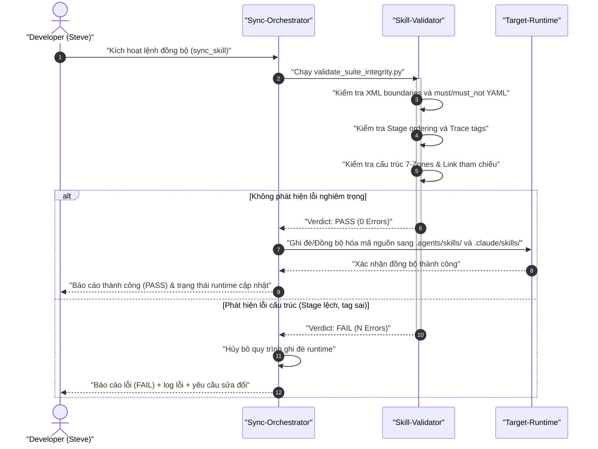
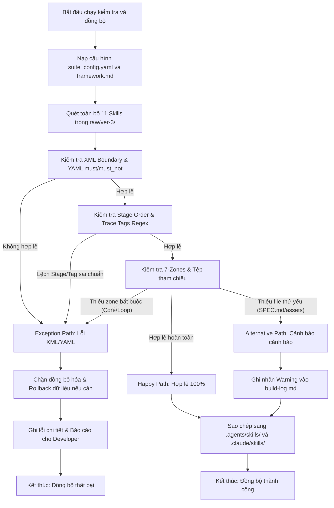
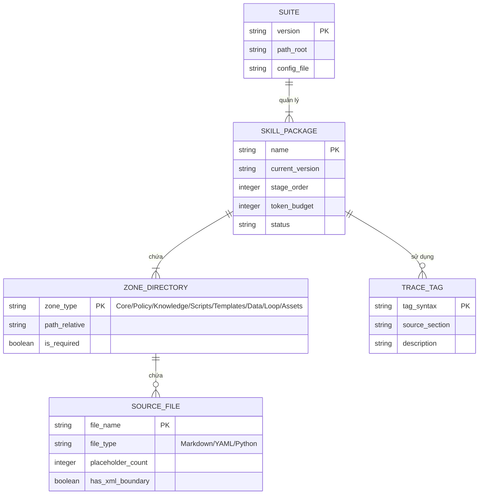

# 📊 Báo Cáo Phân Tích Nghiệp Vụ & Đặc Tả Kỹ Thuật: master-skill-suite-unification

## 1. Phân Loại Yêu Cầu & Ma Trận MoSCoW

Bảng phân loại dưới đây phân tích các yêu cầu nghiệp vụ thành Yêu cầu chức năng (FR) và Yêu cầu phi chức năng (NFR) lượng hóa, kèm theo mức độ ưu tiên MoSCoW và lý do kỹ thuật tương ứng.

| ID | Loại yêu cầu | Phân loại cụ thể | Mô tả đặc tả kỹ thuật | Độ ưu tiên MoSCoW | Lý do kỹ thuật |
|---|---|---|---|---|---|
| FR-1 | Functional | Pipeline Stage Alignment | Điều chỉnh số thứ tự stage của `skill-planner` thành 3, `skill-builder` thành 4 trong cả `framework.md` và tệp `SKILL.md` tương ứng để khớp với chuỗi cuộc gọi (Call Chain). | Must Have | Tránh đứt gãy luồng dữ liệu tự động giữa Planner và Builder. |
| FR-2 | Functional | Centralization | Loại bỏ 3 bản sao cục bộ `format-standards.md` tại các skill đơn lẻ. Chỉ định cấu hình nạp từ tệp master duy nhất `/home/steve/Work-space/WASHVN/raw/ver-3/_shared/knowledge/format-standards.md`. | Must Have | Tránh phân mảnh quy tắc định dạng và mâu thuẫn tiêu chuẩn. |
| FR-3 | Functional | Trace Tag Standardization | Thống nhất cấu trúc Trace Tags cho cả Pipeline skills và BA skills, đưa về chuẩn biểu thức chính quy (Regex): `^\[(TỪ DESIGN §[0-9]+(\.[0-9]+)?\|GỢI Ý BỔ SUNG\|TỪ AUDIT TÀI NGUYÊN\|CẦN LÀM RÕ\|TỪ INPUT\|SUY LUẬN)\]$`. | Must Have | Đảm bảo tính truy vết nguồn gốc (Traceability) và chống ảo giác (Anti-hallucination). |
| FR-4 | Functional | Structural Refactoring | Tái cấu trúc cấu trúc thư mục của 12 skills theo mô hình 7-Zones (hoặc 8-Zones). Bổ sung các thư mục `templates/`, `data/`, `scripts/`, `loop/` còn thiếu cho `skill-knowledge-miner`, `skill-builder`, và bộ 3 BA Skills. | Must Have | Đảm bảo tính module hóa cao và tuân thủ tuyệt đối quy định cấu trúc suite. |
| FR-5 | Functional | Zone Formalization | Khai báo zone `policy/` (chứa L1 behavioral rules, guardrails) làm zone chính thức trong `framework.md` (chuyển đổi hệ thống thành 8-Zones) hoặc tích hợp triệt để nó vào zone `knowledge/` dưới định dạng quy định cụ thể. | Should Have | Xóa bỏ sự mập mờ trong Zone Contract giữa các skill hiện tại. |
| FR-6 | Functional | Validation Upgrade | Cập nhật `validate_suite_integrity.py` để quét qua 11 skills thực tế trong danh sách kiểm tra tự động thay vì bỏ sót 4 skills như phiên bản cũ. | Must Have | Đảm bảo chất lượng toàn diện trước khi thực hiện deploy lên runtime. |
| NFR-1 | Non-Functional | Token Optimization | Giới hạn dung lượng tệp `SKILL.md` (L0 anchor) luôn nhỏ hơn 700 tokens. Nếu vượt quá, bắt buộc phải split nội dung L1 sang `policy/{skill-name}.yaml`. | Must Have | Giảm tải ngữ cảnh hệ thống giúp tiết kiệm chi phí token và tăng tốc độ xử lý của LLM. |
| NFR-2 | Non-Functional | Quality Gate | Tỷ lệ placeholder (TODO, pass, mock, TBD) trong mã nguồn / scripts hoạt động phải bằng 0 khi vượt qua Stage 3.5 và Stage 4. | Must Have | Đảm bảo code chạy thực tế và ngăn ngừa lỗi runtime do code chưa hoàn thiện. |
| NFR-3 | Non-Functional | Security & Performance | Toàn bộ script kiểm thử ở Stage 4 phải chạy trong Sandbox Docker/gVisor với tài nguyên cô lập, thời gian chạy tối đa của validator dưới 15 giây. | Should Have | Đảm bảo an toàn bảo mật hệ thống và phản hồi nhanh chóng cho người dùng. |

## 2. Sơ Đồ Hệ Thống (System Diagrams)

### A. Sơ Đồ Tuần Tự (Sequence Diagram)

Sơ đồ thể hiện sự tương tác giữa Developer, Sync-Orchestrator, Validator và Target-Runtime trong quá trình kiểm tra và đồng bộ hóa kiến trúc.



### B. Sơ Đồ Luồng Hoạt Động (Flowchart)

Sơ đồ thể hiện 3 luồng xử lý chính: Happy Path (đồng bộ thành công), Alternative Path (đồng bộ kèm cảnh báo), và Exception Path (lỗi cấu trúc chặn đồng bộ).



### C. Sơ Đồ Thực Thể (ERD)

Sơ đồ thực thể định nghĩa các quan hệ và thuộc tính cấu trúc của các thành phần trong Master Skill Suite.



## 3. Thiết Kế Cơ Sở Dữ Liệu (Data Schema Design)

### Chi tiết bảng cấu hình suite

#### Bảng: `suite_config`
Bảng chứa cấu hình chung của toàn bộ suite ver-3 cho việc kiểm tra và đồng bộ hóa.

| Tên trường | Kiểu dữ liệu | Ràng buộc | Mô tả |
|---|---|---|---|
| `suite_version` | `string` | `PK, NOT NULL` | Phiên bản thống nhất của suite (Ví dụ: `1.0.0`) |
| `runtime_dest_agents` | `string` | `NOT NULL` | Đường dẫn đồng bộ sang Antigravity runtime |
| `runtime_dest_claude` | `string` | `NOT NULL` | Đường dẫn đồng bộ sang Claude Code runtime |
| `token_budget_limit` | `integer` | `DEFAULT 700` | Giới hạn token tối đa cho file `SKILL.md` |
| `placeholder_density_limit` | `integer` | `DEFAULT 0` | Số lượng placeholder tối đa cho phép |

### JSON Schema tương ứng (cho validator tự động)
```json
{
  "$schema": "http://json-schema.org/draft-07/schema#",
  "title": "SuiteConfigSchema",
  "type": "object",
  "properties": {
    "suite_version": {
      "type": "string",
      "pattern": "^[0-9]+\\.[0-9]+\\.[0-9]+$"
    },
    "runtime_dest_agents": {
      "type": "string"
    },
    "runtime_dest_claude": {
      "type": "string"
    },
    "token_budget_limit": {
      "type": "integer",
      "minimum": 100,
      "maximum": 1000
    },
    "placeholder_density_limit": {
      "type": "integer",
      "minimum": 0,
      "maximum": 9
    }
  },
  "required": ["suite_version", "runtime_dest_agents", "runtime_dest_claude", "token_budget_limit", "placeholder_density_limit"]
}
```

## 4. Tiêu Chí Nghiệm Thu - Gherkin Acceptance Criteria

### User Story
```markdown
**User Story:**
As a LLM Developer (Steve)
I want to validate and synchronize the ver-3 Master Skill Suite
So that my AI agents have a unified, zero-error execution flow without guessing.
```

### Scenarios

```gherkin
Feature: Đặc tả quy trình đồng bộ hóa và kiểm định Master Skill Suite ver-3

  Scenario: Happy Path — Kiểm định thành công 100% và thực hiện đồng bộ hóa sang runtime
    Given Thư mục "raw/ver-3/" có đầy đủ 11 skills và tệp cấu hình "_shared/" hợp lệ
    And Tất cả các tệp "SKILL.md" tuân thủ số thứ tự Stage từ 0 đến 5
    And Hệ thống Trace Tags sử dụng đúng chuẩn thống nhất và không có placeholder
    When Chạy script "validate_suite_integrity.py"
    Then Trạng thái kết quả trả về là "PASS" với 0 lỗi
    And Hệ thống tự động sao chép mã nguồn sang ".agents/skills/" và ".claude/skills/"

  Scenario: Alternative Path — Thiếu tệp SPEC.md hoặc assets phụ trợ nhưng vẫn cho phép đồng bộ
    Given Thư mục "raw/ver-3/skill-explorer/" không có tệp "SPEC.md"
    But Tệp "SKILL.md" và các zone bắt buộc khác (Core, Loop, Knowledge) hợp lệ đầy đủ
    When Chạy script "validate_suite_integrity.py"
    Then Trạng thái kết quả trả về là "PASS" kèm theo 1 cảnh báo "WARNING: Missing SPEC.md"
    And Hệ thống vẫn thực hiện sao chép mã nguồn sang ".agents/skills/" và ".claude/skills/"

  Scenario: Exception Path — Sai Stage Order hoặc Trace Tag sai cấu trúc gây chặn đồng bộ
    Given Tệp "raw/ver-3/skill-planner/SKILL.md" khai báo "stage_order: 2" trong khi framework quy định Stage 3
    When Chạy script "validate_suite_integrity.py"
    Then Trạng thái kết quả trả về là "FAIL" với lỗi "Stage Order mismatch in skill-planner"
    And Quy trình sao chép runtime bị chặn hoàn toàn để bảo vệ hệ thống
    And Ghi lại thông tin lỗi chi tiết vào tệp "build-log.md"
```

## 5. Ma Trận Đánh Giá Rủi Ro (Risk & Impact Assessment Matrix)

Bảng đánh giá rủi ro kỹ thuật và biện pháp giảm thiểu tương ứng trong quá trình đồng bộ và vận hành.

| Mã Rủi ro | Mô tả rủi ro | Xác suất (L/M/H) | Tác động (L/M/H) | Giải pháp giảm thiểu |
|---|---|---|---|---|
| RR-01 | **Mâu thuẫn Stage Order gây lặp vòng vô tận**: LLM Agent bị quay vòng lặp giữa Stage 2 và Stage 3 do số thứ tự stage bị cấu hình sai lệch. | Medium | High | Ràng buộc cứng số thứ tự Stage trong validator; chặn chạy nếu phát hiện bất kỳ sự lệch pha nào. |
| RR-02 | **Lỗi cấu trúc SKILL.md làm hỏng runtime**: Agent bị crash hoặc treo khi cố nạp tệp SKILL.md thiếu thẻ XML ranh giới ngữ nghĩa. | Low | High | Sử dụng regex quét cấu trúc bắt buộc của tệp SKILL.md trước khi thực hiện deploy. |
| RR-03 | **Token Overload gây trượt ngữ cảnh**: File SKILL.md quá lớn làm LLM Agent mất tập trung vào các rule cốt lõi hoặc hết dung lượng context. | High | Medium | Enforce Token Budget Gate (<700 tokens), tự động tách L1 sang thư mục `policy/` bằng script tiền xử lý. |
| RR-04 | **Mất mát dữ liệu trong runtime do ghi đè**: Ghi đè trực tiếp code lỗi lên runtime làm hỏng các skill cũ đang chạy ổn định của Steve. | Low | High | Tạo cơ chế Archive tự động sao lưu runtime cũ vào `.agents/skills_backup/` trước khi đồng bộ bản mới. |

## 6. Sơ Đồ Ánh Xạ Nguồn Gốc (Traceability Mapping)

- **Yêu cầu phân loại**: `[TỪ INPUT]` Ánh xạ từ các phần lỗi ghi nhận trong `docs/context-to-work/arch-sync/scope.2026-06-07.md` (EP1 đến EP5, Affected Area và Analysis Dimensions).
- **Sơ đồ & Logic nghiệp vụ**: `[SUY LUẬN]` Thiết kế luồng xử lý và mô hình dữ liệu để giải quyết triệt để các khoảng trống nghiệp vụ được phát hiện ở Elicitation Report.
- **Điểm chưa rõ**: `[CẦN LÀM RÕ]` Các câu hỏi lớn gửi Steve liên quan đến việc định dạng Zone `policy/` và lựa chọn chuẩn trace tags cuối cùng.
