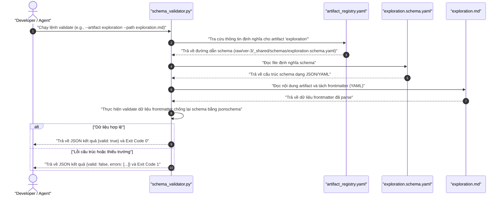
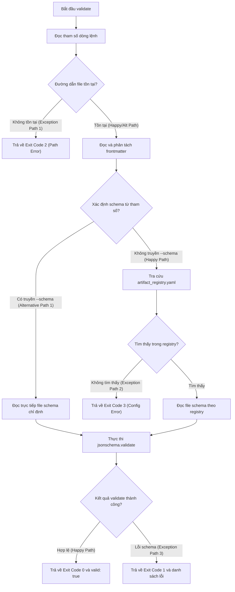
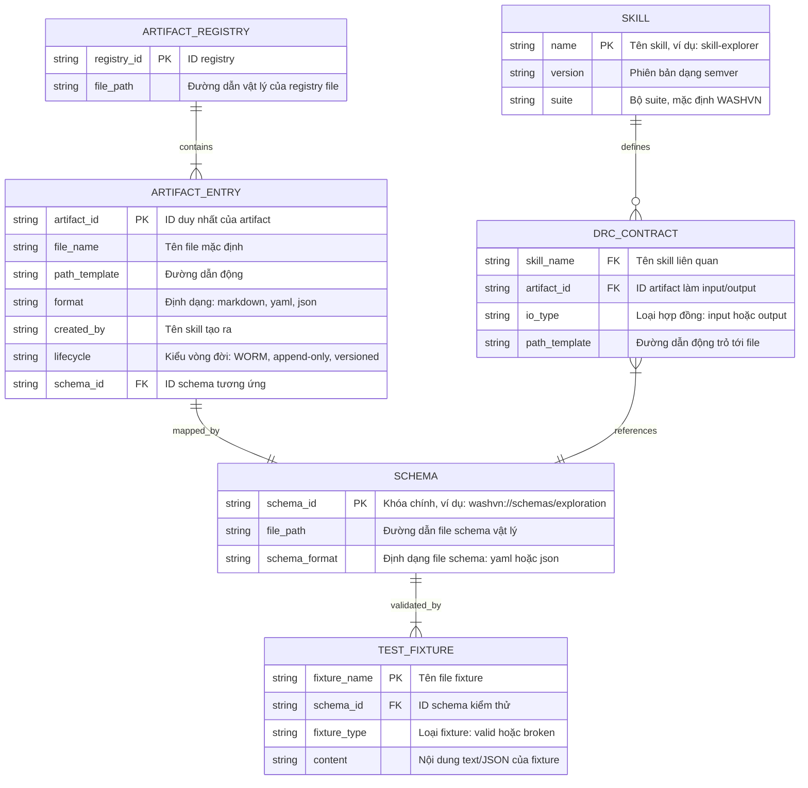

# 📊 Báo Cáo Phân Tích Nghiệp Vụ & Đặc Tả Kỹ Thuật: Phase 4 — Schemas & DRC Contracts

## 1. Phân Loại Yêu Cầu & Ma Trận MoSCoW

Dưới đây là bảng phân loại chi tiết các yêu cầu chức năng (FR) và phi chức năng (NFR) lượng hóa dành riêng cho **Phase 4 (Schemas & DRC Contracts)** dựa trên tài nguyên hiện có.

| ID | Loại yêu cầu | Phân loại cụ thể | Mô tả đặc tả kỹ thuật | Độ ưu tiên MoSCoW | Lý do kỹ thuật |
|---|---|---|---|---|---|
| **FR-1** | Functional | Data Validation | Định nghĩa và hoàn thiện **14 Schemas** (JSON Schema draft-07) đại diện cho 14 loại artifacts trong pipeline để máy có thể parse tự động. [TỪ INPUT] | **Must Have** | Cung cấp nền tảng validation cho toàn bộ các stage của Master Skill Suite, ngăn ngừa lỗi định dạng trước khi dữ liệu được chuyển đến stage tiếp theo. |
| **FR-2** | Functional | CLI Validation Tool | Xây dựng CLI script [schema_validator.py](file:///home/stveve/Documents/workspace/build-workflow/WASHVN/raw/ver-3/_shared/validators/schema_validator.py) để thực hiện parse frontmatter và validate artifact cụ thể hoặc tất cả artifacts. [TỪ INPUT] | **Must Have** | Cho phép tự động hóa việc validate tài liệu/artifacts trong CI/CD hoặc qua git hooks. |
| **FR-3** | Functional | CLI Lifecycle Tool | Xây dựng CLI script [artifact_lifecycle.py](file:///home/stveve/Documents/workspace/build-workflow/WASHVN/raw/ver-3/_shared/validators/artifact_lifecycle.py) để kiểm tra tính toàn vẹn thư mục, sự tồn tại của file, tính hợp lệ của timestamp và phát hiện mtime drift. [TỪ INPUT] | **Should Have** | Đảm bảo tính nhất quán về mặt thời gian và phiên bản của artifacts trong suốt vòng đời của skill. |
| **FR-4** | Functional | CLI DRC Resolver | Xây dựng CLI script [drc_resolver.py](file:///home/stveve/Documents/workspace/build-workflow/WASHVN/raw/ver-3/_shared/scripts/drc_resolver.py) kiểm tra tính tương thích đầu ra/đầu vào (Input/Output contracts) của các skill với registry. [TỪ INPUT] | **Should Have** | Đảm bảo hợp đồng dữ liệu giữa các stage (DRC) được giải quyết chính xác và không có xung đột giao tiếp. |
| **FR-5** | Functional | Data Configuration | Xây dựng [artifact_registry.yaml](file:///home/stveve/Documents/workspace/build-workflow/WASHVN/raw/ver-3/_shared/artifact_registry.yaml) định nghĩa cấu trúc của 14 artifacts cốt lõi (ID, path template, format, lifecycle type, creator/consumer). [TỪ INPUT] | **Must Have** | Đóng vai trò là single source of truth để `schema_validator.py` và `drc_resolver.py` thực hiện tra cứu. |
| **FR-6** | Functional | Templates Authoring | Cung cấp 3 templates chuẩn: DRC Contract template, Skill Skeleton, và Skill README template. [TỪ INPUT] | **Must Have** | Tiêu chuẩn hóa cấu trúc thư mục 7-Zone cho các skill ở Phase 5-7. |
| **FR-7** | Functional | Testing & Fixtures | Viết **28 test fixtures** (2 files cho mỗi schema: 1 valid và 1 broken vi phạm đúng 1 ràng buộc). [TỪ INPUT] | **Should Have** | Dùng để chạy unit test cho các schemas và validator scripts, đảm bảo validator phát hiện đúng lỗi. |
| **FR-8** | Functional | Documentation | Viết tài liệu [karpathy-standards.md](file:///home/stveve/Documents/workspace/build-workflow/WASHVN/raw/ver-3/_shared/knowledge/karpathy-standards.md) định nghĩa các quy tắc coding và documentation. [TỪ INPUT] | **Should Have** | Cung cấp tri thức định hướng hành vi (L1 standards) cho các agent trong việc lập trình an toàn. |
| **NFR-1** | Non-Functional | Performance | Tốc độ chạy validation của `schema_validator.py`: < 500ms đối với single file check và < 2.0 giây đối với toàn bộ suite check. [SUY LUẬN] | **Should Have** | Tránh làm nghẽn quá trình commit/push hoặc trải nghiệm tương tác trực tiếp của nhà phát triển. |
| **NFR-2** | Non-Functional | Structural Constraint | Mỗi schema file (dạng YAML/JSON) phải có dung lượng tối thiểu **≥ 30 dòng**. [TỪ INPUT] | **Must Have** | Đảm bảo tính chi tiết và đầy đủ của schema, không dùng stubs rỗng hoặc schema quá sơ sài. |
| **NFR-3** | Non-Functional | Logic Constraint | Schema `criteria.schema.json` bắt buộc yêu cầu danh sách `acceptance_criteria` có **≥ 5 phần tử** và `test_cases` có **≥ 2 phần tử**. [TỪ INPUT] | **Must Have** | Ràng buộc chất lượng đầu ra của Stage 0 (Explorer) theo chuẩn chất lượng của Master Skill Suite. |
| **NFR-4** | Non-Functional | Logic Constraint | Schema `design.schema.yaml` bắt buộc yêu cầu danh sách `must_not_rules` có **≥ 5 phần tử**. [TỪ INPUT] | **Must Have** | Ép buộc Stage 1 (Architect) định nghĩa rõ vùng không gian phủ định (Negative Space) để kiểm soát agent. |
| **NFR-5** | Non-Functional | Logic Constraint | Schema `domain-handbook.schema.yaml` bắt buộc yêu cầu danh sách `glossary` có **≥ 10 phần tử** và `anti_patterns` có **≥ 3 phần tử**. [TỪ INPUT] | **Must Have** | Tránh tình trạng tài liệu Miner rỗng hoặc thiếu chiều sâu thuật ngữ nghiệp vụ. |
| **NFR-6** | Non-Functional | Environment Compatibility | CLI scripts phải viết bằng Python 3.8+ và chỉ sử dụng các thư viện chuẩn cùng `jsonschema`, `pyyaml`, `click`. [SUY LUẬN] | **Must Have** | Đảm bảo tính tương thích và dễ dàng cài đặt trên môi trường sandbox cô lập. |
| **NFR-7** | Non-Functional | Security & Cleanliness | Không được phép chứa bất kỳ mã giả lập (mock), ghi chú TODO, pass hoặc placeholder chưa hoàn thiện trong mã nguồn Python hoặc YAML. [TỪ INPUT] | **Must Have** | Tránh rò rỉ hoặc gây hiểu nhầm cho AI agent khi đọc code thực thi. |

## 2. Sơ Đồ Hệ Thống (System Diagrams)

### A. Sơ Đồ Tuần Tự (Sequence Diagram — Luồng Validate Artifact)

Sơ đồ dưới đây thể hiện sự tương tác giữa nhà phát triển/agent, bộ validator CLI, registry, và các file schemas/artifacts.



### B. Sơ Đồ Luồng Hoạt Động (Flowchart — Tiến Trình Validate)

Sơ đồ luồng thể hiện đầy đủ các nhánh Happy Path (Validate thành công), Alternative Path (Chỉ định schema trực tiếp), và Exception Paths (File lỗi, sai registry, sai cấu trúc).



### C. Sơ Đồ Thực Thể (ERD — Quan hệ dữ liệu trong Phase 4)

Sơ đồ thực thể biểu diễn mối liên kết cấu trúc dữ liệu giữa các thành phần cấu hình và artifacts trong Phase 4.



## 3. Thiết Kế Cơ Sở Dữ Liệu & Data Schema Design

### Chi tiết bảng cơ sở dữ liệu logical của `artifact_registry`

Dưới đây mô tả cấu trúc của một bản ghi artifact đăng ký trong [artifact_registry.yaml](file:///home/stveve/Documents/workspace/build-workflow/WASHVN/raw/ver-3/_shared/artifact_registry.yaml).

| Tên trường | Kiểu dữ liệu | Ràng buộc | Mô tả |
|---|---|---|---|
| `artifact_id` | `string` | `PK, Pattern: ^[a-z0-9_]+$` | ID định danh duy nhất cho artifact trong toàn bộ pipeline. |
| `file_name` | `string` | `NOT NULL` | Tên file vật lý tiêu chuẩn (ví dụ: `exploration.md`). |
| `path_template` | `string` | `NOT NULL` | Đường dẫn mẫu động, hỗ trợ biến `{target_skill}` (ví dụ: `.skill-context/{target_skill}/exploration.md`). |
| `format` | `string` | `NOT NULL, Enum: [markdown, yaml, json]` | Định dạng lưu trữ của tệp tin. |
| `created_by` | `string` | `NOT NULL` | Skill hoặc Agent chịu trách nhiệm tạo ra artifact này. |
| `consumed_by` | `array of strings` | `NOT NULL` | Danh sách các skills tiêu thụ artifact này ở hạ nguồn. |
| `schema` | `string` | `NOT NULL, Pattern: ^raw/ver-3/_shared/schemas/...` | Đường dẫn tuyệt đối hoặc tương đối tới file schema validator. |
| `lifecycle` | `string` | `NOT NULL, Enum: [WORM, append-only, versioned]` | Quy tắc quản lý vòng đời tệp tin (Write Once Read Many, Ghi đè hay Đánh số phiên bản). |

### JSON Schema tương ứng cho `artifact_registry.yaml`

Schema này sẽ được sử dụng để validate trực tiếp tính toàn vẹn của tệp cấu hình registry.

```json
{
  "$schema": "http://json-schema.org/draft-07/schema#",
  "$id": "washvn://schemas/artifact-registry",
  "title": "Artifact Registry Schema",
  "description": "Schema to validate the artifact_registry.yaml file containing all pipeline artifacts definition",
  "type": "object",
  "required": ["artifacts"],
  "additionalProperties": false,
  "properties": {
    "artifacts": {
      "type": "array",
      "minItems": 1,
      "items": {
        "type": "object",
        "required": [
          "artifact_id",
          "file_name",
          "path_template",
          "format",
          "created_by",
          "consumed_by",
          "schema",
          "lifecycle"
        ],
        "additionalProperties": false,
        "properties": {
          "artifact_id": {
            "type": "string",
            "pattern": "^[a-z0-9_]+$"
          },
          "file_name": {
            "type": "string"
          },
          "path_template": {
            "type": "string"
          },
          "format": {
            "type": "string",
            "enum": ["markdown", "yaml", "json"]
          },
          "created_by": {
            "type": "string"
          },
          "consumed_by": {
            "type": "array",
            "items": {
              "type": "string"
            }
          },
          "schema": {
            "type": "string",
            "pattern": "^raw/ver-3/_shared/schemas/[a-z0-9_-]+\\.schema\\.(yaml|json)$"
          },
          "lifecycle": {
            "type": "string",
            "enum": ["WORM", "append-only", "versioned"]
          }
        }
      }
    }
  }
}
```

## 4. Tiêu Chí Nghiệm Thu - Gherkin Acceptance Criteria

### User Story
```markdown
**User Story:**
As a WASHVN Master Skill Suite Developer (or Agent)
I want to validate stage artifacts against formal schemas and lifecycle rules
So that I can guarantee data consistency, avoid drift, and ensure reliable execution across pipeline stages.
```

### Scenarios

```gherkin
Feature: Đặc tả tính năng và kiểm thử tự động của Validator - Phase 4

  Scenario: Happy Path — Thực hiện validate thành công một artifact hợp lệ
    Given Một artifact file "exploration.md" hợp lệ tồn tại tại thư mục ".skill-context/test-skill/"
    And Tệp tin chứa đầy đủ frontmatter YAML với "skill_name" là "test-skill" và "scs_score" là 3.0
    And Cấu hình "artifact_registry.yaml" trỏ "exploration" tới schema "exploration.schema.yaml"
    When Nhà phát triển thực hiện chạy lệnh "python3 schema_validator.py --artifact exploration --path .skill-context/test-skill/exploration.md"
    Then Tiến trình kết thúc thành công với Exit Code 0
    And Đầu ra stdout hiển thị thông tin JSON chứa khóa "valid: true"

  Scenario: Alternative Path — Chỉ định schema tùy chỉnh bên ngoài registry
    Given Một artifact file "custom-data.yaml" chứa frontmatter không đăng ký trong registry
    And Một file schema tự định nghĩa "custom.schema.yaml" nằm tại thư mục tạm
    When Nhà phát triển chạy lệnh "python3 schema_validator.py --path custom-data.yaml --schema custom.schema.yaml"
    Then Tiến trình kết thúc thành công với Exit Code 0
    And Bộ validator thực hiện kiểm thử trực tiếp bằng file schema chỉ định thay vì tra cứu registry

  Scenario: Exception Path — Lỗi cấu trúc frontmatter không khớp với schema
    Given Một artifact file "exploration.md" bị thiếu trường bắt buộc "exploration_summary"
    And Hoặc trường "scs_score" có giá trị sai quy định là 6.0 (vượt quá 5.0)
    When Nhà phát triển thực hiện chạy lệnh "python3 schema_validator.py --artifact exploration --path .skill-context/test-skill/exploration.md"
    Then Tiến trình kết thúc thất bại với Exit Code 1
    And Đầu ra stdout trả về mã JSON có khóa "valid: false"
    And Danh sách "errors" chứa thông báo lỗi chi tiết chỉ rõ vị trí và trường dữ liệu không hợp lệ
```

## 5. Ma Trận Đánh Giá Rủi Ro (Risk & Impact Assessment Matrix)

| Mã Rủi ro | Mô tả rủi ro | Xác suất (L/M/H) | Tác động (L/M/H) | Giải pháp giảm thiểu |
|---|---|---|---|---|
| **RR-01** | Sự khác biệt về cách biên dịch YAML/JSON Schema giữa các thư viện Python gây sai lệch kết quả validate. [SUY LUẬN] | Low | Medium | Ràng buộc phiên bản thư viện `jsonschema` cụ thể trong file cài đặt. Đảm bảo toàn bộ các schema định nghĩa theo đúng chuẩn của Draft-07 và được test bằng 28 fixtures. |
| **RR-02** | Khó khăn khi đồng bộ hoặc quản lý mtime trên các máy khách khác nhau (Git checkout có thể ghi đè mtime thực tế), gây báo động giả khi drift detection chạy. [SUY LUẬN] | High | Medium | Trong script `artifact_lifecycle.py`, cung cấp cơ chế fallbacks: nếu mtime trên đĩa bị thay đổi nhưng băm SHA-256 của file không đổi so với hash lưu trong context state, bỏ qua cảnh báo drift. |
| **RR-03** | Thiếu tính đồng bộ trong naming convention hoặc schema format giữa các stage. [TỪ INPUT] | Medium | High | Đồng bộ hóa triệt để cấu trúc trường bắt buộc của 14 schemas (ví dụ: luôn yêu cầu `skill_name`, `version`, `suite`). normalize tên file schemas về định dạng `*.schema.yaml` trừ `criteria.schema.json`. |
| **RR-04** | Trình tự xây dựng bị đảo lộn gây nghẽn tiến độ. [TỪ INPUT] | Medium | Medium | Tuân thủ tuyệt đối quy trình phân bổ 7 Batches build khuyến nghị từ Core -> Quality -> Execution -> BA -> Templates -> Scripts -> Documentation. |

## 6. Sơ Đồ Ánh Xạ Nguồn Gốc (Traceability Mapping)

- **Đặc tả danh sách 14 Schemas**: [TỪ INPUT] Ánh xạ trực tiếp từ §1 và §3 của [phase-4-resources.2026-07-10.md](file:///home/stveve/Documents/workspace/build-workflow/WASHVN/docs/context-to-work/next-phase-analysis/phase-4-resources.2026-07-10.md).
- **Yêu cầu kỹ thuật lượng hóa (NFR-2, NFR-3, NFR-4, NFR-5)**: [TỪ INPUT] Trích xuất từ các quy tắc ràng buộc thiết kế ở §3.1, §3.3, §3.4, §3.12 của tài nguyên đầu vào.
- **Thiết kế API Validator CLI & Exit Codes**: [TỪ INPUT] Tham chiếu trực tiếp đặc tả kỹ thuật ở §4.1 và §4.3 của tài nguyên đầu vào.
- **Độ trễ và hiệu năng (NFR-1)**: [SUY LUẬN] Rút ra từ thực tiễn vận hành git hooks hoặc tương tác CLI thời gian thực của lập trình viên để không ảnh hưởng đến DX.
- **Rủi ro kiểm soát timestamp/mtime (RR-02)**: [SUY LUẬN] Suy luận từ thực tế hoạt động của Git (Git clone không bảo toàn file modification times).
- **Trình tự Build Batches**: [TỪ INPUT] Ánh xạ trực tiếp từ sơ đồ quy trình xây dựng ở §9 của tài nguyên đầu vào.

---

### ⚠️ ĐIỂM CẦN LÀM RÕ [CẦN LÀM RÕ]
1. **Số lượng schemas thực tế**: Có nên mở rộng từ 14 schemas lên 22 schemas để validate toàn bộ các artifacts phụ (như `_state.yaml`, `context-bus.yaml`, `thought-cache.yaml`)? Khuyến nghị: Trong Phase 4, tập trung hoàn thiện 14 schema cốt lõi trước, các schema phụ sẽ được bổ sung dưới dạng tùy chọn ở Phase 8.
2. **Định dạng file criteria**: Tại sao `criteria.schema.json` là JSON thuần trong khi 13 schema khác dùng YAML? Có nên đồng bộ tất cả về YAML hoặc JSON không? Khuyến nghị: Giữ `criteria.schema.json` ở dạng JSON để tương thích với các ecosystem tools yêu cầu JSON Schema gốc, và viết 13 file còn lại bằng YAML để dễ bảo trì bằng mắt thường. Thư viện Python sẽ tự động load cả hai định dạng.
3. ** karpathy-standards.md**: Có cần khôi phục tài liệu này từ lịch sử Git hay viết mới hoàn toàn dựa trên `standards.md §5`? Khuyến nghị: Viết mới trực tiếp bằng cách cô đọng nội dung từ `standards.md` để đảm bảo tính cập nhật và chính xác cao nhất đối với cấu trúc dự án hiện tại.
