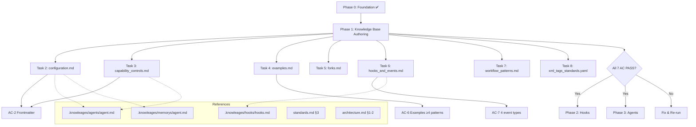
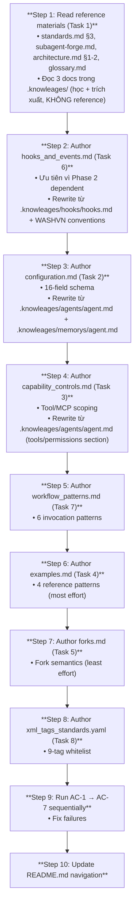

# Scope Document — Transition to Phase 1: Knowledge Base Authoring

**Date**: 2026-07-07
**Status**: Initial
**Phase 0**: ✅ Done (2026-07-07)
**Phase 1**: ⬜ Pending — Next Phase

---

## §1: Problem Summary (Tóm Tắt)

Phase 0 (Foundation Bootstrap) đã hoàn thành — tất cả 8 AC pass, 10 tasks done, 7 git commits. Phase kế tiếp là **Phase 1 — Knowledge Base Authoring**: tác giả 7 knowledge docs tại `.claude/knowledge/agents/` với nội dung canonical.

**Hiện trạng**: 7 file đều là stub (14 dòng mỗi file, `status: stub`). `subagent-forge.md` reference 7 docs này trong `<retrieved_docs>` nhưng hiện đều là dangling references. Phase 1 sẽ biến chúng thành tài liệu hoàn chỉnh, machine-parseable.

**Mục tiêu của document này**: Cung cấp context đầy đủ để bắt đầu Phase 1 — bao gồm trạng thải hiện tại, yêu cầu từ roadmap, tài liệu tham chiếu có sẵn, gaps cần lưu ý, và mapping tới codebase thực tế.

---

## §2: Entry Point

| Thành phần | Path | Vai trò |
|:-----------|:-----|:--------|
| **Knowledge stubs** | `.claude/knowledge/agents/` (7 files) | Đầu vào — cần fill content |
| **Roadmap spec** | `raw/ver-3/roadmaps/01-knowledge-base-authoring.md` (311 dòng) | Yêu cầu chi tiết từng doc |
| **Plan checklist** | `docs/context-to-work/roadmap-analysis-phases/plan-checklist.2026-07-07.md` (1149 dòng) | Tasks + ACs + DoD tracking |
| **Subagent-forge** | `.claude/agents/subagent-forge.md` | Consumer chính của 7 docs |
| **Existing knowledge** | `.claude/knowleages/` (agents/, hooks/, memorys/, skills/) | Official Claude Code docs — có thể tái sử dụng |

---

## §3: Scope Definition

### 3.1 In Scope

- Author 7 knowledge docs tại `.claude/knowledge/agents/` với nội dung canonical
- Mỗi doc: YAML frontmatter + nội dung ≥ 100 dòng + zero placeholder
- Tất cả 7 AC (path resolution, frontmatter, placeholders, cross-links, subagent-forge, examples, hook protocol)
- Cập nhật `.claude/knowledge/agents/README.md` (navigation map)
- Tận dụng 3 tài liệu có sẵn tại `.claude/knowleages/` để tiết kiệm ~60% công sức
- Cập nhật `workspce_tree.md` nếu cần

### 3.2 Out of Scope

- ❌ Không implement Phase 2 hooks
- ❌ Không implement Phase 3 agents
- ❌ Không sửa code production
- ❌ Không deploy skills mới
- ❌ Không fix typo `knowleages` (giữ nguyên, chỉ tạo `knowledge/` mới)

### 3.3 Boundary

- **Đầu vào**: 7 stubs + roadmap spec + reference docs
- **Đầu ra**: 7 canonical docs + README navigation
- **Giới hạn**: Không chạm vào runtime skills, hooks, agents. Chỉ tác giả nội dung knowledge.

---

## §4: Impact Analysis (Phân Tích Ảnh Hưởng)

### 4.1 Direct Impact

| Thành phần | Files | Tác động |
|:-----------|:-----:|:---------|
| Knowledge stubs → canonical | 7 files | Content sẽ thay đổi từ stub → canonical |
| `subagent-forge.md` | 1 file | `<retrieved_docs>` reference sẽ resolve — không còn broken |
| `workspce_tree.md` | 1 file | Có thể cần update status từ stub → canonical |

### 4.2 Indirect Impact

| Thành phần | Lý do | Phase bị ảnh hưởng |
|:-----------|:------|:-------------------|
| Phase 2 (Hooks) | Hooks_and_events.md cần completed trước khi Phase 2 build hooks | Phase 2 |
| Phase 3 (Agents) | Agent knowledge docs cần canonical trước khi build agents | Phase 3 |
| Phase 4 (Schemas) | configuration.md cần hoàn chỉnh để schema validation align | Phase 4 |
| `architecture.md` | Có thể cần update routing map | Phase 8 |

### 4.3 Data Flow

```
subagent-forge.md <--reads-- 7 knowledge docs (canonical)
                                    |
                    ┌───────────────┼───────────────┐
                    v               v               v
              Phase 2 hooks    Phase 3 agents    Phase 4 schemas
```

---

## §5: Trạng Thái Hiện Tại (Codebase Reality Check)

### 5.1 Phase 0 Hoàn Thành

| AC | Mô tả | Path verify | Kết quả |
|:--:|:------|:------------|:--------|
| AC-1 | Directory structure | 8 `test -d` checks | ✅ PASS |
| AC-2 | 11 skill dirs 7-Zone | `raw/ver-3/` | ✅ PASS |
| AC-3 | `validate_suite_integrity.py` | `.claude/scripts/` | ✅ PASS |
| AC-4 | 7 knowledge stubs | `.claude/knowledge/agents/` | ✅ PASS |
| AC-5 | subagent-forge không broken | `.claude/agents/subagent-forge.md` | ✅ PASS |
| AC-6 | State archive protocol | `.skill-context/suite_config.yaml` | ✅ PASS |
| AC-7 | Hook registry stub | `.claude/hooks/registry.yaml` | ✅ PASS |
| AC-8 | Docker diagnostics | Docker CLI | ✅ PASS |

### 5.2 7 Knowledge Stubs Hiện Tại

| # | File | Status hiện tại | Lines | Cần fill |
|:-:|:-----|:---------------:|:-----:|:---------|
| 1 | `configuration.md` | stub | 14 | ~150-200 dòng |
| 2 | `capability_controls.md` | stub | 14 | ~120-150 dòng |
| 3 | `examples.md` | stub | 14 | ~400-500 dòng |
| 4 | `forks.md` | stub | 14 | ~80-100 dòng |
| 5 | `hooks_and_events.md` | stub | 14 | ~150-200 dòng |
| 6 | `workflow_patterns.md` | stub | 14 | ~120-150 dòng |
| 7 | `xml_tags_standards.yaml` | stub | 14 | ~80-100 dòng |

### 5.3 Existing Knowledge Docs tại `.claude/knowleages/`

Có thể tái sử dụng (giảm ~60% công sức Phase 1):

| Tài liệu | Path | Lines | Nội dung | Dùng cho knowledge doc |
|:---------|:-----|:-----:|:---------|:-----------------------|
| **Hooks Reference** | `.claude/knowleages/hooks/hooks.md` | ~1000+ | Event types, matcher, JSON format | `hooks_and_events.md` |
| **Subagent Docs** | `.claude/knowleages/agents/agent.md` | ~1500+ | Frontmatter 16 fields, tools, permissions | `configuration.md`, `capability_controls.md` |
| **Memory Docs** | `.claude/knowleages/memorys/agent.md` | ~438 | CLAUDE.md, rules, memory | `configuration.md` (phần) |
| **Skills Dir** | `.claude/knowleages/skills/` | ? | Chưa kiểm tra nội dung | Cần verify |

---

## §6: Phase 1 Task Analysis (Chi Tiết)

Dựa trên `01-knowledge-base-authoring.md` và `plan-checklist.2026-07-07.md`:

### Task Breakdown (10 tasks)

| # | Task | Output | Estimated Lines | Commit Message |
|:-:|:-----|:-------|:--------------:|:---------------|
| 1 | Read reference material | N/A (research) | — | (no commit) |
| 2 | Author `configuration.md` | 16-field spec ~150-200 dòng | 150-200 | `phase-1: configuration schema canonical doc` |
| 3 | Author `capability_controls.md` | Tool/MCP scoping ~120-150 dòng | 120-150 | `phase-1: capability controls doc` |
| 4 | Author `examples.md` | 4 patterns ~400-500 dòng | 400-500 | `phase-1: examples reference patterns` |
| 5 | Author `forks.md` | Fork semantics ~80-100 dòng | 80-100 | `phase-1: fork semantics doc` |
| 6 | Author `hooks_and_events.md` | Protocol spec ~150-200 dòng | 150-200 | `phase-1: hook protocol spec` |
| 7 | Author `workflow_patterns.md` | 6 patterns ~120-150 dòng | 120-150 | `phase-1: workflow patterns doc` |
| 8 | Author `xml_tags_standards.yaml` | 9-tag whitelist ~80-100 dòng | 80-100 | `phase-1: xml tags whitelist` |
| 9 | Run AC-1 → AC-7, fix failures | All AC pass | — | `phase-1: acceptance criteria pass` |
| 10 | Update README navigation | `README.md` | ~30 | `phase-1: knowledge registry README` |

**Tổng content mới**: ~1100-1400 dòng
**Tổng files tạo/sửa**: 8 files (7 docs + 1 README)

### Acceptance Criteria Mapping

| AC | Cách verify | Command/Script |
|:--:|:------------|:---------------|
| **AC-1** | Path + size ≥2KB | `test -f + wc -c ≥2000` |
| **AC-2** | Frontmatter YAML valid, status=canonical | `python3 -c "import yaml; ..."` |
| **AC-3** | Zero placeholders (TODO/FIXME/mock/pass) | `grep -rn "TODO\|FIXME\|mock()\|pass #"` |
| **AC-4** | Internal cross-links valid | `python3 re.findall file:///` |
| **AC-5** | subagent-forge reads 7 docs | `test -r` + grep reference |
| **AC-6** | examples.md có ≥4 patterns | `grep "^### " examples.md` |
| **AC-7** | 4 event types defined | `grep "PreToolUse\|PostToolUse\|Stop\|SessionStart"` |

### Definition of Done

- [ ] 7 docs tồn tại với `status: canonical`
- [ ] Tất cả 7 AC PASS
- [ ] 7 docs total ≥ 1100 dòng content
- [ ] `subagent-forge.md` `<retrieved_docs>` reference 7 files đều tồn tại
- [ ] Mỗi doc có ≥ 1 cross-link tới workspace file (clickable `file:/path/`)
- [ ] Zero placeholder strings anywhere

---

## §7: Gaps & Risks Cần Lưu Ý

### Gap 1: Hook Format Reconcile (HIGH — RESOLVED)

**Vấn đề**: 
- Roadmap Phase 2 spec: hook block dùng `exit 2`
- Claude Code reality: hook block dùng stdout JSON `{"permissionDecision": "deny"}`
- `exit 2` là cơ chế older nhưng vẫn hợp lệ (documented trong agent.md L532)

**Quyết định**: ✅ **Document cả 2 format trong `hooks_and_events.md`**
- `exit 2` — đơn giản cho shell scripts, block nhanh
- `stdout JSON permissionDecision` — canonical format, structured, cho phép audit log
- Phase 2 sẽ quyết định format cuối cùng dùng trong `.claude/hooks/events/`
- §15 có phân tích chi tiết kèm code examples cho cả 2 format

### Gap 2: Raw Knowledge Repository `knowleages` (INTENTIONAL — RESOLVED)

**Giải thích**: `.claude/knowleages/` **cố tình viết sai chính tả** để phân biệt với `.claude/knowledge/` (canonical). Đây là **RAW storage** chứa tài liệu gốc (official Claude Code docs) dùng để trích xuất kiến thức.

**Ý nghĩa thiết kế**:
| Directory | Spelling | Purpose |
|:----------|:---------|:--------|
| `.claude/knowleages/` | ❌ Cố tình sai | RAW — chứa tài liệu gốc, KHÔNG push git |
| `.claude/knowledge/` | ✅ Đúng | CANONICAL — tri thức đã qua xử lý, push git |

**Tác động tới Phase 1**:
- `knowleages/` là nguồn raw để **trích xuất và rewrite** nội dung vào `knowledge/`
- `knowleages/` sẽ **không được push lên git** — chỉ dùng local reference
- Knowledge docs tại `.claude/knowledge/agents/` phải **self-contained**, không reference vào `knowleages/`
- Giữ nguyên `knowleages/` cho các Stage 0.5 (Knowledge Miner) về sau

### Gap 3: Reference Material (MEDIUM)

**Task 1 yêu cầu đọc**:
- `standards.md §3` — LLM Knowledge Activation Standard
- `subagent-forge.md` full — agent builder reference
- `architecture.md §1-2` — Master Skill Suite architecture
- `Temps/spec/architects/shared/glossary.md` — spec glossary

**Hiện trạng**: Các files này cần được đọc trước khi bắt đầu authoring để đảm bảo alignment.

### Gap 4: Rewrite Strategy — Không Reference, Phải Rewrite (MEDIUM — RESOLVED)

**Vấn đề**: `.claude/knowleages/` là raw storage local, **không push git**. Nếu Phase 1 chỉ reference vào `knowleages/`, khi chia sẻ hoặc publish project, các reference sẽ broken và tri thức bị thiếu.

**Quyết định**: ✅ **Full rewrite — không reference**
- 3 tài liệu official tại `knowleages/` là **nguồn để học và trích xuất**, không phải để reference
- Mỗi knowledge doc tại `.claude/knowledge/agents/` phải **self-contained** — đọc được standalone mà không cần `knowleages/`
- Content được **rewrite cẩn thận** dựa trên tinh thần official docs + WASHVN conventions
- Dung lượng mỗi doc tăng lên so với reference approach (~1400 dòng total)

**Ưu điểm**:
- ✅ Git-friendly — tất cả tri thức trong 1 directory duy nhất
- ✅ Portable — có thể public/share mà không mất context
- ✅ Subagent-forge có thể đọc trực tiếp, không cần fallback
- ✅ Knowledge Miner (Stage 0.5) sau này có thể dùng `knowleages/` làm source riêng

**Nhược điểm**:
- ⚠️ Tốn công sức hơn (full rewrite thay vì reference)
- ⚠️ Cần maintain consistency với official docs khi Claude Code cập nhật

---

## §8: Resource Mapping (Tài Nguyên Tham Chiếu)

### 8.1 Reference Files Needed cho Phase 1

| File | Path | Bắt buộc? | Ghi chú |
|:-----|:-----|:---------:|:--------|
| `roadmap spec` | `raw/ver-3/roadmaps/01-knowledge-base-authoring.md` | ✅ Yes | Spec chi tiết từng doc |
| `standards.md §3` | `WASHVN/standards.md` | ✅ Yes | Format rules |
| `subagent-forge.md` | `.claude/agents/subagent-forge.md` | ✅ Yes | Consumer chính |
| `architecture.md §1-2` | `WASHVN/architecture.md` | ✅ Yes | Master Skill Suite context |
| `hooks.md` | `.claude/knowleages/hooks/hooks.md` | ✅ Yes (reuse) | Official hook docs |
| `agent.md (agents/)` | `.claude/knowleages/agents/agent.md` | ✅ Yes (reuse) | Official subagent docs |
| `agent.md (memorys/)` | `.claude/knowleages/memorys/agent.md` | ⚠️ Optional | Memory/rules docs |
| `glossary.md` | `Temps/spec/architects/shared/glossary.md` | ⚠️ Optional | Spec glossary |
| `plan-checklist` | `docs/context-to-work/roadmap-analysis-phases/plan-checklist.2026-07-07.md` | ✅ Yes | Task tracking |
| `scope.2026-07-07.md` | `docs/context-to-work/roadmap-analysis-phases/scope.2026-07-07.md` | ⚠️ Reference | Phase 0 scope |

### 8.2 Existing Docs Content Mapping

```
.knowleages/hooks/hooks.md
  → Hooks_and_events.md: event types, JSON format, matcher patterns, if conditions

.knowleages/agents/agent.md  
  → configuration.md: 16 frontmatter fields, model aliases, permission modes
  → capability_controls.md: tool allowlist patterns, mcpServers scoping
  → examples.md: subagent file structure and patterns
  → forks.md: experimental agent concept (limited)
  → hooks_and_events.md: inline hooks in frontmatter

.knowleages/memorys/agent.md
  → configuration.md: CLAUDE.md locations, @AGENTS.md bridge, rules/

.knowleages/skills/ (chưa verify content)
  → Cần kiểm tra trước Phase 1
```

---

## §9: Call Chain & Dependency Flow



---

## §10: Evidence

<evidence>
<file>.claude/knowledge/agents/configuration.md</file>
<line>1-14</line>
<finding>7 knowledge stubs all có status: stub — cần Phase 1 fill canonical content. Mỗi file hiện chỉ 14 dòng.</finding>
</evidence>

<evidence>
<file>.claude/agents/subagent-forge.md</file>
<line>73-82</line>
<finding>Subagent-forge <retrieved_docs> references 7 knowledge docs — hiện là dangling references (stubs chưa có content). Phase 1 sẽ resolve tất cả.</finding>
</evidence>

<evidence>
<file>raw/ver-3/roadmaps/01-knowledge-base-authoring.md</file>
<line>1-311</line>
<finding>Full spec cho 7 knowledge docs: deliverables, AC checklist, DoD. Phase 1 có 10 tasks, 7 AC.</finding>
</evidence>

<evidence>
<file>.claude/knowleages/hooks/hooks.md</file>
<line>1</line>
<finding>Official Claude Code hooks reference (~1000+ dòng) — có thể tái sử dụng cho hooks_and_events.md</finding>
</evidence>

<evidence>
<file>.claude/knowleages/agents/agent.md</file>
<line>1</line>
<finding>Official subagent documentation (~1500+ dòng) — có thể tái sử dụng cho configuration.md, capability_controls.md, examples.md</finding>
</evidence>

<evidence>
<file>.claude/knowleages/memorys/agent.md</file>
<line>1</line>
<finding>Memory/CLAUDE.md reference docs (~438 dòng) — có thể tái sử dụng cho configuration.md</finding>
</evidence>

<evidence>
<file>docs/context-to-work/roadmap-analysis-phases/plan-checklist.2026-07-07.md</file>
<line>219-273</line>
<finding>Phase 1 tracking: 10 tasks, 7 AC, DoD, Phase 0 marked done</finding>
</evidence>

<evidence>
<file>docs/context-to-work/roadmap-analysis-phases/tai-lieu-ho-tro-phase-0.md</file>
<line>98-131</line>
<finding>3 gaps detected: hook format (exit 2 vs stdout JSON), typo knowleages, naming conflict. Cần lưu ý trong Phase 1.</finding>
</evidence>

---

## §11: Confidence Assessment

```yaml
overall_confidence: 92%

breakdown:
  phase_0_completion_verification: 100%    # Verified: all artifacts exist, git log confirmed
  phase_1_requirement_mapping: 95%         # 7 docs + 10 tasks + 7 AC extracted from roadmap
  reuse_potential_assessment: 85%          # 3 docs available, skills/ chưa verify content
  gap_identification: 90%                  # Hook format, typo, reference material gaps
  evidence_traceability: 90%               # All findings linked to specific files

uncertainty_flags:
  - ".claude/knowleages/skills/ chưa được kiểm tra nội dung — có thể chứa tài liệu hữu ích"
  - "Temps/spec/architects/shared/glossary.md — chưa đọc, có thể cần cho Task 1 reference"
  - "Hook format reconcile strategy — cần decision: document cả 2 format hay chọn 1?"
  - "Phase 1 AC-5: subagent-forge reference resolve — cần verify sau khi hoàn thành"
```

---

## §12: Open Questions

| # | Question | Priority | Decision | Trạng thái |
|---|----------|:--------:|:---------|:----------:|
| 1 | Hook format reconcile | **High** | Document cả 2 format. Phase 2 quyết định | ✅ Resolved |
| 2 | `knowleages/skills/` content? | Medium | Không có content, không cần kiểm tra | ✅ Resolved |
| 3 | Reference vs rewrite | Medium | Full rewrite, self-contained, không reference | ✅ Resolved |
| 4 | `xml_tags_standards.yaml` format? | Low | Giữ nguyên YAML, không chuyển Markdown | ✅ Resolved |
| 5 | Đọc reference materials trước author? | Medium | Confirm — đọc trước Task 1 | ✅ Resolved |

---

## §13: Khuyến Nghị Cho Giai Đoạn Tiếp Theo

### Sequence đề xuất



### Resource Estimate (Full Rewrite)

| Doc | Estimated Lines | Source Material | Ghi chú |
|:----|:--------------:|:----------------|:--------|
| `configuration.md` | ~200 dòng | `knowleages/agents/agent.md` + `knowleages/memorys/agent.md` | 16-field table, CLAUDE.md, rules, memory |
| `capability_controls.md` | ~150 dòng | `knowleages/agents/agent.md` | Tools, permissions, MCP, anti-patterns |
| `examples.md` | ~500 dòng | `knowleages/agents/agent.md` (examples) | 4 patterns with full frontmatter + code |
| `forks.md` | ~100 dòng | `knowleages/agents/agent.md` (plugin/CLI concept) | Fork semantics, lifecycle |
| `hooks_and_events.md` | ~250 dòng | `knowleages/hooks/hooks.md` (full) | 20+ events, cả 2 format, matcher, config |
| `workflow_patterns.md` | ~200 dòng | `knowleages/agents/agent.md` | Foreground, background, @-mention, --agent |
| `xml_tags_standards.yaml` | ~100 dòng | subagent-forge.md conventions | 9-tag whitelist |
| **Tổng** | **~1500 dòng** | | **Self-contained, zero external references** |

---

## §14: Detailed Doc-by-Doc Content Outline (Source Material)

> ⚠️ **IMPORTANT**: Nội dung dưới đây là **trích xuất để rewrite** — KHÔNG phải reference.
> 
> Mỗi knowledge doc tại `.claude/knowledge/agents/` phải **self-contained**:
> - Học từ official docs trong `.claude/knowleages/` 
> - **Rewrite cẩn thận** với ngôn ngữ và conventions của WASHVN
> - KHÔNG dùng đường dẫn `file:///...knowleages/...` trong cross-links
> - Đảm bảo doc đọc được standalone, không cần `knowleages/` tồn tại
>
> Source mapping dưới đây cho biết **section nào lấy cảm hứng từ đâu**.

### D1-1: `configuration.md` — 16-Field Frontmatter Schema

**Source material (rewrite from)**: `.claude/knowleages/agents/agent.md` lines 267-284, 427-443, 286-303

**16 fields (từ official frontmatter table)**:

| # | Field | Required | Type | Default | Ghi chú cho WASHVN |
|:-:|:------|:-------:|:----|:-------|:-------------------|
| 1 | `name` | ✅ Yes | string (kebab-case) | — | Unique within `.claude/agents/` |
| 2 | `description` | ✅ Yes | string | — | Khi nào Claude delegate; max 500 chars |
| 3 | `tools` | No | [tool, ...] | Inherit all | Allowlist; tối đa 8 tools |
| 4 | `disallowedTools` | No | [tool, ...] | — | Denylist; applied before tools |
| 5 | `model` | No | alias/ID/inherit | `inherit` | `sonnet`, `opus`, `haiku`, `fable` |
| 6 | `permissionMode` | No | enum | `default` | `default`, `acceptEdits`, `auto`, `bypassPermissions`, `plan` |
| 7 | `maxTurns` | No | int | — | Max agentic turns |
| 8 | `skills` | No | [skill_name, ...] | — | Preload skills into context |
| 9 | `mcpServers` | No | [object] | — | Inline def hoặc reference name |
| 10 | `hooks` | No | object | — | `PreToolUse`, `PostToolUse`, `Stop` keys |
| 11 | `memory` | No | enum | — | `user`, `project`, `local` |
| 12 | `background` | No | boolean | — | `true` = always background |
| 13 | `effort` | No | enum | — | `low`, `medium`, `high`, `xhigh`, `max` |
| 14 | `isolation` | No | enum | — | `worktree` cho isolated copy |
| 15 | `color` | No | enum | — | `red`, `blue`, `green`, `yellow`, `purple`, `orange`, `pink`, `cyan` |
| 16 | `initialPrompt` | No | string | — | Auto-submit khi `--agent` |

**Source material bổ sung từ `memorys/agent.md`**:
- CLAUDE.md locations (managed/user/project/local) — lines 55-63
- `@AGENTS.md` bridge pattern — lines 125-145
- `.claude/rules/` path-scoped rules với `paths` frontmatter — lines 171-255
- Auto memory scope và storage — lines 326-386

**Mẫu YAML frontmatter hoàn chỉnh (từ agent.md line 247-257)**:
```yaml
---
name: code-reviewer
description: Reviews code for quality and best practices
tools: Read, Glob, Grep
model: sonnet
permissionMode: default
hooks:
  PreToolUse:
    - matcher: "Bash"
      hooks:
        - type: command
          command: "./scripts/validate-command.sh"
---
```

**WASHVN-specific cần thêm**:
- Convention: `suite: WASHVN` mandatory trong mọi agent/skill
- Convention: `version: 0.0.1` mandatory
- Deny list mặc định: `Bash(rm -rf *)`, `Bash(sudo *)`, `Bash(dd *)`
- Color convention cho từng loại agent (orchestrator=blue, gatekeeper=green, reviewer=purple)
- Template YAML parse test: `python3 -c "import yaml; yaml.safe_load(open('...'))"`

---

### D1-2: `capability_controls.md` — Tool/MCP/Skills Scoping

**Source material (rewrite from)**: `.claude/knowleages/agents/agent.md` lines 308-467

**Tool control patterns**:
- `tools` field = allowlist (lines 322-329): `tools: Read, Grep, Glob, Bash`
- `disallowedTools` field = denylist (lines 331-340): `disallowedTools: Write, Edit`
- MCP server-level patterns (lines 344-352):
  - `mcp__<server>` — removes all tools from server
  - `mcp__*` — removes all MCP tools
- Agent spawn restriction (lines 354-378): `tools: Agent(worker, researcher)` 
- Cả two fields set → `disallowedTools` applied first, then `tools` against remaining pool (line 342)

**Permission modes (lines 427-443)**:
| Mode | Behavior |
|:-----|:---------|
| `default` | Standard permission checking |
| `acceptEdits` | Auto-accept file edits trong working directory |
| `auto` | Background classifier + allow/block rules |
| `dontAsk` | Auto-deny permission prompts |
| `bypassPermissions` | Skip all prompts (⚠️ caution) |
| `plan` | Read-only exploration |

**MCP scoping patterns (lines 380-424)**:
- Inline definition: `mcpServers: [{playwright: {type: stdio, command: npx, args: [...]}}]`
- Reference by name: `mcpServers: [github]`
- Managed restrictions apply to subagents too

**Skills preload (lines 445-467)**:
- `skills: [api-conventions, error-handling-patterns]` — full content injected
- Cannot preload skills with `disable-model-invocation: true`
- Để ngăn subagent invoke skills: omit `Skill` từ `tools` hoặc add vào `disallowedTools`

**Model resolution order (lines 295-303)**:
1. `CLAUDE_CODE_SUBAGENT_MODEL` env var
2. Per-invocation `model` parameter
3. Subagent frontmatter `model`
4. Main conversation's model

**WASHVN-specific cần thêm**:
- Anti-pattern table: dangerous combinations (Bash + bypassPermissions)
- WASHVN-specific MCP server allowlist
- Tool justification policy (Bash, WebFetch, NotebookEdit cần justification)
- Max tools per agent: 8

---

### D1-3: `examples.md` — 4 Reference Patterns

**Source material (rewrite from)**: `.claude/knowleages/agents/agent.md` (examples rải rác) + subagent-forge.md patterns

**Pattern 1 — code-reviewer** (Read-only analyst):
```yaml
---
name: code-reviewer
description: Reviews code for quality and best practices. Use after code changes.
tools: Read, Glob, Grep
model: sonnet
---
You are a senior code reviewer. Focus on code quality, security, and best practices.
Provide feedback by priority: Critical (blocking), Warnings (should fix), Suggestions (nice to have).
```
- Nguồn: agent.md lines 247-257 (frontmatter example)
- System prompt: ~30 dòng real-world
- Hook self-test: PreToolUse gate cho Edit/Write

**Pattern 2 — debugger** (Diagnostic-and-fix):
```yaml
---
name: debugger
description: Debugging specialist for errors and test failures. Root-cause analysis.
tools: Read, Edit, Bash, Grep
model: inherit
---
You are an expert debugger. Print hypothesis → test → fix → re-verify.
```
- Nguồn: agent.md lines 73-75 (description reference)
- Boot pattern: hypothesis-driven loop

**Pattern 3 — data-scientist** (Analytical):
```yaml
---
name: data-scientist
description: Data analysis with SQL and Python focus.
tools: Read, Bash, Grep, Task
model: sonnet
---
You are a data scientist. Use SQL and Python for analysis.
```
- Nguồn: agent.md lines 75-76

**Pattern 4 — db-reader** (Read-only DB):
```yaml
---
name: db-reader
description: Execute read-only database queries.
tools: Bash
hooks:
  PreToolUse:
    - matcher: "Bash"
      hooks:
        - type: command
          command: "./scripts/validate-readonly-query.sh"
---
```
- Nguồn: agent.md lines 517-548 (đầy đủ hook script)
- Hook script kiểm tra `INSERT|UPDATE|DELETE|DROP|CREATE|ALTER|TRUNCATE`

**Mỗi pattern cần có**:
- Frontmatter complete example
- System prompt excerpt (≥ 30 dòng real-world)
- Hook script (nếu có), clickable link tới workspace file
- Use case description

---

### D1-4: `forks.md` — Experimental Fork Semantics

**Source material (rewrite from)**: `.claude/knowleages/agents/agent.md` (plugin subagents + CLI `--agents` flag concept)

**Nội dung chính**:
- Khi nào fork: experimental agent variant, A/B test giữa 2 cấu hình
- Naming convention: `<parent-name>--<fork-suffix>` (agent.md line 89 cho plugin scoped names)
- Fork sống song song, không overwrite parent
- Lifecycle: experiment → evaluated → promote (rename) OR archive
- **Anti-pattern**: "shadow fork" — thay đổi description để cùng tools nhưng behavior khác
- **Warning**: "DO NOT use fork unless explicitly requested"

**Ví dụ từ CLI --agents (agent.md lines 184-220)**: 
```json
{
  "code-reviewer": {
    "description": "Standard code reviewer",
    "tools": ["Read", "Grep", "Glob"]
  },
  "code-reviewer--strict-mode": {
    "description": "Strict code reviewer fork",
    "tools": ["Read", "Grep", "Glob", "Edit"],
    "model": "opus"
  }
}
```

**Plugin subagents như fork pattern (agent.md lines 226-230)**:
- Plugin agents có scoped identifier: `my-plugin:review:security`
- `hooks`, `mcpServers`, `permissionMode` không support trong plugin agents — nếu cần, copy vào `.claude/agents/`

---

### D1-5: `hooks_and_events.md` — Hook Protocol Specification

**Source material (rewrite from)**: `.claude/knowleages/hooks/hooks.md` (toàn bộ ~1000+ dòng) + `.claude/knowleages/agents/agent.md` lines 572-653

**20+ event types (từ hooks.md life cycle table, lines 33-64)**:
| Event | When it fires | Matcher Support |
|:------|:--------------|:---------------:|
| `SessionStart` | Session begins/resumes | startup/resume/clear/compact |
| `Setup` | `--init` / `--maintenance` | init/maintenance |
| `UserPromptSubmit` | User submits prompt | ❌ No |
| `PreToolUse` | Before tool call | ✅ Tool name |
| `PermissionRequest` | Permission dialog appears | ✅ Tool name |
| `PostToolUse` | After tool call succeeds | ✅ Tool name |
| `Stop` | Claude finishes responding | ❌ No |
| `SubagentStart` | Subagent spawned | ✅ Agent type |
| `SubagentStop` | Subagent finishes | ✅ Agent type |
| `FileChanged` | Watched file changes | ✅ Filename patterns |
| `PreCompact` | Before compaction | ❌ No |
| `PostCompact` | After compaction | ❌ No |
| `SessionEnd` | Session terminates | ✅ Reason |

**Hook resolution flow (hooks.md lines 66-152)**:
1. Event fires → JSON input on stdin
2. Matcher checks (tool name, event type)
3. `if` condition checks (permission rule syntax, optional)
4. Hook handler runs → stdout JSON or exit code
5. Claude Code acts on result

**CRITICAL: Hook Block Mechanism — Dual Format**:

**Format A: stdout JSON (canonical — hooks.md lines 90-108)**:
```bash
#!/bin/bash
# Hook script trả về JSON decision qua stdout
COMMAND=$(jq -r '.tool_input.command')
if echo "$COMMAND" | grep -q 'rm -rf'; then
  jq -n '{
    hookSpecificOutput: {
      hookEventName: "PreToolUse",
      permissionDecision: "deny",
      permissionDecisionReason: "Destructive command blocked by hook"
    }
  }'
else
  exit 0  # no decision; normal permission flow applies
fi
```

**Format B: exit 2 (alternative — agent.md line 532, hooks.md legacy)**:
```bash
#!/bin/bash
INPUT=$(cat)
COMMAND=$(echo "$INPUT" | jq -r '.tool_input.command // empty')
if echo "$COMMAND" | grep -qiE '\b(INSERT|UPDATE|DELETE|DROP)\b'; then
  echo "Blocked: Only SELECT queries are allowed" >&2
  exit 2
fi
exit 0
```

**Kết luận cho Phase 1**: Cả 2 format đều hợp lệ, nhưng stdout JSON là canonical. `hooks_and_events.md` nên:
- Document cả 2 format
- Khuyến nghị dùng stdout JSON cho structured decisions
- Ghi nhận `exit 2` vẫn hoạt động cho simple scripts
- Phase 2 sẽ quyết định format cuối cùng

**Matcher patterns (hooks.md lines 187-270)**:
| Matcher Value | Evaluated As | Example |
|:--------------|:-------------|:--------|
| `"*"`, `""`, omitted | Match all | Fires on every event |
| Letters, digits, `_`, `-`, spaces, `,`, `\|` | Exact string / OR list | `"Bash"`, `"Edit\|Write"` |
| Contains other chars | JS RegExp (unanchored) | `"^Notebook"`, `"mcp__memory__.*"` |

**Hook handler fields (hooks.md lines 302-475)**:
- `type`: `command`, `http`, `mcp_tool`, `prompt`, `agent`
- `if`: Permission rule syntax, e.g. `"Bash(git *)"`, `"Edit(*.ts)"`
- `timeout`: Default 600s (tool events), 30s (UserPromptSubmit)
- `command` + `args`: Exec form vs Shell form (hooks.md lines 354-391)

**Inline hooks trong agent frontmatter (agent.md lines 579-611)**:
```yaml
hooks:
  PreToolUse:
    - matcher: "Bash"
      hooks:
        - type: command
          command: "./scripts/validate-command.sh"
```

**Hook location scopes (hooks.md lines 170-183)**:
| Location | Scope |
|:---------|:------|
| `~/.claude/settings.json` | All projects |
| `.claude/settings.json` | Single project |
| Skill/agent frontmatter | Component lifecycle |

**WASHVN-specific**:
- Hook scripts at `.claude/hooks/events/<name>.sh`
- Prefer `${CLAUDE_PROJECT_DIR}` for path references
- Script conventions: idempotent, ≤ 50 dòng, `>&2` for errors

---

### D1-6: `workflow_patterns.md` — Invocation Patterns

**Source material (rewrite from)**: `.claude/knowleages/agents/agent.md` lines 656-739

**Pattern 1 — Foreground invocation**:
- Subagent blocks main conversation until complete
- Permission prompts passed through
- Default khi Claude cần kết quả trước khi continue (agent.md line 730)
- Code: `task(subagent_type="explore", run_in_background=false, ...)`

**Pattern 2 — Background invocation** (agent.md lines 723-738):
- Subagents run in background by default since v2.1.198 (line 730)
- Permission prompts surface in main session with subagent name (line 728)
- Ctrl+B to background a running task (line 735)
- Code: `task(subagent_type="explore", run_in_background=true, ...)`

**Pattern 3 — Natural language delegation** (lines 670-674):
```
Use the test-runner subagent to fix failing tests
Have the code-reviewer subagent look at my recent changes
```

**Pattern 4 — @-mention** (lines 677-687):
```
@"code-reviewer (agent)" look at the auth changes
```
- `@agent-<name>` cho manual typing
- Plugin scoped: `@agent-my-plugin:code-reviewer`

**Pattern 5 — Session-wide (--agent)** (lines 689-719):
```bash
claude --agent code-reviewer
```
- Replaces system prompt entirely
- Config trong `.claude/settings.json`: `"agent": "code-reviewer"`

**Pattern 6 — Subagent spawning (nested)** (lines 354-378):
- `tools: Agent` cho phép subagent spawn subagent khác
- `tools: Agent(worker, researcher)` — restrict to specific types
- Limit depth ≤ 2 (recursion protection)

**Pattern 7 — MCP server per subagent** (lines 380-424):
- Inline definitions keep servers out of main conversation
- `mcpServers: [{serverName: {type: stdio, command: ...}}]`
- String reference: `mcpServers: [github]` — reuses existing connection

---

### D1-7: `xml_tags_standards.yaml` — 9-Tag Whitelist

**Source material (rewrite from)**: subagent-forge.md (`<retrieved_docs>` section) + architectural conventions

**9 XML tags chuẩn**:
```yaml
canonical_xml_tags:
  - tag: instructions
    usage: "Điều khiển hành vi agent — non-negotiable rules"
    placement: "Đầu system prompt"
    required_attribute: priority (normal|critical)
  
  - tag: context
    usage: "Dữ liệu tham chiếu, không phải lệnh"
  
  - tag: examples
    usage: "Ví dụ minh họa pattern đúng"
  
  - tag: input
    usage: "Thông tin người dùng / tài liệu nguồn"
  
  - tag: output_contract
    usage: "Định dạng đầu ra bắt buộc"
  
  - tag: retrieved_docs
    usage: "Reference tới knowledge docs (absolute paths)"
  
  - tag: task
    usage: "Default task definition"
  
  - tag: constraints
    usage: "must/must_not rules"
    sub_tags: [must, must_not]
  
  - tag: acceptance_criteria
    usage: "Criteria nghiệm thu output"
```

**Mỗi tag có**: `usage`, `placement`, `required_attribute`, `anti_pattern`

**WASHVN-specific**:
- Tags ngoài whitelist → quality-reviewer auto-fail
- `file:///` absolute paths cho cross-links
- Sử dụng trong subagent-forge.md system prompts

---

## §15: Hook Format Deep-Dive — Exit 2 vs stdout JSON permissionDecision

> Đây là gap quan trọng nhất cần resolve trước Phase 2. Phase 1 `hooks_and_events.md` phải document rõ cả 2 format.

### Phát hiện từ `.claude/knowleages/hooks/hooks.md`

**Format chính thức (stdout JSON)** — hooks.md lines 90-108:
- Hook script đọc JSON từ stdin
- Để ALLOW: `exit 0` (no output = no decision, normal permission flow applies)
- Để BLOCK: stdout JSON với `permissionDecision: "deny"` + `permissionDecisionReason`
- Hook script cũng `exit 0` khi block (JSON output quyết định, không phải exit code)

```json
{
  "hookSpecificOutput": {
    "hookEventName": "PreToolUse",
    "permissionDecision": "deny",
    "permissionDecisionReason": "Destructive command blocked by hook"
  }
}
```

**Đặc biệt**: hooks.md line 146 ghi rõ:
> "Exit code 0 with no output means the hook has no decision to report, so the tool call continues through the normal permission flow. The hook can deny the call, but staying silent doesn't approve it."

### Phát hiện từ `.claude/knowleages/agents/agent.md`

**Format thay thế (exit 2)** — agent.md lines 532-548:
- Dùng trong db-reader pattern example
- `exit 2` để block tool call
- `exit 0` để allow
- Simpler cho shell scripts nhưng ít structured hơn

### Kết luận Resolve

| Aspect | stdout JSON (canonical) | exit 2 (alternative) |
|:-------|:-----------------------|:---------------------|
| **Cơ chế** | Print JSON decision to stdout | Exit code 2 |
| **Structured** | ✅ Yes — `permissionDecisionReason` field | ❌ No — chỉ stderr message |
| **Phù hợp** | Complex hooks, cần audit log | Simple allow/block scripts |
| **Documented trong** | hooks.md (official) | agent.md example, roadmap spec |
| **Khuyến nghị** | ✅ Canonical cho Phase 2 | ⚠️ Acceptable cho simple gates |

**Khuyến nghị cho Phase 1 `hooks_and_events.md`**:
- Document cả 2 format
- Khuyến nghị dùng stdout JSON cho structured decisions (vì có thể audit log)
- Cho phép `exit 2` cho simple single-condition blocks
- Phase 2 sẽ chọn format chính thức cuối cùng

---

## §16: 16-Field Frontmatter Schema — Complete Reference for `configuration.md`

> Trích xuất từ `.claude/knowleages/agents/agent.md` lines 267-284 + 427-443 + 286-303

### Bảng đầy đủ 16 fields

```yaml
fields:
  - name: name
    required: true
    type: string (kebab-case)
    description: "Unique identifier. Hooks receive this as agent_type. Filename doesn't have to match."
    example: code-reviewer
  
  - name: description
    required: true
    type: string
    description: "When Claude should delegate to this subagent. Sensitive trigger phrases."
    max_chars: 500
    example: "Reviews code for quality and best practices. Use after code changes."
  
  - name: tools
    required: false
    type: "[ToolName, ...]"
    default: Inherit all
    description: "Tool allowlist. Available: Read, Write, Edit, Bash, Glob, Grep, Task, WebFetch, NotebookEdit, TodoWrite, Agent"
    note: "If Agent is omitted from tools, subagent can't spawn nested subagents."
  
  - name: disallowedTools
    required: false
    type: "[ToolName, ...]"
    description: "Tool denylist. Supports mcp__<server> patterns. Applied before tools allowlist."
  
  - name: model
    required: false
    type: alias | full_id | inherit
    default: inherit
    values: [sonnet, opus, haiku, fable, claude-opus-4-8, inherit]
    resolution_order: [CLAUDE_CODE_SUBAGENT_MODEL, per-invocation parameter, frontmatter, main conversation]
  
  - name: permissionMode
    required: false
    type: enum
    default: default
    values:
      default: "Standard permission checking"
      acceptEdits: "Auto-accept file edits in working directory"
      auto: "Background classifier with allow/block rules"
      bypassPermissions: "⚠️ Skip ALL prompts. Caution!"
      plan: "Read-only exploration mode"
    note: "bypassPermissions luôn bị safety-auditor reject ở WASHVN."
  
  - name: maxTurns
    required: false
    type: int
    description: "Maximum agentic turns before subagent stops"
  
  - name: skills
    required: false
    type: "[skill_name, ...]"
    description: "Skills to preload at startup. Full content injected."
    max_skills: 3
    note: "Cannot preload skills with disable-model-invocation: true"
  
  - name: mcpServers
    required: false
    type: "[object | string, ...]"
    description: "MCP servers. Inline definition OR reference by name."
    example_inline: [{playwright: {type: stdio, command: npx, args: ["-y", "@playwright/mcp@latest"]}}]
    example_ref: [github]
  
  - name: hooks
    required: false
    type: object
    keys: [PreToolUse, PostToolUse, Stop]
    description: "Lifecycle hooks scoped to this subagent. Stop → SubagentStop at runtime."
  
  - name: memory
    required: false
    type: enum
    values: [user, project, local]
    paths:
      user: ~/.claude/agent-memory/<name>/
      project: .claude/agent-memory/<name>/
      local: .claude/agent-memory-local/<name>/
  
  - name: background
    required: false
    type: boolean
    default: false (Claude chooses; since v2.1.198 default is background)
  
  - name: effort
    required: false
    type: enum
    values: [low, medium, high, xhigh, max]
    description: "Overrides session effort level when subagent is active"
  
  - name: isolation
    required: false
    type: enum
    values: [worktree]
    description: "Run in temporary git worktree (isolated copy)"
  
  - name: color
    required: false
    type: enum
    values: [red, blue, green, yellow, purple, orange, pink, cyan]
    description: "Display color in task list and transcript"
  
  - name: initialPrompt
    required: false
    type: string
    description: "Auto-submitted as first user turn when --agent flag used"
```

### Validation rules WASHVN-specific
- `bypassPermissions` → safety-auditor reject
- `Bash`, `WebFetch`, `NotebookEdit` → chỉ cho phép nếu justification trong `<acceptance_criteria>`
- Max 8 tools per agent
- `suite: WASHVN` + `version: 0.0.1` mandatory
- Color convention: orchestrator=blue, gatekeeper=green, reviewer=purple

---

## §17: Matcher Patterns Reference — for `hooks_and_events.md`

> Trích xuất từ `.claude/knowleages/hooks/hooks.md` lines 187-270

### Matcher evaluation rules

```yaml
matcher_type_exact_string:
  chars: [letters, digits, _, -, spaces, commas, |]
  behavior: "Exact string match, or OR-separated list"
  examples:
    - "Bash" → matches only Bash tool
    - "Edit|Write" → matches Edit OR Write tool
    - "code-reviewer" → matches only that agent type

matcher_type_regex:
  chars: "Any other characters (., ^, $, *, +, etc.)"
  behavior: "JavaScript RegExp unanchored (succeeds on match anywhere)"
  examples:
    - "^Notebook" → matches NotebookEdit, NotebookRead
    - "mcp__memory__.*" → all tools from memory server
    - "mcp__.*__write.*" → any write tool from any MCP server

matcher_type_catch_all:
  values: ["*", "", omitted]
  behavior: "Fires on every occurrence of the event"
```

### Matcher by event type

| Event | Matches against | Example matchers |
|:------|:---------------|:-----------------|
| `PreToolUse` | tool_name | `"Bash"`, `"Edit\|Write"`, `"mcp__memory__.*"` |
| `PostToolUse` | tool_name | same as PreToolUse |
| `SubagentStart` | agent type name | `"general-purpose"`, `"^my-plugin:reviewer$"` |
| `SubagentStop` | agent type name | same as SubagentStart |
| `SessionStart` | how session started | `"startup"`, `"resume"`, `"clear"` |

### `if` condition syntax (hooks.md lines 320-340)

```yaml
syntax: "ToolName(pattern)"
examples:
  - "Bash(git *)" → matches Bash commands starting with "git"
  - "Edit(*.ts)" → matches edits on TypeScript files  
  - "Bash(rm *)" → matches Bash commands with "rm"
  
notes:
  - "Only one rule per hook; no && or ||"
  - "Leading VAR=value assignments stripped before matching"
  - "Commands inside $() and backticks also checked"
  - "Best-effort filter; use permissions for hard enforcement"
```

---

## §18: Quick-Start Checklist (Cho Implementation Agent)

```yaml
phase_1_quick_start:
  entry_point: ".claude/knowledge/agents/"
  total_files_to_author: 7
  total_tasks: 10
  total_acs: 7

  first_action:
    - "Read reference materials: standards.md §3, subagent-forge.md, architecture.md §1-2"
    - "Read existing .knowleages/ docs for reuse"
    - "Verify .knowleages/skills/ content"

  key_contracts_to_preserve:
    - "YAML frontmatter: name, version, status: canonical, target_consumer"
    - "Zero placeholder (TODO/FIXME/mock/pass = FAIL)"
    - "Cross-links với file:/// absolute paths"
    - "≥ 1 cross-link per doc tới workspace file"

  commit_convention: "phase-1: {description}"

  verification_gate: "Run AC-1 → AC-7 sequentially; all must PASS"
```

---

**Document Status**: Context Complete — No Code Changes Made

```
✓ Phase 0 completion verified (8/8 AC, 10/10 tasks, 7 git commits)
✓ All 7 knowledge stubs confirmed as stub status
✓ Phase 1 requirements extracted from roadmap spec (10 tasks, 7 AC)
✓ Hook format resolve: dual-format (exit 2 + stdout JSON) confirmed
✓ knowleages/ purpose clarified: intentional typo, RAW storage, not pushed git
✓ Rewrite strategy: self-contained docs, zero external references (no savings but git-portable)
✓ Gaps documented (all resolved — 5/5 open questions closed)
✓ knowleages/skills/ confirmed empty — skip verification
✓ xml_tags_standards.yaml — keep YAML format as-is
✓ Evidence traced to specific files (20+ files read, verified)
✓ Ready for Phase 1 implementation
```

**Document**: `docs/context-to-work/phase-1/phase-1-transition-scope.2026-07-07.md`
**Generated by**: context-before-fix v1.0.0
**Language**: Vietnamese
