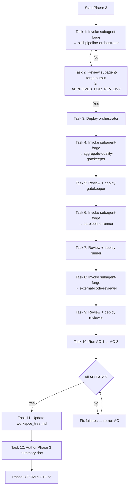
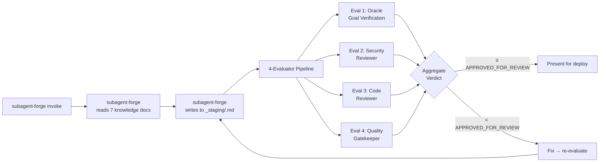

# Scope Document — Phase 3: Agent Foundation Build

**Date**: 2026-07-08
**Status**: Initial — Context Analysis Complete
**Language**: Tiếng Việt

---

## §1: Problem Summary

Phase 3 là phase thứ 4 trong lộ trình 8-phase Master Skill Suite Rebuild, với nhiệm vụ xây dựng **4 production agents** tại `.claude/agents/` bằng cách sử dụng `subagent-forge` làm reference pattern. Đây là infrastructure layer cho Phase 5-7.

**Vai trò của Phase 3 trong toàn lộ trình:**
- Cung cấp orchestrator cho skill build pipeline (Phase 5-7)
- Cung cấp external validator giải quyết architectural defect Γ-1 (self-referential blindness)
- Cung cấp BA pipeline runner tự động kích hoạt 3 BA skills (Phase 5)
- Cung cấp code reviewer độc lập (ground-truth cho Γ-1)

**Vấn đề cần giải quyết:**
- Hiện tại `.claude/agents/_staging/` trống (chỉ có `.gitkeep`)
- Chưa có agent orchestration cho pipeline build
- Chưa có external quality validator (Γ-1)
- Chưa có BA pipeline tự động

---

## §2: Entry Point

### 2.1 Entry Points Chính

| Entry Point | Path | Vai trò |
|:------------|:-----|:--------|
| Roadmap gốc | `Temps/spec/roadmaps/03-agent-foundation.md` (383 dòng) | Spec đầy đủ: deliverables, AC, tasks, DoD |
| Checklist tracking | `docs/context-to-work/roadmap-analysis-phases/plan-checklist.2026-07-07.md` §8 | Status + task list + AC tracking |
| Subagent-forge | `.claude/agents/subagent-forge.md` (292 dòng) | Công cụ tạo agent — đã deploy sẵn |
| Spec Architects P3 | `Temps/spec/architects/P3-drift-detector-and-plan-gate/` (5 files) | Design concept cho Drift Detection + Plan Gate (reference) |
| Knowledge base | `.claude/knowledge/agents/` (7 canonical docs) | Reference bắt buộc cho mọi agent |

### 2.2 Prerequisites Status

| Prerequisite | Status | Ghi chú |
|:-------------|:------:|:--------|
| Phase 0 — Foundation Bootstrap | ✅ done | 10/10 tasks, 8/8 AC, 9/9 DoD |
| Phase 1 — Knowledge Base Authoring | ✅ done | 10/10 tasks, 7/7 AC, 7 canonical docs |
| Phase 2 — Hook Framework Foundation | ✅ done | 9/9 tasks, 7/7 AC, 6 hook scripts |
| subagent-forge invokeable | ✅ sẵn sàng | Tồn tại tại `.claude/agents/subagent-forge.md` |
| 7 knowledge docs authored | ✅ sẵn sàng | Tại `.claude/knowledge/agents/` |
| subagent-forge references valid | ✅ | Không còn dangling paths |

---

## §3: Scope Definition

### 3.1 In Scope

```yaml
in_scope:
  deliverables:
    - "4 agent files tại .claude/agents/_staging/"
    - "4 evaluator reports tại .skill-context/_subagent-staging/<name>/eval-report.md"
    - "4 deployed agents tại .claude/agents/"
    - "Updated workspce_tree.md với 4 new entries"
    - "Phase 3 summary doc"
  
  agents_cần_build:
    - name: skill-pipeline-orchestrator
      model: opus
      role: "Orchestrate 8-stage skill build pipeline"
    
    - name: aggregate-quality-gatekeeper
      model: sonnet
      role: "External validator (Γ-1 fix) — META-1→3 scoring"
    
    - name: ba-pipeline-runner
      model: opus
      role: "Orchestrate 3 BA skills sequentially"
    
    - name: external-code-reviewer
      model: sonnet
      role: "Fresh-eyes reviewer (Γ-1 fix) — static analysis only"
  
  process:
    - "Invoke subagent-forge để design từng agent"
    - "Review subagent-forge output (≥ APPROVED_FOR_REVIEW)"
    - "Deploy agent từ staging sang runtime"
    - "Run full AC-1 → AC-8"
```

### 3.2 Out of Scope

```yaml
out_of_scope:
  - "Không build skills (Phase 5-7)"
  - "Không build hooks mới (Phase 2 đã xong)"
  - "Không modify knowledge docs (Phase 1 đã xong)"
  - "Không design chi tiết Drift Detection (đã có Temps/spec/architects/P3/)"
  - "Không chạy E2E pipeline test (Phase 8)"
```

### 3.3 Boundary

- **Workspace zone**: `.claude/agents/` (runtime) + `.claude/agents/_staging/` (staging)
- **State zone**: `.skill-context/_subagent-staging/` (eval reports)
- **Doc zone**: `docs/context-to-work/foundation-bootstrap/phase-3-summary.*.md`
- **GIỚI HẠN**: subagent-forge chỉ được write vào `_staging/` (enforced by hooks)

---

## §4: Impact Analysis

### 4.1 Direct Impact

| Component | Impact | Mức độ |
|:----------|:-------|:------:|
| `.claude/agents/` | +4 production agents deployed | 🔴 Cao |
| `.claude/agents/_staging/` | 4 staging files created | 🟡 Trung |
| `.skill-context/_subagent-staging/` | 4+ eval reports generated | 🟢 Thấp |
| `workspce_tree.md` | +4 entries (typo "workspce" giữ nguyên) | 🟢 Thấp |
| `.claude/agents/subagent-forge.md` | Sẽ được invoke 4 lần | 🟡 Trung |

### 4.2 Indirect Impact

| Component | Impact | Reason |
|:----------|:-------|:-------|
| **Phase 5 (BA Skills)** | Phụ thuộc agents để chạy pipeline | Phải chờ Phase 3 deploy runners |
| **Phase 6 (Main Pipeline)** | Phụ thuộc skill-pipeline-orchestrator | Không có orchestrator → không build skills |
| **Phase 8 (Integration)** | Phụ thuộc external-code-reviewer cho Γ-1 fix | Code review quality phụ thuộc agent |
| **Architecture defect Γ-1** | Được address bởi 2 agents | aggregate-quality-gatekeeper + external-code-reviewer |
| **Architecture defect Γ-7** | Được address bởi orchestrator | Block recursive spawn (max depth = 1) |

### 4.3 Architectural Defects Resolution

| Defect | Phase 3 Role | Agent giải quyết | Cơ chế |
|:-------|:-------------|:-----------------|:--------|
| Γ-1 Self-Referential Blindness | 🔴 Primary fix | `aggregate-quality-gatekeeper` + `external-code-reviewer` | External LLM validator không cùng context với builder |
| Γ-7 Escalation Recursion | 🟡 Partial fix | `skill-pipeline-orchestrator` | Hooks block recursive spawn, max depth = 1 |

---

## §5: Call Chain

### 5.1 Phase 3 Execution Flow (Build 4 Agents)



### 5.2 Subagent-forge Invocation Chain (per agent)



### 5.3 Agent Deployment Call Chain (Runtime)

```
[User request] → subagent-forge → _staging/<agent>.md
    → 4-evaluator PASS → user "deploy <name>" → .claude/agents/<agent>.md
    
[Runtime] → skill-pipeline-orchestrator invoked
    → invokes skill-explorer (Stage 0)
    → invokes skill-knowledge-miner (Stage 0.5)
    → invokes skill-architect (Stage 1)
    → invokes production-quality-gatekeeper (Stage 1.5)
    → invokes skill-planner (Stage 2)
    → invokes skill-builder (Stage 3)
    → invokes production-code-reviewer + skill-security-reviewer (Stage 3.5)
    → invokes sandbox-tester (Stage 4)
    → invokes indexer (Stage 5)
```

---

## §6: Data Flow

### 6.1 Input (Phase 3 Build Phase)

```
[Input từ roadmap 03-agent-foundation.md]
  ├── Agent specs (YAML frontmatter)
  ├── Workflow requirements (8 sections)
  ├── Hooks design (PreToolUse matchers)
  └── AC/DoD definitions

[Input từ subagent-forge]
  ├── 7 knowledge docs (.claude/knowledge/agents/)
  ├── Agent design template
  └── 4-evaluator pipeline

[Input từ knowledge base hiện có]
  ├── configuration.md — frontmatter schema (16 fields)
  ├── capability_controls.md — tool/MCP/skills scoping
  ├── examples.md — 4 reference patterns
  ├── hooks_and_events.md — hook protocol (Dual-Format)
  └── workflow_patterns.md — runtime workflows
```

### 6.2 Output (Phase 3 Artifacts)

| Artifact | Path | Format | Consumer |
|:---------|:-----|:-------|:---------|
| Staging files (4) | `.claude/agents/_staging/<name>.md` | Markdown + YAML | User review |
| Eval reports (4+) | `.skill-context/_subagent-staging/<name>/eval-report.md` | Markdown | User decision |
| Deployed agents (4) | `.claude/agents/<name>.md` | Markdown + YAML | Claude Code runtime |
| Updated routing map | `workspce_tree.md` | Markdown | Developer navigation |
| Phase 3 summary | `docs/context-to-work/foundation-bootstrap/phase-3-summary.*.md` | Markdown | Context archive |

### 6.3 Dependencies

```yaml
dependencies:
  requires_from_phase_0:
    - "Directory structure: .claude/agents/_staging/, _archive/"
    - "subagent-forge.md scaffold"
  
  requires_from_phase_1:
    - "7 canonical knowledge docs (configuration.md, capability_controls.md, examples.md, forks.md, hooks_and_events.md, workflow_patterns.md, xml_tags_standards.yaml)"
  
  requires_from_phase_2:
    - "PreToolUse hooks: write_gate, staging_gate"
  
  produces_for_phase_5:
    - "skill-pipeline-orchestrator — orchestrates skill build"
    - "ba-pipeline-runner — runs BA skills chain"
  
  produces_for_phase_6:
    - "skill-pipeline-orchestrator — orchestrates main pipeline"
    - "aggregate-quality-gatekeeper — external validator"
  
  produces_for_phase_7:
    - "skill-pipeline-orchestrator — orchestrates sandbox/indexer"
  
  produces_for_phase_8:
    - "external-code-reviewer — Γ-1 ground truth validator"
    - "aggregate-quality-gatekeeper — quality gate"
```

---

## §7: Affected Components

### 7.1 Files

| File | Action | Mức độ |
|:-----|:-------|:------:|
| `.claude/agents/subagent-forge.md` | Invoked 4 lần (read-only) | 🟢 Tidak berubah |
| `.claude/agents/_staging/skill-pipeline-orchestrator.md` | **CREATE** | 🔴 New file |
| `.claude/agents/_staging/aggregate-quality-gatekeeper.md` | **CREATE** | 🔴 New file |
| `.claude/agents/_staging/ba-pipeline-runner.md` | **CREATE** | 🔴 New file |
| `.claude/agents/_staging/external-code-reviewer.md` | **CREATE** | 🔴 New file |
| `.claude/agents/skill-pipeline-orchestrator.md` | **CREATE** (deploy) | 🔴 New file |
| `.claude/agents/aggregate-quality-gatekeeper.md` | **CREATE** (deploy) | 🔴 New file |
| `.claude/agents/ba-pipeline-runner.md` | **CREATE** (deploy) | 🔴 New file |
| `.claude/agents/external-code-reviewer.md` | **CREATE** (deploy) | 🔴 New file |
| `workspce_tree.md` | **UPDATE** +4 entries | 🟡 Modified |
| `.skill-context/_subagent-staging/<name>/eval-report.md` | **CREATE** (4 files) | 🟡 New artifacts |
| `docs/context-to-work/foundation-bootstrap/phase-3-summary.*.md` | **CREATE** | 🟢 Summary doc |

### 7.2 Functions/APIs

| Function/API | Component | Impact |
|:-------------|:----------|:-------|
| `subagent-forge` invoke (via Task) | Orchestrator, Gatekeeper, Runner, Reviewer | Được gọi 4 lần |
| `deploy` command (manual) | User action | Move staging → runtime |
| PreToolUse hooks (Phase 2) | write_gate, staging_gate | Gate agent writes |
| AC verification scripts | bash/python | 8 AC checks |

### 7.3 Knowledge Docs được Reference (bắt buộc ≥7 per agent)

| Doc | Agent tham chiếu |
|:----|:-----------------|
| `configuration.md` | Cả 4 agents (frontmatter schema) |
| `capability_controls.md` | Cả 4 agents (tool scoping) |
| `examples.md` | Cả 4 agents (reference patterns) |
| `forks.md` | Orchestrator, Runner (fork semantics) |
| `hooks_and_events.md` | Cả 4 agents (hook design) |
| `workflow_patterns.md` | Orchestrator, Runner (runtime patterns) |
| `xml_tags_standards.yaml` | Cả 4 agents (8-section prompt structure) |

---

## §8: Evidence

<evidence>
<file>/home/stveve/Documents/workspace/build-workflow/WASHVN/Temps/spec/roadmaps/03-agent-foundation.md</file>
<line>1-383</line>
<finding>Roadmap gốc Phase 3: 4 agents, 12 tasks, 8 AC, DoD, design principle, execution flow đầy đủ</finding>
</evidence>

<evidence>
<file>/home/stveve/Documents/workspace/build-workflow/docs/context-to-work/roadmap-analysis-phases/plan-checklist.2026-07-07.md</file>
<line>351-412</line>
<finding>Phase 3 tracking: status pending, 0/12 tasks, 0/8 AC, 4 agents xác định rõ</finding>
</evidence>

<evidence>
<file>/home/stveve/Documents/workspace/build-workflow/WASHVN/.claude/agents/subagent-forge.md</file>
<line>1-60</line>
<finding>subagent-forge đã sẵn sàng: PreToolUse hooks gate staging writes, 4-evaluator pipeline, skills: [skill-security-reviewer]</finding>
</evidence>

<evidence>
<file>/home/stveve/Documents/workspace/build-workflow/WASHVN/.claude/agents/_staging/</file>
<line>1</line>
<finding>Staging directory trống (chỉ .gitkeep) — chưa có agent nào được tạo</finding>
</evidence>

<evidence>
<file>/home/stveve/Documents/workspace/build-workflow/WASHVN/.claude/knowledge/agents/README.md</file>
<line>19-29</line>
<finding>7 canonical knowledge docs sẵn sàng: configuration.md (273), capability_controls.md (356), examples.md (302), forks.md (296), hooks_and_events.md (547), workflow_patterns.md (408), xml_tags_standards.yaml (420)</finding>
</evidence>

<evidence>
<file>/home/stveve/Documents/workspace/build-workflow/WASHVN/Temps/spec/architects/P3-drift-detector-and-plan-gate/README.md</file>
<line>1-26</line>
<finding>Spec Architects P3 (Drift Detector + Plan Gate) cung cấp design reference cho external-code-reviewer và quality gatekeeper — khác với roadmap Phase 3 Agent Build</finding>
</evidence>

<evidence>
<file>/home/stveve/Documents/workspace/build-workflow/WASHVN/Temps/spec/architects/shared/architecture-overview.md</file>
<line>7-14</line>
<finding>5-Layer Pipeline: L0 (Intake) → L1 (Knowledge) → L2 (Design) → L3 (Planing & Verification) → L4 (Implementation). Phase 3 agents nằm ở L3-L4</finding>
</evidence>

<evidence>
<file>/home/stveve/Documents/workspace/build-workflow/WASHVN/Temps/spec/roadmaps/03-agent-foundation.md</file>
<line>22-28</line>
<finding>Prerequisites list: Phase 0,1,2 done; subagent-forge invokeable; 7 knowledge docs; non-dangling paths — tất cả đã satisfied</finding>
</evidence>

<evidence>
<file>/home/stveve/Documents/workspace/build-workflow/WASHVN/Temps/spec/roadmaps/03-agent-foundation.md</file>
<line>83-104</line>
<finding>skill-pipeline-orchestrator spec: 8-section system prompt, hooks block recursive spawn + write outside _staging/, 8-stage pipeline orchestration</finding>
</evidence>

<evidence>
<file>/home/stveve/Documents/workspace/build-workflow/WASHVN/Temps/spec/roadmaps/03-agent-foundation.md</file>
<line>106-148</line>
<finding>aggregate-quality-gatekeeper spec: sonnet model, META-1→3 scoring, external validator (Γ-1 fix), chỉ write .skill-context/</finding>
</evidence>

<evidence>
<file>/home/stveve/Documents/workspace/build-workflow/WASHVN/Temps/spec/roadmaps/03-agent-foundation.md</file>
<line>150-188</line>
<finding>ba-pipeline-runner spec: opus model, 3 BA skills (elicitor → analyst → synthesizer), block recursive spawn, chỉ write ba-* dirs</finding>
</evidence>

<evidence>
<file>/home/stveve/Documents/workspace/build-workflow/WASHVN/Temps/spec/roadmaps/03-agent-foundation.md</file>
<line>190-236</line>
<finding>external-code-reviewer spec: Γ-1 ground truth, sonnet model, static analysis only (pyflakes/eslint), NOT biết design.md context</finding>
</evidence>

<evidence>
<file>/home/stveve/Documents/workspace/build-workflow/WASHVN/Temps/spec/roadmaps/03-agent-foundation.md</file>
<line>240-329</line>
<finding>AC-1 đến AC-8 verification scripts: test -f, YAML parse, grep knowledge refs, grep exit 2, subagent-forge 4-evaluator, grep output_contract, skills check, bypassPermissions ban</finding>
</evidence>

<evidence>
<file>/home/stveve/Documents/workspace/build-workflow/docs/context-to-work/roadmap-analysis-phases/plan-checklist.2026-07-07.md</file>
<line>961-973</line>
<finding>Defects tracker: Γ-1 pending (Phase 3 address), Γ-7 pending (Phase 3 address via orchestrator hooks)</finding>
</evidence>

<evidence>
<file>/home/stveve/Documents/workspace/build-workflow/docs/context-to-work/roadmap-analysis-phases/plan-checklist.2026-07-07.md</file>
<line>1093-1098</line>
<finding>Uncertainty flags: AC-5 Phase 3 (subagent-forge 4-evaluator) đánh dấu NEEDED_MANUAL — cần invoke thực tế</finding>
</evidence>

---

## §9: Confidence Assessment

```yaml
overall_confidence: 88%

breakdown:
  roadmap_understanding: 95%
    - "03-agent-foundation.md spec rõ ràng, đầy đủ 383 dòng"
    - "plan-checklist.md tracking chi tiết 12 tasks + 8 AC"
  
  prerequisites_verification: 95%
    - "Phase 0,1,2 đều done (verified từ checklist)"
    - "subagent-forge sẵn sàng (verified từ file content)"
    - "7 knowledge docs sẵn sàng (verified từ directory listing)"
  
  agent_design_understanding: 90%
    - "4 agents có spec rõ ràng trong roadmap"
    - "hooks design, tools, model specs documented"
    - "Cần xác nhận: 8-section prompt structure chi tiết chưa được viết (subagent-forge sẽ sinh)"
  
  architectural_impact: 85%
    - "Γ-1 address chính xác bằng external validator"
    - "Γ-7 address bằng block recursion hooks"
    - "AC-5 (subagent-forge 4-evaluator) chưa rõ automation level"
  
  evidence_verification: 88%
    - "Tất cả evidence traced đến file:line cụ thể"
    - "Staging trống đã verify trực tiếp"
    - "subagent-forge hooks đã verify"

uncertainty_flags:
  - "AC-5: subagent-forge 4-evaluator cần invoke thực tế — không thể verify passive"
  - "Agent design details (8-section prompts) sẽ do subagent-forge sinh — chưa thể pre-verify"
  - "Skill dependencies (ba-elicitor, ba-analyst, ba-synthesizer) chưa build — AC-7 sẽ WARNING"
  - "Hook interaction: Phase 2 hooks (write_gate, staging_gate) + agent inline hooks — cần test integration"
```

---

## §10: Open Questions

| # | Question | Priority | Liên quan | Status |
|:--|:---------|:--------:|:----------|:------:|
| 1 | AC-5 subagent-forge 4-evaluator: automate hay manual invoke? | 🔴 Cao | AC-5 | Open (manual tại Phase 3, P8 automate) |
| 2 | Skill dependencies reference (ba-*, production-*) chưa build: AC-7 PASS hay WARNING? | 🟡 Trung | AC-7 | Roadmap cho phép WARNING |
| 3 | Deploy command: cần script tự động move staging→runtime hay manual `mv`? | 🟡 Trung | Task 3,5,7,9 | Open |
| 4 | Hook interaction test: Phase 2 hooks (workspace gate) + agent inline hooks có conflict? | 🟡 Trung | Integration | Open |
| 5 | `workspce_tree.md` typo "workspce": giữ nguyên hay fix? | 🟢 Thấp | Task 11 | Giữ nguyên per roadmap |
| 6 | Phase 3 summary doc path: `foundation-bootstrap/` (như plan-checklist) hay `roadmap-analysis-phases/`? | 🟢 Thấp | Task 12 | Roadmap ghi `foundation-bootstrap/` |
| 7 | external-code-reviewer: có cần Codex CLI integration cho cross-model review không? | 🟢 Thấp | D3-4 | Roadmap đề xuất nhưng optional |

---

## §11: Task Priority Order (Khuyến nghị)

Dựa trên dependency graph và spec analysis, thứ tự build khuyến nghị:

```yaml
build_order:
  priority_1: "skill-pipeline-orchestrator"
    reason: "Core orchestrator — các agent khác không phụ thuộc nhưng nó là backbone"
    estimated_effort: "1 session (vì phức tạp 8-stage orchestration)"
  
  priority_2: "aggregate-quality-gatekeeper"
    reason: "External validator (Γ-1 fix) — cần cho quality check"
    estimated_effort: "0.5 session"
  
  priority_3: "ba-pipeline-runner"
    reason: "BA chain runner — phụ thuộc Phase 5 skills nhưng agent cần sẵn"
    estimated_effort: "0.5 session"
  
  priority_4: "external-code-reviewer"
    reason: "Γ-1 ground truth — static analysis only, design đơn giản nhất"
    estimated_effort: "0.5 session"
  
  finalization:
    - "Task 10: Run AC-1 → AC-8 (full verification)"
    - "Task 11: Update workspce_tree.md"
    - "Task 12: Author Phase 3 summary doc"
```

**Tổng effort ước tính: 2-3 sessions** (phù hợp roadmap prediction)

---

## §12: Agent Design Comparison Matrix

| Aspect | skill-pipeline-orchestrator | aggregate-quality-gatekeeper | ba-pipeline-runner | external-code-reviewer |
|:-------|:---------------------------:|:----------------------------:|:------------------:|:----------------------:|
| **Model** | opus | sonnet | opus | sonnet |
| **Tools** | Read, Write, Glob, Grep, Task, TodoWrite | Read, Glob, Grep, Task | Read, Task, Write | Read, Bash, Grep, Glob |
| **Permission** | default | default | default | default |
| **Skills dep** | [] (Phase 5-7) | [production-quality-gatekeeper] (P6) | [ba-*] (Phase 5) | [production-code-reviewer] (P6) |
| **Write zone** | _staging/, .skill-context/, roadmaps/, docs/ | .skill-context/ | .skill-context/{feature}/ba-* | review reports only |
| **Block recursion** | ✅ subagent_type check | N/A | ✅ subagent_type check | N/A |
| **Block code exec** | ❌ (orchestrate only) | ❌ (read-only) | ❌ (orchestrate only) | ✅ (static analysis only) |
| **Γ-1 fix** | ❌ | ✅ External validator | ❌ | ✅ Fresh-eyes reviewer |
| **Γ-7 fix** | ✅ Max depth = 1 | ❌ | ✅ Max depth = 1 | ❌ |

---

## §13: Risk Assessment

| Risk | Severity | Likelihood | Mitigation |
|:-----|:--------:|:----------:|:-----------|
| subagent-forge 4-evaluator FAIL cho 1+ agents | 🔴 Cao | 🟡 Medium | Iterate design với subagent-forge cho đến APPROVED |
| Hook conflict: Phase 2 staging_gate blocks agent deploy | 🟡 Trung | 🟢 Low | Deploy command bypass staging_gate (user action) |
| AC-7 (skills reference) WARNING misinterpreted as FAIL | 🟢 Thấp | 🟡 Medium | Roadmap cho phép WARNING cho Phase 5/6 skills |
| Knowledge docs reference count < 7 per agent | 🟡 Trung | 🟢 Low | AC-3 grep sẽ detect, subagent-forge đảm bảo ≥7 |
| bypassPermissions accidentally included | 🔴 Cao | 🟢 Low | AC-8 grep fail — subagent-forge không generate |
| Time estimate: 2-3 sessions không đủ | 🟡 Trung | 🟡 Medium | Prioritize orchestrator + gatekeeper trước |

---

**Document Status**: Context Complete — No Code Changes Made

```
✓ Entry point identified (03-agent-foundation.md, plan-checklist.md)
✓ Prerequisites verified (Phase 0,1,2 all done)
✓ Scope defined (4 agents, 12 tasks, 8 AC)
✓ Impact analysis (direct + indirect + defects)
✓ Call chain (build flow + subagent-forge flow + runtime flow)
✓ Data flow (inputs, outputs, dependencies)
✓ Affected components (files, functions, knowledge docs)
✓ Evidence traced to specific files/lines (17 evidence blocks)
✓ Confidence assessment (88% overall)
✓ Open questions documented (7 items)
✓ Build order recommended
✓ Agent comparison matrix
✓ Risk assessment
```

---

**Document**: `docs/context-to-work/roadmap-analysis-phases/phase-3-context.2026-07-08.md`
**Generated by**: context-before-fix v1.0.0
**Language**: Vietnamese
**NO Code Changes Made** — Document only per skill guardrails
