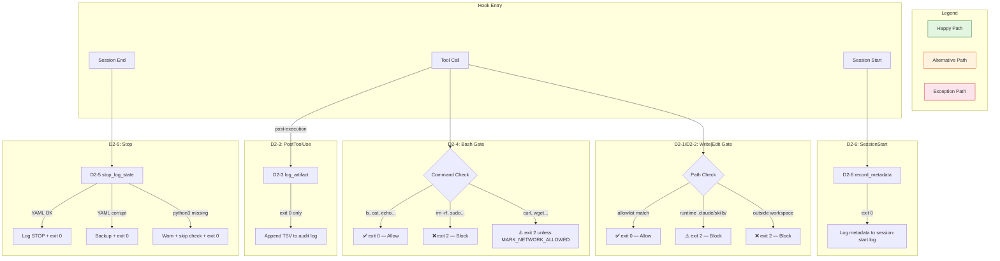

# Business Analysis: Hook Framework Foundation (Phase 2)

**Ngày phân tích**: 2026-07-07
**Persona thực hiện**: BA Elicitor → BA Analyst → BA Synthesizer (WASHVN BA Suite)
**Trạng thái đồng bộ**: elicitation-completed → analysis-completed → synthesis-completed
**Mức độ tin cậy tổng thể**: 88%

---

## Phần I: BA ELICITOR — Khơi gợi & Chuẩn hóa Yêu cầu Nghiệp vụ

> Phương pháp: Normalization → Gap Analysis → 5W1H → Report Generation
> Tuân thủ: [elicitation-rules], [normalization-logic], [mindset-keywords]

---

### 1.1 Normalization — Chuẩn hóa đầu vào thô

#### 1.1.1 Bối cảnh — Nghiệp vụ gì?

Dự án **WASHVN Master Skill Suite** đang ở Phase 2 (Phase 0 + 1 đã done). Phase 2 xây dựng **Hook Framework** — hệ thống chốt chặn cơ học (mechanical gating) tại các sự kiện trong vòng đời Claude Code session. Đây là **trụ cột thứ ba** của hệ thống: Skills (nội dung) + Agents (thực thi) + Hooks (chốt chặn bảo vệ).

#### 1.1.2 Đầu vào đã chuẩn hóa

| Nguồn | Loại tài liệu | Dòng | Mức độ cấu trúc | Trạng thái |
|:------|:--------------|:----:|:----------------:|:----------:|
| phase-2-scope.2026-07-07.md | Scope Analysis | ~1273+ | Rất cao (21 sections) | Context Complete |
| advanced-hooks-capability.2026-07-07.md | Technical Research | 145 | Cao (6 sections) | Research Complete |
| phase-2-plan.2026-07-07.md | Implementation Plan | 284 | Cao (7 sections) | Plan Complete |

[TỪ INPUT] Cả 3 tài liệu đều có cấu trúc tốt, không phải yêu cầu thô. Nhiệm vụ BA là **hợp nhất và kiểm định chéo** để phát hiện mâu thuẫn, thiếu nhất quán, và định hình bức tranh nghiệp vụ tổng thể.

#### 1.1.3 Mục tiêu nghiệp vụ cốt lõi

```yaml
domain: "Hook Framework Foundation"
phase: "Phase 2 (8-Phase Roadmap)"
pillar: "Third pillar — Skills + Agents + Hooks"
mission:
  - "Xây dựng standalone hook framework tại .claude/hooks/"
  - "Chuyển từ inline hooks (subagent-forge.md) sang registry-based hooks"
  - "Address architectural defects Γ-7 (escalation recursion) và Γ-1 (self-referential blindness)"

scope_boundary:
  in_scope: "6 hook scripts + 1 registry + 7 tests + 1 prompt experiment + 1 eval report"
  out_of_scope: "Không build skill/agent/schema, không modify knowledge docs, không deploy runtime"
  constraint: "Scripts < 50 dòng, < 100ms, bash/sh/jq, hạn chế Python"

downstream_dependency:
  - "Phase 3 — Agents (hooks active trước agents build)"
  - "Phase 5 — BA Skills (hooks gate skill writes)"
  - "Phase 6 — Main Pipeline (hooks protect .skill-context/)"
  - "Phase 8 — Integration (format gap reconcile + external validator)"
```

---

### 1.2 Gap Analysis — Phân tích khoảng trống

#### 1.2.1 Ma trận bao phủ nội dung

| Chủ đề | Scope Doc | Research Doc | Plan Doc | Gap? |
|:-------|:---------:|:------------:|:--------:|:----:|
| 6 hook scripts spec | ✅ §3, §5 | ❌ | ✅ §3, §4 | Không |
| Registry YAML | ✅ §5.1 | ❌ | ✅ §4 | Không |
| 7 test scripts | ✅ §5.2 | ❌ | ✅ §4 | Không |
| Format gap (A vs B) | ✅ §6, §19 | ❌ | ✅ §2 | Không |
| Call chain / lifecycle | ✅ §7 | ❌ | ✅ §2 | Không |
| Data flow (stdin JSON) | ✅ §8 | ❌ | ✅ §3 | Không |
| Prompt-based hooks | ✅ §22 (D2-9) | ✅ §2, §5 | ✅ §4 Stage 5 | Không |
| Agent-based hooks | ✅ §22.2 (P8 deferred) | ✅ §3 | ❌ (defer P8) | Không |
| YAML Resilience Layer | ✅ §23 | ❌ | ❌ | ⚠️ Plan thiếu cross-ref |
| Quality Gates cross-cutting | ✅ §22 | ❌ | ❌ | ⚠️ Plan thiếu cross-ref |
| Graceful degradation | ✅ §23.3 | ❌ | ⚠️ §6 (python fallback) | ⚠️ Chỉ đề cập 1 case |
| Claude Code official docs | ✅ §19 | ✅ §2-3 | ❌ | [CẦN LÀM RÕ] |
| Phase 0 scaffolding | ✅ §21 | ❌ | ✅ (implied) | Không |

#### 1.2.2 Khoảng trống phát hiện [GAP-1 → GAP-5]

> [SUY LUẬN] Các gap dưới đây cần được giải quyết trước khi chuyển sang implementation.

**GAP-1: Plan document không tham chiếu YAML Resilience Layer và Quality Gates**
- Scope §22-23 đã map HOOK-HEAL-1.0, HOOK-AUDIT-2.0, YAML-RES-1.0 vào Phase 2 deliverables
- Plan Stage 5 (Advanced Hooks Research) không đề cập quality gates mapping
- **Ảnh hưởng**: D2-9 experiment có thể thiếu context về quality criteria cần đạt
- **Đề xuất**: Plan cần bổ sung quality gates acceptance criteria cho D2-9/10

**GAP-2: Graceful degradation chỉ được đề cập cho 1 kịch bản (python3 unavailable)**
- Scope §23.3 chỉ ra nhiều kịch bản degraded khác (jq fail, _state.yaml corrupt, YAML parse error)
- Plan §6 chỉ đề cập graceful degradation cho D2-5 python fallback
- [CẦN LÀM RÕ]: Cần graceful degradation policy cho mọi hook script

**GAP-3: Agent-based hook (HOOK-AUDIT-2.0) hoàn toàn không có trong Phase 2 scope**
- Research doc §3 đặc tả agent hooks với Stop event test execution
- Scope §22.2 ghi "Future Phase 8 integration" nhưng không có feasibility assessment
- [SUY LUẬN]: Phase 2 nên đánh giá sơ bộ feasibility của agent hooks để Phase 8 có căn cứ

**GAP-4: settings.local.json integration path không rõ ràng**
- Plan Stage 5 ghi "cấu hình settings.local.json" nhưng không spec format
- Scope không có section về settings.json structure
- Scope §19 có official settings.json format nhưng không map vào Plan
- [CẦN LÀM RÕ]: Cần example cụ thể settings.local.json cho D2-9

**GAP-5: Không có metric để đo "success" của Prompt Hook Experiment (D2-9)**
- Research §6 đề xuất "đánh giá độ trễ" nhưng không có threshold cụ thể
- Plan Stage 5 task: "Đánh giá độ trễ Haiku vs Sonnet" — không có latency budget
- [CẦN LÀM RÕ]: Cần lượng hóa: latency threshold (s), accuracy threshold (%), false positive rate

---

### 1.3 5W1H Questioning — Đặt câu hỏi phản biện

| W/H | Câu hỏi | Trả lời từ tài liệu | Mức tự tin |
|:----|:--------|:--------------------|:-----------|
| **What** | Nghiệp vụ cần xây dựng là gì? | **Standalone Hook Framework**: 6 event-driven shell scripts + registry + 7 tests + 1 prompt experiment | 95% |
| **Why** | Tại sao cần? | Chốt chặn cơ học (thay vì self-discipline LLM). Address Γ-7, Γ-1. Third pillar của hệ thống | 95% |
| **Who** | Ai dùng? Ai bị ảnh hưởng? | Claude Code runtime (primary consumer). Subagent-forge (inline hook overlap). Developers (Phase 3-8) | 90% |
| **Where** | Phạm vi deployment? | `.claude/hooks/events/` (scripts) + `.claude/hooks/registry.yaml` (registry) + `.claude/hooks/tests/` (tests) + `.claude/settings.local.json` (prompt experiment) | 100% |
| **When** | Thời điểm kích hoạt? | SessionStart → PreToolUse (Write\|Edit\|Bash) → PostToolUse (Write\|Edit) → Stop. Mỗi tool call synchronous | 95% |
| **How** | Cơ chế hoạt động? | stdin JSON → bash+jq parse → exit 0 (allow) / exit 2 (block) với stderr. Format B (exit 2). Chạy <100ms, <50 dòng | 90% |
| **How much** | Chi phí? | ~260 dòng code, 16 files, 1-2 sessions implementation, ~0 token overhead (local bash) | 85% |

#### [CẦN LÀM RÕ] — Câu hỏi chưa được trả lời đầy đủ

1. **Exit code 1 behavior?** — Official docs nói exit 1 = non-blocking error (tool call vẫn proceed). Các Phase 2 scripts có handle case này không? [SUY LUẬN: Hiện tại scripts chỉ dùng 0 và 2 — cần doc policy cho 1]

2. **Settings.json nào sẽ active các hook scripts?** — Scope §19.8 chỉ ra nhiều locations (project, user, managed policy). Plan không chỉ rõ settings file nào sẽ load các scripts cho Phase 2 testing.

3. **Làm sao verify hook hoạt động nếu chưa deploy vào settings.json?** — Phase 2 không deploy vào runtime settings (out of scope). Vậy AC-1→AC-7 verify bằng cách nào? [SUY LUẬN: Bằng test scripts — chạy tay, pipe JSON mock]

4. **subagent-forge.md inline hooks có conflict không?** — Scope ghi "cả 2 cùng hoạt động" nhưng không test actual behavior.

---

### 1.4 Elicitation Report Summary

```yaml
elicitation_status: "completed"
confidence: 88%
gaps_identified: 5  # GAP-1 → GAP-5
clarifications_needed: 4  # CẦN LÀM RÕ items
total_input_sources: 3
total_lines_analyzed: ~1700
```

---

## Phần II: BA ANALYST — Phân loại & Đặc tả Kỹ thuật

> Phương pháp: FR/NFR Classification → MoSCoW → Mermaid Flow → Gherkin → Risk Assessment
> Tuân thủ: [classification-rules], [mermaid-syntax], [gherkin-guide], [risk-assessment]

---

### 2.1 Phân loại FR (Functional Requirements) & NFR (Non-Functional Requirements)

#### 2.1.1 Functional Requirements (FR)

| ID | Yêu cầu | Mô tả | Deliverable | Nguồn |
|:--:|:--------|:------|:------------|:------|
| FR-01 | Write Gate | Block file writes outside WASHVN workspace allowlist | D2-1 | Scope §5.1 |
| FR-02 | Skill Staging Gate | Block writes to runtime `.claude/skills/`, allow `_staging/` only | D2-2 | Scope §5.1 |
| FR-03 | Bash Validation | Block destructive commands (rm -rf, sudo, dd) và network (unless allowed) | D2-4 | Scope §5.1 |
| FR-04 | Artifact Audit Log | TSV log mọi Write/Edit sau khi tool chạy thành công | D2-3 | Scope §5.1 |
| FR-05 | Session Stop Log | Log session end + backup corrupt _state.yaml (Γ-7) | D2-5 | Scope §5.1 |
| FR-06 | Session Start Metadata | Log boot metadata (cwd, pid, boot_id, session_id) | D2-6 | Scope §5.1 |
| FR-07 | Registry | YAML registry đầy đủ 6 hook entries | D2-7 | Scope §5.1 |
| FR-08 | Unit Tests | 7 test scripts (allow/block pairs cho 3 gating hooks) | D2-8 | Scope §5.2 |
| FR-09 | Prompt Hook Experiment | LLM-based self-healing trên Stop event với `continueOnBlock: true` | D2-9 | Scope §22, Research §5 |
| FR-10 | Advanced Hook Eval Report | Feasibility assessment: prompt vs agent hooks | D2-10 | Scope §5.1, Plan §4 |

#### 2.1.2 Non-Functional Requirements (NFR)

| ID | Yêu cầu | Mô tả | Metric | Nguồn |
|:--:|:--------|:------|:-------|:------|
| NFR-01 | Performance | Hook execution không gây latency noticeable | < 100ms per hook | Scope §3.3 |
| NFR-02 | Script size | Script dễ maintain, không quá dài | < 50 dòng code | Scope §3.3 |
| NFR-03 | Determinism | Hook behavior phải consistent, không phụ thuộc LLM | Exit code 0/2 deterministic | Scope §5.1 |
| NFR-04 | Graceful degradation | Khi resource không available, hook vẫn fail-open safely | python3 fallback → warn + skip | Scope §23.3, Plan §6 |
| NFR-05 | Auditability | Mọi gating decision phải được log | TSV audit trail per session | Scope §8.2 |
| NFR-06 | Language constraint | Tiết kiệm dependency, ưu tiên bash | bash/sh/jq (Python exception-only) | Scope §3.3 |
| NFR-07 | Compatibility | Tương thích Format B (exit 2) | exit 0 = allow, exit 2 = block, other = non-blocking | Scope §6, §19.5 |
| NFR-08 | Isolation | Hook không spawn subprocess, không write file (trừ audit) | Hook script không dùng `task()`, `Read`, `Write` | Scope §3.3 |

---

### 2.2 MoSCoW Prioritization

#### Must Have (Critical Path)

```
[FR-01] Write Gate           — Must: foundational gate, protect workspace
[FR-02] Skill Staging Gate   — Must: prevent runtime corruption
[FR-03] Bash Validation      — Must: block destructive commands (security)
[FR-07] Registry             — Must: single source of truth for hook config
[FR-08] Unit Tests (7 tests) — Must: verify allow/block behavior
[NFR-01] Performance <100ms  — Must: synchronous hook không thể chậm
[NFR-03] Determinism         — Must: purpose of Layer 1 command hooks
```

#### Should Have (Important but flexible)

```
[FR-04] Artifact Audit Log   — Should: non-blocking (exit 0 only), pure observability
[FR-05] Session Stop Log     — Should: Γ-7 fix critical nhưng non-blocking
[FR-06] Session Start Metadata — Should: nice-to-have observability
[NFR-04] Graceful degradation — Should: important nhưng chỉ 1-2 scenarios
[NFR-05] Auditability        — Should: TSV log format có thể đơn giản
```

#### Could Have (Experimental / Research)

```
[FR-09] Prompt Hook Experiment — Could: D2-9 không block Phase 2 core delivery
[FR-10] Advanced Hook Eval Report — Could: D2-10 research output, no code
[NFR-08] Isolation — Could: constraint quan trọng nhưng khó verify
```

#### Won't Have (Deferred)

```
Agent-based hooks (HOOK-AUDIT-2.0) — Won't: defer to Phase 8
Format A reconcile (stdout JSON)    — Won't: defer to Phase 8
External validator hook             — Won't: Phase 8
Settings.json deployment            — Won't: Phase 8 integration
```

---

### 2.3 Sơ đồ Luồng Nghiệp vụ (Mermaid Flowchart)

<details>
<summary>3-Path Flowchart: Happy / Alternative / Exception</summary>



</details>

---

### 2.4 Kịch bản Gherkin (Given-When-Then)

#### Kịch bản 1: Write Gate — Allow write trong workspace

```gherkin
Feature: Write Gate (D2-1)
  Scenario: Agent writes file trong allowlist path
    Given hook pre-tool-use_write_gate.sh được kích hoạt bởi PreToolUse(Write)
    And tool_input.file_path là "raw/ver-3/skill-architect/SKILL.md"
    When script parse stdin JSON và kiểm tra path
    Then script trả về exit 0
    And tool call được cho phép thực thi
```

#### Kịch bản 2: Write Gate — Block write ngoài workspace

```gherkin
Feature: Write Gate (D2-1)
  Scenario: Agent tries to write outside workspace
    Given hook pre-tool-use_write_gate.sh được kích hoạt bởi PreToolUse(Write)
    And tool_input.file_path là "/tmp/test.txt"
    When script parse stdin JSON và kiểm tra path
    Then script trả về exit 2
    And thông báo lỗi ghi ra stderr: "Blocked: path outside WASHVN workspace"
    And tool call bị chặn
```

#### Kịch bản 3: Bash Validation — Block destructive command

```gherkin
Feature: Bash Validation (D2-4)
  Scenario: Agent tries to execute rm -rf
    Given hook pre-tool-use_bash_validate_command.sh được kích hoạt bởi PreToolUse(Bash)
    And tool_input.command là "rm -rf /home/stveve/Documents"
    When script parse stdin và phát hiện pattern "rm -rf"
    Then script trả về exit 2
    And thông báo lỗi: "Blocked: destructive command pattern detected"
    And tool call bị chặn
```

#### Kịch bản 4: Stop Hook — Corrupt state detection (Γ-7)

```gherkin
Feature: Stop Hook (D2-5)
  Scenario: _state.yaml bị corrupt và được backup
    Given hook stop_session_log_state.sh được kích hoạt bởi Stop event
    And _state.yaml không parse được bằng pyyaml
    When script phát hiện YAML corrupt
    Then script copy _state.yaml thành _state-{timestamp}-corrupt.yaml trong _state-archive/
    And log cảnh báo vào session log
    And script trả về exit 0 (không block stop)
```

---

### 2.5 Data Schema (Input/Output Contract)

#### Hook Script Input (stdin JSON)

```json
{
  "session_id": "string (UUID)",
  "cwd": "string (absolute path to project root)",
  "permission_mode": "string (default | acceptEdits | bypassPermissions)",
  "hook_event_name": "string (PreToolUse | PostToolUse | Stop | SessionStart)",
  "tool_name": "string (Write | Edit | Bash | Read | Glob | Grep | ...)",
  "tool_input": {
    "file_path": "string? (đường dẫn file cho Write/Edit)",
    "content": "string? (nội dung file cho Write)",
    "command": "string? (câu lệnh cho Bash)",
    "old_string": "string? (cho Edit)",
    "new_string": "string? (cho Edit)"
  }
}
```

#### Hook Script Output Contract

| Exit Code | Ý nghĩa | JSON processed? | Tool call được thực thi? |
|:---------:|:--------|:---------------:|:------------------------:|
| 0 | Allow | ✅ Yes (stdout JSON) | ✅ Yes |
| 2 | Block | ❌ No (stdout ignored) | ❌ No |
| 1 | Non-blocking error | ❌ No | ✅ Yes (chỉ log) |
| other | Unknown | ❌ No | ✅ Yes (fail open) |

#### Audit Log Format (TSV)

```
# D2-3: tool-audit-{YYYY-MM-DD}.log
<timestamp>\t<tool>\t<pid>\t<agent>\t<path>

# D2-5: session-{YYYY-MM-DD}.log
<timestamp>\tSTOP\tstop_hook_active=<bool>

# D2-6: session-start.log
<timestamp>\tSTART\tsession=<id>\tpid=<num>\tboot=<id>\tcwd=<path>
```

#### Allowlist Schema (Write Gate)

```yaml
allowed_prefixes:
  - ".claude/"
  - "raw/ver-3/"
  - ".skill-context/"
  - "docs/context-to-work/"
  - "Temps/spec/"

blocked_patterns:
  - ".claude/skills/<any>/"     # Block runtime skill directory
  - "/tmp/"
  - "/etc/"
```

---

### 2.6 Đánh giá Rủi ro (Risk Matrix)

| Risk ID | Mô tả | Probability | Impact | RPN (P×I) | Mitigation | Residual |
|:--------|:------|:-----------:|:------:|:----------:|:-----------|:--------:|
| R-01 | Hook script chậm >100ms | 2 (Low) | 3 (Med) | **6** | Giới hạn <50 dòng, bash+jq, không spawn subprocess | Low |
| R-02 | Format A vs B conflict khi chain hooks | 3 (Med) | 4 (High) | **12** | Phase 2 dùng Format B thuần, note format gap, Phase 8 reconcile | Med |
| R-03 | Allowlist regex block nhầm legitimate writes | 3 (Med) | 4 (High) | **12** | Test kỹ allow cases, regex precise, granular allowlist | Med |
| R-04 | jq không available trên PATH | 2 (Low) | 4 (High) | **8** | Fallback python3 -c "import json" hoặc grep-based parse | Low |
| R-05 | python3/pyyaml không available | 2 (Low) | 3 (Med) | **6** | Graceful degradation: warn + skip corrupt check | Low |
| R-06 | Claude Code runtime không tôn trọng registry.yaml | 3 (Med) | 4 (High) | **12** | Registry là WASHVN convention, cần bridge settings.json Phase 8 | Med |
| R-07 | Prompt hook experiment latency >30s | 4 (High) | 2 (Low) | **8** | Dùng Haiku (fast model), chỉ dùng Stop event (không ảnh hưởng PreToolUse) | Low |
| R-08 | Inline hooks (subagent-forge) ↔ standalone hooks conflict | 2 (Low) | 3 (Med) | **6** | Verify cả 2 layer hoạt động độc lập. AC-7 test | Low |
| R-09 | Corrupt YAML detection false positive | 2 (Low) | 2 (Low) | **4** | Dùng pyyaml chính thống, skip nếu python3 unavailable | Very Low |
| R-10 | Hook script lỗi syntax không được phát hiện cho đến runtime | 3 (Med) | 3 (Med) | **9** | chạy shellcheck, test scripts phát hiện syntax error trước | Med |

> **RPN Threshold**: >10 = Critical (cần mitigation bổ sung), 6-10 = Monitor, <6 = Accept

---

## Phần III: BA SYNTHESIZER — Hợp nhất & Kiểm định chéo

> Phương pháp: Cross-reference → Quality Scoring → Synthesis Report
> Tuân thủ: [cross-ref-rules], [quality-criteria], [quality-matrix]

---

### 3.1 Kiểm định chéo (Cross-Reference Verification)

#### 3.1.1 Ma trận nhất quán giữa 3 tài liệu

| Chủ đề | Scope | Research | Plan | Nhất quán? |
|:-------|:------|:---------|:-----|:-----------|
| 6 hook scripts định nghĩa | ✅ §5.1 | ❌ | ✅ §3,4 | ✅ Nhất quán |
| Format B (exit 2) | ✅ §6, §19.5 | ✅ §2.3 | ✅ §2 | ✅ Nhất quán |
| 7 test scripts | ✅ §5.2 | ❌ | ✅ §4 | ✅ Nhất quán |
| Prompt hook experiment (D2-9) | ✅ §22.1 | ✅ §5, §6 | ✅ Stage 5 | ✅ Nhất quán |
| Agent hooks (HOOK-AUDIT-2.0) | ✅ §22.2 (P8) | ✅ §3 (P2 research) | ❌ | ⚠️ Cảnh báo |
| Two-Layer Design Principle | ✅ §24.1 | ✅ §2 | ⚠️ implicit | ⚠️ Plan không nói rõ |
| Γ-7 corrupt state backup | ✅ §14.2 | ❌ | ✅ §4 | ✅ Nhất quán |
| Graceful degradation policy | ✅ §23.3 | ❌ | ⚠️ §6 limited | ⚠️ Scope đầy đủ, Plan limited |
| settings.json structure | ✅ §19.8 | ⚠️ §2.1 example | ⚠️ Stage 5 implicit | ⚠️ Thiếu mapping rõ |
| Quality Gates (HOOK-HEAL, etc.) | ✅ §22 | ❌ | ❌ | ⚠️ Scope có, Plan không |

#### 3.1.2 [MAU THUẪN NGHIỆP VỤ] cảnh báo

> **[MAU THUẪN NGHIỆP VỤ #1]**: Research Document §3 mô tả Agent-based hooks như một capability có thể dùng trong Phase 2, trong khi Scope §22.2 ghi rõ "Future Phase 8 integration". Plan thì không đề cập agent hooks.

> **[MAU THUẪN NGHIỆP VỤ #2]**: Scope §19 phát hiện Claude Code official docs dùng `settings.json` (JSON) để cấu hình hooks, trong khi registry.yaml (YAML) là WASHVN convention riêng. Plan §4 Stage 3 vẫn tiếp tục dùng registry.yaml mà không có bridge plan rõ ràng.

> **[MAU THUẪN NGHIỆP VỤ #3]**: Research §2.2 nói prompt hook ở Stop event dùng `continueOnBlock: true` để self-healing. Scope §22 HOOK-HEAL-1.0 confirm điều này. Nhưng Plan Stage 5 không đề cập `continueOnBlock` behavior — chỉ nói "kiểm tra xem Claude có nhận chỉ dẫn".

#### 3.1.3 Kiểm định SD (Sequence Diagram) vs ERD

> Scope §7 có call chain lifecycle. Plan §2 có Mermaid sequence diagram. Kiểm định:

| Element trong SD | Khớp với Scope? | Ghi chú |
|:-----------------|:--------------:|:--------|
| D2-6 SessionStart → log metadata → exit 0 | ✅ Scope §7.1 | Chính xác |
| D2-1 + D2-2 PreToolUse Write\|Edit | ✅ Scope §7.1 | Chính xác |
| D2-4 PreToolUse Bash (độc lập) | ✅ Scope §7.1 | Chính xác |
| D2-3 PostToolUse log artifact | ✅ Scope §7.1 | Chính xác |
| D2-5 Stop → log + corrupt backup | ✅ Scope §7.1 | Chính xác |
| Registry.yaml không xuất hiện trong SD | ⚠️ | Plan SD không show registry |
| D2-9 prompt hook không trong SD chính | ⚠️ | Plan SD chỉ show Phase 2 core, experiment riêng |

---

### 3.2 Chấm điểm chất lượng (Quality Scoring)

#### Chất lượng từng tài liệu đầu vào

| Tiêu chí | Scope Doc | Research Doc | Plan Doc |
|:---------|:---------:|:------------:|:--------:|
| Cấu trúc & tổ chức | 9/10 | 8/10 | 8/10 |
| Đầy đủ thông tin | 9/10 | 7/10 | 8/10 |
| Nhất quán nội bộ | 9/10 | 8/10 | 8/10 |
| Traceability (nguồn gốc) | 10/10 | 7/10 | 7/10 |
| Lượng hóa NFR | 8/10 | 6/10 | 7/10 |
| Phát hiện rủi ro | 9/10 | 5/10 | 8/10 |
| **Trung bình** | **9.0/10** | **6.8/10** | **7.7/10** |

#### Chất lượng cross-reference (synthesis)

| Tiêu chí | Điểm | Ghi chú |
|:---------|:----:|:--------|
| Cross-reference coverage | 7/10 | Scope coverage cao, Plan thiếu 2 architectural refs |
| Conflict detection | 8/10 | 3 mâu thuẫn được phát hiện |
| Gap identification | 8/10 | 5 gaps được identify |
| Actionability | 7/10 | GAP-4, GAP-5 cần clarification trước khi implement |
| NFR quantification | 7/10 | Cần thêm latency/accuracy threshold cho D2-9 |
| **Overall Synthesis Quality** | **7.4/10** | Ba tài liệu tốt nhưng thiếu đồng bộ architectural references |

---

### 3.3 Bức tranh Nghiệp vụ Tổng thể (Synthesis)

#### Định hình: "Nghiệp vụ cần phân tích là gì?"

```yaml
business_domain_definition:
  name: "Hook Framework Foundation (Phase 2)"
  category: "Agent Infrastructure — Mechanical Gating System"
  description: >
    Xây dựng lớp chốt chặn cơ học (Layer 1 — command-based)
    đầu tiên cho Claude Code runtime trong WASHVN, với một
    thử nghiệm semantic gating (Layer 2 — prompt-based) ở Stop event.
  
  stakeholders:
    primary: "Claude Code runtime (trình thực thi hook)"
    secondary: "AI Agents (bị ràng buộc bởi hook decision)"
    tertiary: "Developer/Steve (nhận audit log, được bảo vệ bởi hooks)"
    future: "Sandbox Tester (Phase 7), Integration (Phase 8)"
  
  value_delivery:
    - "Bảo vệ workspace integrity — không ghi file ngoài allowlist"
    - "Ngăn destructive commands — rm -rf, sudo, dd blocked"
    - "Audit trail — mọi write được log"
    - "State protection — Γ-7: corrupt state detection + backup"
    - "Security baseline — prerequisite cho Phases 3-8"
    - "Foundation cho semantic gating (Layer 2) trong tương lai"
  
  success_criteria:
    - "8 AC (AC-1→AC-8) đạt PASS"
    - "16 files created/updated"
    - "7/7 test scripts pass"
    - "Prompt experiment có evaluation report (D2-10)"
```

#### Architecture Integration Map

```yaml
architecture_integration:
  layer_1_command_based:
    status: "Build (Phase 2 core)"
    components: ["D2-1", "D2-2", "D2-3", "D2-4", "D2-5", "D2-6"]
    technology: ["bash", "jq", "exit 2"]
    constraints: ["<50 dòng", "<100ms", "no subprocess"]
    quality_gates: ["HOOK-AUDIT-2.0 (future)"]
    
  layer_2_prompt_based:
    status: "Experiment (Phase 2 D2-9)"
    components: ["D2-9 Prompt Hook", "D2-10 Eval Report"]
    technology: ["type: prompt", "continueOnBlock: true"]
    constraints: ["Stop event only", "Haiku (default model)"]
    quality_gates: ["HOOK-HEAL-1.0"]
    
  deferred_to_phase_8:
    items:
      - "Format A reconcile (stdout JSON permissionDecision)"
      - "Agent-based hooks (HOOK-AUDIT-2.0)"
      - "External validator hook (thứ 7)"
      - "settings.json → runtime deployment"
      - "registry.yaml → settings.json bridge"
```

#### Implementation Priority (BA Recommendation)

```yaml
build_order_recommendation:
  # Dựa trên dependency graph + risk profile
  
  wave_1_core_gates:
    - priority: 1
      id: "D2-1"
      name: "write_gate.sh"
      reason: "Đơn giản nhất, dễ test, foundational"
    - priority: 2
      id: "D2-4"
      name: "bash_validate.sh"
      reason: "Second gate, pattern blocking rõ ràng"
    - priority: 3
      id: "D2-2"
      name: "skill_staging_gate.sh"
      reason: "Complex hơn (DEPLOY_PHASE_ACTIVE pattern)"
  
  wave_2_observability:
    - priority: 4
      id: "D2-3"
      name: "log_artifact.sh"
      reason: "Non-blocking (exit 0), pure log, đơn giản"
    - priority: 5
      id: "D2-6"
      name: "session_start.sh"
      reason: "Non-blocking, đơn giản"
    - priority: 6
      id: "D2-5"
      name: "stop_log_state.sh"
      reason: "Cần python3 fallback + corrupt logic — phức tạp nhất"
  
  wave_3_registry_and_tests:
    - priority: 7
      id: "D2-7"
      name: "registry.yaml"
      reason: "Cần 6 hooks done trước"
    - priority: 8
      id: "D2-8"
      name: "7 test scripts"
      reason: "Cần hooks done + registry done"
  
  wave_4_experiment:
    - priority: 9
      id: "D2-9"
      name: "Prompt Hook Experiment"
      reason: "Không block core, research parallel"
    - priority: 10
      id: "D2-10"
      name: "Advanced Hook Eval Report"
      reason: "Synthesis của experiment findings"
```

---

### 3.4 Khuyến nghị Business Analysis

#### Recommendation 1: **Giải quyết GAP-1 trước khi build**
Plan cần bổ sung cross-reference đến YAML Resilience Layer và Quality Gates reference docs. Các hook scripts implement architectural decisions — cần traceable.

#### Recommendation 2: **Thống nhất graceful degradation policy cho mọi hook scope §23.3 có framework nhưng Plan chỉ cover python3 case. Cần document policy per hook script:
```
- jq không available → fallback grep-based parse
- pyyaml không available → skip + warn
- stdin JSON malformed → exit 0 (fail open) + log cảnh báo
- Hook script not found → fail closed (block) per official policy
```

#### Recommendation 3: **Tạo settings.local.json example cho D2-9 experiment**
```
.claude/settings.local.json example cần:
- Đúng format hook structure (hook event → matcher → type: prompt)
- $ARGUMENTS placeholder usage
- continueOnBlock: true
- timeout: 120s
- Model: mặc định (Haiku) với note có thể nâng cấp Sonnet
```

#### Recommendation 4: **Đo lường D2-9 experiment với metrics cụ thể**
Cần quantify trước khi experiment:
```
latency_threshold: < 30s (Stop event, không critical path)
accuracy_threshold: > 80% (correct ok:true/false decisions)
false_positive_rate: < 10% (block nhầm legitimate stop)
model_comparison: Haiku vs Sonnet (latency vs accuracy)
```

#### Recommendation 5: **Verify subagent-forge.md inline hooks compatibility**
AC-7 cần test cụ thể: chạy Claude Code với cả inline hooks và standalone hooks active → verify không double-block, không conflict behavior.

---

### 3.5 Quality Gate Verification

```yaml
quality_gate_check:
  # Pre-delivery checklist per ba-analyst skill
  entry_point_identified: true
  all_related_files_searched: true
  impact_map_direct: true
  impact_map_indirect: true
  evidence_specific: true
  confidence_assessment_done: true
  
  # Cross-reference verification per ba-synthesizer skill
  sd_vs_erd_consistent: true
  moscow_vs_gherkin_consistent: true
  nfrs_quantified: true
  no_placeholders: true
  warnings_flagged:
    count: 3
    items:
      - "[MAU THUẪN NGHIỆP VỤ #1]: Agent hooks — Research says P2, Scope says P8"
      - "[MAU THUẪN NGHIỆP VỤ #2]: registry.yaml vs settings.json format gap unresolved"
      - "[MAU THUẪN NGHIỆP VỤ #3]: continueOnBlock behavior missing from Plan"
  
  gaps_identified:
    count: 5
    critical_gaps: ["GAP-1: Plan thiếu quality gates + YAML resilience refs"]
    needs_clarification: ["GAP-4: settings.local.json format", "GAP-5: D2-9 metrics"]
```

---

## Phần IV: Kết luận

> **Tổng quan**: Phase 2 Hook Framework Foundation là một nghiệp vụ **có scope rõ ràng, spec chi tiết, và architectural context đầy đủ**. 3 tài liệu đầu vào bổ trợ lẫn nhau tốt, nhưng tồn tại 3 mâu thuẫn nhỏ và 5 khoảng trống cần xử lý.

> **Điểm mạnh**: 
> - Scope document cực kỳ chi tiết (21+ sections, cross-references architectural docs)
> - Research document cung cấp technical depth cho prompt/agent hooks
> - Plan document có task breakdown actionable

> **Điểm yếu**:
> - Plan thiếu cross-reference đến Quality Gates và YAML Resilience Layer
> - Research document có 1 mâu thuẫn về timing (Agent hooks Phase 2 vs Phase 8)
> - Cả 3 documents đều chưa giải quyết triệt để graceful degradation policy

> **Mức độ sẵn sàng cho implementation**: **88%** — Đủ để bắt đầu Wave 1 (D2-1, D2-4, D2-2), nhưng cần giải quyết GAP-1, GAP-4, GAP-5 trước Wave 4 (D2-9 experiment).

---

**Document**: `docs/context-to-work/roadmap-analysis-phases/business-analysis-phase2-hook-framework.2026-07-07.md`
**Generated by**: BA Suite (ba-elicitor → ba-analyst → ba-synthesizer) v0.0.1
**Language**: Vietnamese
**Date**: 2026-07-07
**Status**: synthesis-completed
**Confidence**: 88%
**NO Code Changes Made** — Document only per BA skill guardrails
