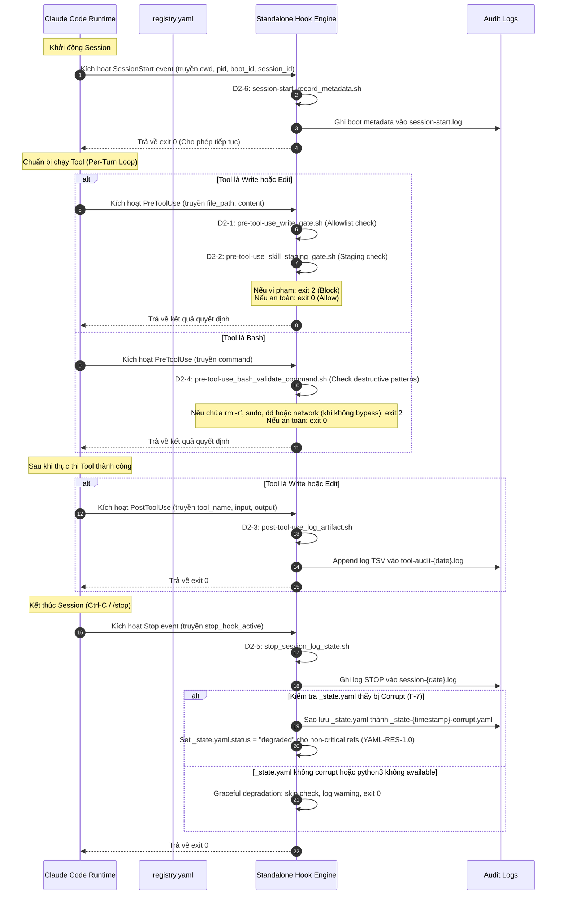

# Kế Hoạch Triển Khai — Phase 2: Hook Framework Foundation (Rebuild)

> **Phiên bản**: 0.1.0 — Rebuilt từ scope + BA analysis + 5 chuyên đề khai thác
> **Các vấn đề đã xử lý**: GAP-1→GAP-5, Mâu thuẫn #1→#3, CẦN LÀM RÕ items
> **Xem phân tích đầy đủ**: [`business-analysis-phase2-hook-framework.2026-07-07.md`](file:///home/stveve/Documents/workspace/build-workflow/WASHVN/docs/context-to-work/roadmap-analysis-phases/business-analysis-phase2-hook-framework.2026-07-07.md)

---

## 1. Tổng Quan & Mục Tiêu

Phase 2 tập trung vào việc thiết lập **standalone hook framework** độc lập tại thư mục `.claude/hooks/`. Điều này giúp chuyển dịch từ cơ chế hooks viết inline hiện tại sang một hệ thống quản lý tập trung, có cấu trúc đăng ký cụ thể, cho phép kiểm soát cơ học các hành vi của agent (như ghi file, thực thi lệnh bash, kết nối mạng) trước và sau khi chạy tool, nhằm giảm thiểu rủi ro bảo mật và giải quyết các lỗi cấu trúc (Γ-7, Γ-1).

### Mục tiêu cụ thể:
- Phát triển **6 standalone hook scripts** bằng Bash/Sh và `jq` tại thư mục [.claude/hooks/events/](file:///home/stveve/Documents/workspace/build-workflow/WASHVN/.claude/hooks/events/).
- Xây dựng **1 tệp cấu hình registry** hoàn chỉnh tại [.claude/hooks/registry.yaml](file:///home/stveve/Documents/workspace/build-workflow/WASHVN/.claude/hooks/registry.yaml).
- Viết **7 test scripts** để tự động kiểm thử tại [.claude/hooks/tests/](file:///home/stveve/Documents/workspace/build-workflow/WASHVN/.claude/hooks/tests/).
- Đảm bảo cơ chế hoạt động theo **Format B** (trả về exit code `2` và thông điệp lỗi sang `stderr` khi muốn block).
- Tích hợp **Quality Gates** (HOOK-HEAL-1.0, YAML-RES-1.0) và **YAML Resilience Layer** (rule_9 last-mile verification).
- Thử nghiệm **Prompt-based Hook** (D2-9, HOOK-HEAL-1.0) cho self-healing tại Stop event.

> **Cross-Reference**: Kiến trúc này là runtime enforcement của architectural design tại
> [`Temps/spec/architects/P5-fallback-and-escalation/yaml-resilience-layer.md`](file:///home/stveve/Documents/workspace/build-workflow/WASHVN/Temps/spec/architects/P5-fallback-and-escalation/yaml-resilience-layer.md)
> (YAML Resilience Layer — 3-level pre-check, rule_9 last-mile verification) và
> [`Temps/spec/architects/shared/quality-gates-reference.md`](file:///home/stveve/Documents/workspace/build-workflow/WASHVN/Temps/spec/architects/shared/quality-gates-reference.md)
> (Quality Gates — HOOK-HEAL-1.0, HOOK-AUDIT-2.0, YAML-RES-1.0).
>
> Xem phân tích đầy đủ tại [`phase-2-scope.2026-07-07.md §22-23`](file:///home/stveve/Documents/workspace/build-workflow/WASHVN/docs/context-to-work/roadmap-analysis-phases/phase-2-scope.2026-07-07.md).

---

## 2. Kiến Trúc Luồng Gọi (Call Chain) & Vòng Đời

Dưới đây là sơ đồ Mermaid mô tả vòng đời của các sự kiện và thứ tự kích hoạt các hook scripts trong một phiên hoạt động (Session) của Claude Code:



### D2-9 — HOOK-HEAL-1.0 (Prompt-based Hook — Last-Mile Verification)

Sau khi D2-5 hoàn tất, nếu `settings.local.json` được cấu hình, Claude Code runtime sẽ kích hoạt **Prompt-based Hook tại Stop event** theo [HOOK-HEAL-1.0](file:///home/stveve/Documents/workspace/build-workflow/WASHVN/Temps/spec/architects/shared/quality-gates-reference.md):

1. LLM (Haiku/Sonnet) đánh giá cấu trúc documentation (MD layout + YAML frontmatter)
2. Trả về `{"ok": true/false, "reason": "..."}`
3. Nếu `ok: false` + `continueOnBlock: true` → Agent nhận reason và tự sửa lỗi
4. Session kết thúc khi self-heal hoàn tất hoặc timeout

> **rule_9 YAML Resilience Layer**: Đây là last-mile verification gate — phát hiện uncommitted/corrupted YAML state và formatting defects trước khi session exit. Xem: [`yaml-resilience-layer.md`](file:///home/stveve/Documents/workspace/build-workflow/WASHVN/Temps/spec/architects/P5-fallback-and-escalation/yaml-resilience-layer.md) line 47.

---

## 3. Bản Đồ Dữ Liệu Hook (Data Flow Map)

Dưới đây là các định dạng đầu vào (`stdin` JSON) và đầu ra dự kiến của từng Hook script:

| ID | Hook Script | Event Type | Matcher | Input Fields (stdin JSON) | Output / Side Effect | Exit Codes |
|:---|:---|:---|:---|:---|:---|:---:|
| **D2-1** | `pre-tool-use_write_gate.sh` | `PreToolUse` | `Write\|Edit` | `tool_name`, `tool_input.file_path` | Chặn các đường dẫn ghi file ngoài workspace | 0 (allow) / 2 (block) |
| **D2-2** | `pre-tool-use_skill_staging_gate.sh` | `PreToolUse` | `Write\|Edit` | `tool_name`, `tool_input.file_path` | Chặn ghi trực tiếp vào `.claude/skills/` (trừ `_staging/`) | 0 (allow) / 2 (block) |
| **D2-3** | `post-tool-use_log_artifact.sh` | `PostToolUse` | `Write\|Edit` | `tool_name`, `tool_input`, `tool_output` | Ghi audit log TSV vào `tool-audit-{YYYY-MM-DD}.log` | 0 |
| **D2-4** | `pre-tool-use_bash_validate_command.sh` | `PreToolUse` | `Bash` | `tool_name`, `tool_input.command` | Chặn destructive bash commands & mạng trái phép | 0 (allow) / 2 (block) |
| **D2-5** | `stop_session_log_state.sh` | `Stop` | `.*` | `stop_hook_active` | Ghi session STOP log TSV + YAML-RES-1.0 L1 Syntax check + backup corrupt state + set degraded flag | 0 |
| **D2-6** | `session-start_record_metadata.sh` | `SessionStart` | `.*` | `cwd`, `pid`, `boot_id`, `session_id` | Ghi log boot metadata vào `session-start.log` | 0 |
| **D2-9** | *(Prompt-based — không phải script)* | `Stop` | `.*` | `$ARGUMENTS` (event context) | Trả về `{"ok": bool, "reason": str}`. Nếu `!ok` + `continueOnBlock: true` → Agent tự sửa lỗi | 0 (always allow — non-blocking) |
| **D2-10** | *(Evaluation Report)* | N/A | N/A | N/A | Báo cáo đánh giá: latency, success rate, false positive/negative rate | N/A |

> [!IMPORTANT]
> **Quality Gates Integration**: Mọi hook script trong Phase 2 là runtime enforcement của architectural quality gates:
> - **YAML-RES-1.0**: D2-5 implement L1 Syntax check (yaml.safe_load). D2-7 registry.yaml pass L2 Schema validation.
> - **HOOK-HEAL-1.0**: D2-9 experiment — Prompt-based self-healing gate.
> - **HOOK-AUDIT-2.0**: Future Phase 8 — Agent-based test execution (D2-10 đánh giá feasibility).
>
> Xem chi tiết tại `Temps/spec/architects/shared/quality-gates-reference.md` và `phase-2-scope.2026-07-07.md §22-23`.

> [!NOTE]
> Bên cạnh các script Shell truyền thống, Claude Code hỗ trợ thay thế các hook này bằng **Prompt-based hooks** (`type: "prompt"`) và **Agent-based hooks** (`type: "agent"`). Khi cần áp dụng trí thông minh của mô hình (đánh giá chất lượng code, kiểm duyệt nghiệp vụ), ta cấu hình trực tiếp prompt trong tệp cài đặt thay vì viết script sh (Xem chi tiết tại [Tài Liệu Nghiên Cứu Advanced Hooks](file:///home/stveve/Documents/workspace/build-workflow/WASHVN/docs/context-to-work/roadmap-analysis-phases/advanced-hooks-capability.2026-07-07.md)).

---

## 4. Kế Hoạch Triển Khai Chi Tiết (Task & Todo Checklist)

> [!IMPORTANT]
> - Mọi hook script phải tuân thủ giới hạn kỹ thuật: độ dài **dưới 50 dòng code**, thời gian thực thi **dưới 100ms** để không gây ảnh hưởng đến hiệu năng hệ thống.
> - Ưu tiên sử dụng `bash` hoặc `sh` kết hợp với lệnh `jq`. Chỉ dùng Python khi thực sự cần thiết (như parser YAML chuyên dụng trong Stop hook) và cần xây dựng cơ chế graceful degradation nếu không có môi trường Python.
> - **Graceful degradation**: Gating hooks (D2-1, D2-2, D2-4) fail CLOSED (exit 2) khi thiếu dependency. Logging hooks (D2-3, D2-6) fail OPEN (exit 0, skip log). D2-5 fail OPEN với warning.

```yaml
phase_2_todo_checklist:
  # ------------------------------------------------------------------------
  # STAGE 1: Xây dựng các PreToolUse Gating Hooks (Bảo vệ ghi file & thực thi)
  # ------------------------------------------------------------------------
  stage_1_pre_tool_gates:
    - task: "Thiết lập Hook D2-1: pre-tool-use_write_gate.sh"
      trace: "[TỪ SCOPE §5.1, §8.3] [TỪ BA GAP-2 graceful degradation]"
      status: "pending"
      subtasks:
        - "[ ] Tạo file tại .claude/hooks/events/pre-tool-use_write_gate.sh"
        - "[ ] Viết code đọc stdin và trích xuất tool_input.file_path bằng jq"
        - "[ ] Định nghĩa regex kiểm tra danh sách cho phép (Allowlist): .claude/, raw/ver-3/, .skill-context/, docs/context-to-work/, Temps/spec/"
        - "[ ] Trả về exit 2 và in thông điệp lỗi ra stderr nếu path không khớp Allowlist"
        - "[ ] Trả về exit 0 nếu path hợp lệ"
        - "[ ] Thiết lập graceful degradation: nếu jq không available, exit 2 (fail closed) và ghi lỗi ra stderr"
        - "[ ] Thiết lập graceful degradation: nếu stdin JSON malformed, exit 2 (fail closed) và ghi lỗi ra stderr"
        - "[ ] Phân quyền thực thi: chmod +x cho script"

    - task: "Thiết lập Hook D2-2: pre-tool-use_skill_staging_gate.sh"
      trace: "[TỪ SCOPE §5.1, §14.2] [TỪ BA GAP-2 graceful degradation]"
      status: "pending"
      subtasks:
        - "[ ] Tạo file tại .claude/hooks/events/pre-tool-use_skill_staging_gate.sh"
        - "[ ] Đọc stdin trích xuất tool_input.file_path"
        - "[ ] Implement cơ chế bypass qua biến môi trường DEPLOY_PHASE_ACTIVE"
        - "[ ] Chặn mọi hành vi ghi trực tiếp vào thư mục runtime .claude/skills/ (trừ thư mục .claude/skills/_staging/)"
        - "[ ] Trả về exit 2 và ghi lỗi sang stderr nếu vi phạm"
        - "[ ] Trả về exit 0 nếu ghi đúng staging hoặc DEPLOY_PHASE_ACTIVE=true"
        - "[ ] Thiết lập graceful degradation: nếu jq không available, exit 2 (fail closed)"
        - "[ ] Thiết lập graceful degradation: nếu stdin JSON malformed, exit 2 (fail closed)"
        - "[ ] Phân quyền thực thi: chmod +x cho script"

    - task: "Thiết lập Hook D2-4: pre-tool-use_bash_validate_command.sh"
      trace: "[TỪ SCOPE §5.1, §14.2] [TỪ BA GAP-2 graceful degradation]"
      status: "pending"
      subtasks:
        - "[ ] Tạo file tại .claude/hooks/events/pre-tool-use_bash_validate_command.sh"
        - "[ ] Đọc stdin trích xuất tool_input.command"
        - "[ ] Định nghĩa các mẫu destructive cấm: rm -rf, sudo, dd"
        - "[ ] Triển khai cơ chế kiểm tra mạng và cho phép bypass qua MARK_NETWORK_ALLOWED"
        - "[ ] Trả về exit 2 và ghi lỗi sang stderr nếu phát hiện pattern bị cấm hoặc truy cập mạng không được phép"
        - "[ ] Trả về exit 0 cho các lệnh vô hại"
        - "[ ] Thiết lập graceful degradation: nếu jq không available, exit 2 (fail closed)"
        - "[ ] Thiết lập graceful degradation: nếu stdin JSON malformed, exit 2 (fail closed)"
        - "[ ] Thiết lập graceful degradation: MARK_NETWORK_ALLOWED parse fail → default restrictive (block network)"
        - "[ ] Phân quyền thực thi: chmod +x cho script"

  # ------------------------------------------------------------------------
  # STAGE 2: Triển khai Logging & Session Lifecycle Hooks
  # ------------------------------------------------------------------------
  stage_2_logging_lifecycle:
    - task: "Thiết lập Hook D2-3: post-tool-use_log_artifact.sh"
      trace: "[TỪ SCOPE §5.1, §8.2] [TỪ BA GAP-2 graceful degradation]"
      status: "pending"
      subtasks:
        - "[ ] Tạo file tại .claude/hooks/events/post-tool-use_log_artifact.sh"
        - "[ ] Đọc stdin để nhận dữ liệu thao tác ghi file thành công"
        - "[ ] Định dạng log TSV: timestamp\\ttool\\tpid\\tagent\\tpath"
        - "[ ] Ghi dữ liệu log (append) vào tệp .skill-context/_state-archive/tool-audit-{YYYY-MM-DD}.log"
        - "[ ] Đảm bảo thư mục đích tồn tại trước khi ghi"
        - "[ ] Luôn trả về exit 0 (non-blocking hook)"
        - "[ ] Thiết lập graceful degradation: nếu jq không available, skip log entry, exit 0"
        - "[ ] Thiết lập graceful degradation: nếu stdin JSON malformed, skip log entry, exit 0"
        - "[ ] Thiết lập graceful degradation: nếu log directory missing, mkdir -p, nếu fail skip log, exit 0"
        - "[ ] Phân quyền thực thi: chmod +x cho script"

    - task: "Thiết lập Hook D2-6: session-start_record_metadata.sh"
      trace: "[TỪ SCOPE §5.1, §8.2] [TỪ BA GAP-2 graceful degradation]"
      status: "pending"
      subtasks:
        - "[ ] Tạo file tại .claude/hooks/events/session-start_record_metadata.sh"
        - "[ ] Đọc các tham số khởi tạo từ stdin: cwd, pid, boot_id, session_id"
        - "[ ] Định dạng log TSV: timestamp\\tSTART\\tsession=id\\tpid=num\\tboot=id\\tcwd=path"
        - "[ ] Ghi log vào file .skill-context/_state-archive/session-start.log"
        - "[ ] Trả về exit 0"
        - "[ ] Thiết lập graceful degradation: nếu jq không available, skip metadata recording, exit 0"
        - "[ ] Thiết lập graceful degradation: nếu stdin JSON malformed, skip, exit 0"
        - "[ ] Thiết lập graceful degradation: nếu log write fails, ghi warning, exit 0"
        - "[ ] Phân quyền thực thi: chmod +x cho script"

    - task: "Thiết lập Hook D2-5: stop_session_log_state.sh (Γ-7 fix + YAML-RES-1.0)"
      trace: "[TỪ SCOPE §5.1, §8.2, §14.2] [TỪ YAML-RES-1.0 quality-gates-reference.md] [TỪ BA GAP-2]"
      status: "pending"
      subtasks:
        - "[ ] Tạo file tại .claude/hooks/events/stop_session_log_state.sh"
        - "[ ] Ghi nhận thời gian dừng phiên vào .skill-context/_state-archive/session-{YYYY-MM-DD}.log dưới định dạng TSV"
        - "[ ] Triển khai kiểm tra tính hợp lệ của tệp cấu hình trạng thái .skill-context/_state.yaml"
        - "[ ] Viết script phụ bằng Python (sử dụng thư viện pyyaml) để parse thử _state.yaml (YAML-RES-1.0 L1 Syntax)"
        - "[ ] Nếu parse thất bại (file bị lỗi cấu trúc/corrupt): copy sao lưu _state.yaml thành .skill-context/_state-archive/_state-{timestamp}-corrupt.yaml"
        - "[ ] Nếu corrupt là non-critical ref: set _state.yaml.status = 'degraded' (YAML-RES-1.0 non-critical degraded mode)"
        - "[ ] Ghi repair event vào _state.yaml.yaml_repair_history khi corrupt được phát hiện (YAML-RES-1.0 rule_7)"
        - "[ ] Thiết lập graceful degradation — YAML-RES-1.0 compliance (mở rộng):"
        - "     - python3/pyyaml không tồn tại: log cảnh báo, skip YAML check, exit 0"
        - "     - _state.yaml không tồn tại: skip check, exit 0"
        - "     - _state.yaml rỗng: skip check, exit 0"
        - "     - Backup directory (.skill-context/_state-archive/) missing: mkdir -p, nếu fail log warning, exit 0"
        - "     - Log TSV write fails after backup: warning, exit 0"
        - "[ ] Trả về exit 0"
        - "[ ] Phân quyền thực thi: chmod +x cho script"

  # ------------------------------------------------------------------------
  # STAGE 3: Cấu hình Registry & Viết Unit Tests
  # ------------------------------------------------------------------------
  stage_3_registry_and_testing:
    - task: "Cập nhật Registry Cấu Hình registry.yaml"
      trace: "[TỪ SCOPE §2, §5.1] [TỪ YAML-RES-1.0 quality-gates-reference.md L2 Schema]"
      status: "pending"
      subtasks:
        - "[ ] Mở file .claude/hooks/registry.yaml hiện tại"
        - "[ ] Điền chi tiết cấu trúc cho 6 hook entries (PreToolUse, PostToolUse, Stop, SessionStart)"
        - "[ ] Khai báo đúng đường dẫn script_path trỏ tới thư mục events"
        - "[ ] Xác định matcher chính xác cho từng hook (ví dụ: 'Write|Edit' cho write_gate)"
        - "[ ] Đảm bảo registry.yaml pass YAML-RES-1.0 L2 Schema validation: required keys hooks, script_path, matcher, event_type"
        - "[ ] Lưu trữ cấu hình và định dạng YAML chuẩn"

    - task: "Xây dựng 7 Unit Test Scripts cho Gating Hooks"
      trace: "[TỪ SCOPE §5.2]"
      status: "pending"
      subtasks:
        - "[ ] Tạo test_write_gate_allow.sh: Giả lập input ghi file trong workspace (exit code = 0)"
        - "[ ] Tạo test_write_gate_block.sh: Giả lập input ghi file ngoài workspace (exit code = 2)"
        - "[ ] Tạo test_skill_staging_allow_staging.sh: Giả lập ghi vào _staging/ (exit code = 0)"
        - "[ ] Tạo test_skill_staging_block_runtime.sh: Giả lập ghi vào runtime skills (exit code = 2)"
        - "[ ] Tạo test_bash_validate_allow.sh: Giả lập lệnh bash vô hại (exit code = 0)"
        - "[ ] Tạo test_bash_validate_block_destructive.sh: Giả lập rm -rf /home (exit code = 2)"
        - "[ ] Tạo test_bash_validate_block_network.sh: Giả lập curl mà không có bypass (exit code = 2)"
        - "[ ] Cấp quyền thực thi chmod +x cho tất cả 7 files tests"

  # ------------------------------------------------------------------------
  # STAGE 4: Nghiệm Thu Tích Hợp (Verification)
  # ------------------------------------------------------------------------
  stage_4_verification:
    - task: "Chạy Đánh Giá Tổng Thể & Đạt Tiêu Chí Nghiệm Thu"
      trace: "[TỪ SCOPE §10]"
      status: "pending"
      subtasks:
        - "[ ] Chạy kiểm thử tự động 7 test scripts và đảm bảo 100% đạt kết quả mong muốn (PASS)"
        - "[ ] Viết script python ngắn để parse kiểm tra registry.yaml đảm bảo cú pháp YAML hợp lệ"
        - "[ ] Giả lập tệp _state.yaml bị lỗi định dạng cấu trúc, kích hoạt sự kiện Stop và kiểm tra xem tệp backup có được tạo chính xác tại _state-archive/ hay không"
        - "[ ] So sánh tính nhất quán giữa tài liệu đặc tả hooks_and_events.md và các hook scripts thực tế"
        - "[ ] Xác minh không có bất kỳ placeholder (TODO, pass) nào còn sót lại trong mã nguồn của các hook"
        - "[ ] Cập nhật kết quả vào tài liệu báo cáo nghiệm thu tổng thể"

    - task: "[NEW] Xác minh Graceful Degradation Policy cho mọi hook script"
      trace: "[TỪ GAP-2 BA ANALYSIS §1.2.2]"
      status: "pending"
      subtasks:
        - "[ ] D2-1: Xác minh jq missing → exit 2 (block), stdin malformed → exit 2"
        - "[ ] D2-2: Xác minh jq missing → exit 2, stdin malformed → exit 2"
        - "[ ] D2-4: Xác minh jq missing → exit 2, stdin malformed → exit 2"
        - "[ ] D2-3: Xác minh jq missing → exit 0 (skip log), stdin malformed → exit 0"
        - "[ ] D2-6: Xác minh jq missing → exit 0, stdin malformed → exit 0"
        - "[ ] D2-5: Xác minh python3 missing → exit 0 + cảnh báo, _state.yaml missing → exit 0"

    - task: "[NEW] Xác minh YAML-RES-1.0 Compliance"
      trace: "[TỪ YAML-RES-1.0 quality-gates-reference.md]"
      status: "pending"
      subtasks:
        - "[ ] Xác minh D2-5 pyyaml parse (L1 Syntax) hoạt động đúng với _state.yaml corrupt"
        - "[ ] Xác minh D2-7 registry.yaml pass L2 Schema validation (required keys: hooks, script_path, matcher, event_type)"
        - "[ ] Xác minh corrupt detection ghi vào _state.yaml.yaml_repair_history"
        - "[ ] Xác minh non-critical corrupt set _state.yaml.status = 'degraded'"

  # ------------------------------------------------------------------------
  # STAGE 5: Advanced Hooks Research — Quality Gates Integration
  #   Cross-reference: HOOK-HEAL-1.0 (quality-gates-reference.md)
  #   Cross-reference: rule_9 (yaml-resilience-layer.md)
  # ------------------------------------------------------------------------
  stage_5_advanced_hooks_research:
    - task: "Thiết lập HOOK-HEAL-1.0: Prompt-based Hook cho sự kiện Stop"
      trace: "[TỪ HOOK-HEAL-1.0 quality-gates-reference.md §22.1, RESEARCH §6]"
      trace: "[TỪ rule_9 yaml-resilience-layer.md — last-mile verification]"
      trace: "[TỪ BA GAP-5 metrics, Mâu thuẫn #3 continueOnBlock]"
      status: "pending"
      subtasks:
        - "[ ] Bổ sung 'settings.local.json' vào .claude/.gitignore (gitignored by Claude Code convention)"
        - "[ ] Tạo .claude/settings.local.json với cấu trúc: hooks → Stop → [{ handlers → [{ type: prompt, ... }] }]"
        - "[ ] Thiết lập prompt với 3 check categories: YAML frontmatter completeness, MD structure validity, placeholder detection"
        - "[ ] Cấu hình: type: prompt, model: claude-3-5-haiku, timeout: 45s, continueOnBlock: true"
        - "[ ] Schema output bắt buộc: {\"ok\": boolean, \"reason\": string} (tuân thủ hooks_and_events.md §7.4)"
        - "[ ] Tạo 3 test fixture files tại .claude/hooks/tests/fixtures/:
             - test-SKILL-valid.md (có frontmatter đầy đủ, MD hợp lệ)
             - test-SKILL-corrupt.md (YAML lỗi cú pháp + MD lỗi)
             - test-SKILL-nofrontmatter.md (zero metadata, valid MD body)"
        - "[ ] Tạo test harness script chạy experiment: mỗi fixture → simulate Stop → capture {ok, reason, latency}"
        - "[ ] Chạy 10 cycles per fixture × 2 models (Haiku + Sonnet) = 60 total evaluations"
        - "[ ] Kiểm tra self-healing loop: block → reason fed back → agent repairs → re-evaluate → PASS/FAIL"
        - "[ ] Verify continueOnBlock: true behavior — reason string xuất hiện trong context turn tiếp theo"
        - "[ ] Verify max 2 self-healing cycles — force close after 2nd failure"
        - "[ ] Đo tổng thời gian self-healing cycle (block → repair → re-eval) — target < 60s"
        - "[ ] Xác nhận merge behavior: settings.local.json hooks object thay thế hoàn toàn hooks object từ settings.json (shallow merge)"

    - task: "Soạn báo cáo D2-10: Advanced Hook Evaluation Report"
      trace: "[TỪ RESEARCH advanced-hooks-capability.2026-07-07.md, SCOPE §24.2]"
      trace: "[TỪ BA GAP-5 metrics quantification]"
      status: "pending"
      subtasks:
        - "[ ] Tạo docs/context-to-work/roadmap-analysis-phases/hook-evaluation-D2-10.2026-07-07.md"
        - "[ ] Điền latency comparison table (Haiku vs Sonnet — P50, P95, P99):
             - Haiku P50 target: ≤8s, P99 target: ≤20s
             - Sonnet P50 target: ≤15s, P99 target: ≤28s"
        - "[ ] Điền accuracy metrics:
             - Overall Haiku accuracy threshold: ≥80%
             - Overall Sonnet accuracy threshold: ≥92%
             - Per-scenario breakdown (S1 valid, S2 corrupt, S3 missing frontmatter)"
        - "[ ] Điền false positive rate (block legit stop):
             - Haiku target: <10%, Sonnet target: <5%"
        - "[ ] Điền false negative rate (allow corrupt):
             - Target: <15%"
        - "[ ] Điền self-healing performance:
             - Self-healing success rate target: ≥70%
             - Avg repair cycles target: ≤2
             - Avg cycle time target: ≤60s"
        - "[ ] Đánh giá feasibility của Agent-based hooks (HOOK-AUDIT-2.0) cho Phase 8"
        - "[ ] Đề xuất: có mở rộng Layer 2 cho PreToolUse không? (khuyến nghị: không — defer Phase 8)"
        - "[ ] Nộp report tại docs/context-to-work/roadmap-analysis-phases/advanced-hooks-evaluation.2026-07-07.md"
```

---

## 5. Configuration Architecture — registry.yaml ↔ settings.json Bridge

### Format Landscape (4 Formats)

Có **4 định dạng cấu hình hook** khác nhau trong hệ thống, cần phân biệt rõ:

| # | Tên | File Location | Format | Mục đích | Claude Code đọc? |
|:-:|:----|:-------------|:-------|:---------|:----------------:|
| **F1** | WASHVN Registry | `.claude/hooks/registry.yaml` | YAML, flat list | WASHVN tracking & documentation | ❌ Không |
| **F2** | Knowledge doc §2.4 | `.claude/knowledge/agents/hooks_and_events.md` | JSON array, `hooks: [{matcher, handlers}]` | Mô tả schema (abstract) | ❌ Không (sai format) |
| **F3** | Knowledge doc §7.4.1 | `.claude/knowledge/agents/hooks_and_events.md` | JSON object, `hooks: {Event: [{handlers}]}` | Cấu hình prompt/agent hooks | ✅ Có (cho type:prompt) |
| **F4** | Official Claude Code | `settings.json` | JSON object, `hooks: {Event: [{hooks: [{type, command}]}]}` | Runtime activation | ✅ **Có — chính thức** |

> **Lưu ý**: `hooks_and_events.md` §2.4 có internal inconsistency với §7.4.1. §2.4 dùng `hooks` dạng array (sai format cho `settings.json`), trong khi §7.4.1 dùng object với event keys (đúng format). **Cần fix §2.4 trước Phase 8 integration.**

### Bridge Mapping: registry.yaml (F1) → settings.json (F4)

| registry.yaml field | settings.json location | settings.json field | Transformation |
|:-------------------|:-----------------------|:-------------------|:---------------|
| `event_type: PreToolUse` | `"hooks": { "PreToolUse": [...] }` | Object key | Flat field → object key |
| `matcher: "Write\|Edit"` | `...{ "matcher": "Write\|Edit", ... }` | `matcher` | **Direct 1:1 mapping** |
| `script: "events/write_gate.sh"` | `...{ "command": "${CLAUDE_PROJECT_DIR}/.claude/hooks/events/write_gate.sh" }` | `command` | Relative → absolute with `${CLAUDE_PROJECT_DIR}` prefix |
| `exit_allow: 0` | N/A — implicit | Runtime behavior | Use `exit 0` in scripts |
| `exit_block: 2` | N/A — implicit | Runtime behavior | Use `exit 2` in scripts |
| `description` | Optional | `description` | Can preserve via F3 format |
| `version/suite/last_updated` | No equivalent | N/A | WASHVN-only metadata |

### Phase 2 Decision: KHÔNG deploy hooks vào settings.json

- **registry.yaml** là WASHVN tracking convention — Phase 2 populate đầy đủ 6 entries
- **D2-8 test scripts** là primary verification mechanism (pipe mock JSON → verify exit code)
- **D2-9 experiment** dùng `settings.local.json` (F3 format) — chỉ 1 hook Stop event, type:prompt
- **Phase 8 Integration** sẽ bridge registry.yaml → settings.json để runtime activation
- `settings.json` hiện tại chỉ có `permissions` block — không có hooks key

> Chi tiết format gap: [`phase-2-scope.2026-07-07.md §19`](file:///home/stveve/Documents/workspace/build-workflow/WASHVN/docs/context-to-work/roadmap-analysis-phases/phase-2-scope.2026-07-07.md)

---

## 6. Error Handling Policy — Phase 2 Hook Scripts

### Exit Code Convention

| Exit Code | Meaning | When to Use |
|:---------:|:--------|:------------|
| **0** | Allow / No decision | Tool call is allowed, or script has no objection |
| **2** | **Block** | Destructive operation detected — MUST block |
| **1** | Error (non-blocking) | Script failed unexpectedly — allow tool call, log error |
| **Other** | Error (non-blocking) | Same as exit 1 — allow + log |

> ⚠️ **Critical**: Only exit code 2 blocks. Exit code 1 is a non-blocking error — the tool call WILL proceed!

### Graceful Degradation per Hook

| Hook | Category | Degradation Scenario | Fallback Behavior |
|:-----|:---------|:---------------------|:------------------|
| **D2-1** write_gate | **Gating — fail CLOSED** | `jq` not installed | exit 2 (deny all writes) |
| | | stdin JSON malformed | exit 2 (block) |
| | | Allowlist regex undefined | exit 2 (fail closed) |
| **D2-2** staging_gate | **Gating — fail CLOSED** | `jq` not installed | exit 2 (block all skills) |
| | | stdin JSON malformed | exit 2 (block) |
| **D2-4** bash_validate | **Gating — fail CLOSED** | `jq` not installed | exit 2 (deny all bash) |
| | | stdin JSON malformed | exit 2 (block) |
| | | MARK_NETWORK_ALLOWED parse fail | Default restrictive (block network) |
| **D2-3** log_artifact | **Logging — fail OPEN** | `jq` not installed | exit 0, skip log entry |
| | | stdin JSON malformed | exit 0, skip log entry |
| | | Log directory missing | `mkdir -p`, if fail → exit 0, skip log |
| **D2-6** session_start | **Logging — fail OPEN** | `jq` not installed | exit 0, skip metadata |
| | | stdin JSON malformed | exit 0, skip |
| | | Log write fails | exit 0, warning |
| **D2-5** stop_state | **Logging — fail OPEN** | `python3`/`pyyaml` unavailable | exit 0, skip YAML check, warning |
| | | `_state.yaml` not exist or empty | exit 0, skip |
| | | Backup dir missing | `mkdir -p`, if fail → exit 0, warning |
| | | Log TSV write fails | exit 0, warning |

### Stdin JSON Schema — Official (Verified)

**`jq -r '.tool_input.file_path // empty'` và `jq -r '.tool_input.command // empty'` là CORRECT** — field names khớp với Claude Code runtime.

| Event | Key Fields | Verified? |
|:------|:-----------|:---------:|
| **PreToolUse** | `session_id`, `cwd`, `hook_event_name`, `tool_name`, `tool_input.file_path`/`.command`, `tool_use_id` | ✅ |
| **PostToolUse** | `session_id`, `cwd`, `hook_event_name`, `tool_name`, `tool_input`, `tool_response`, `duration_ms` | ✅ |
| **Stop** | `session_id`, `cwd`, `hook_event_name`, `stop_hook_active`, `last_assistant_message`, `background_tasks` | ✅ |
| **SessionStart** | `session_id`, `cwd`, `hook_event_name`, `source`, `model` | ✅ |

### Chain Behavior (Multiple Hooks, Same Event)

- Hooks run sequentially in definition order
- First hook that exits 2 wins — subsequent hooks are skipped
- If no hook exits 2, the tool call proceeds through normal permission flow

### Guiding Principles

1. **When in doubt on gating hooks, DENY** — fail closed (exit 2)
2. **When in doubt on logging hooks, ALLOW** — fail open (exit 0, skip)
3. **Always exit 2, never 1, to block** — exit 1 is non-blocking
4. **Stderr for humans, stdout for JSON** — exit 2 ignores stdout
5. **Keep scripts idempotent** — same input → same exit code

---

## 7. Tiêu Chí Nghiệm Thu (Acceptance Criteria)

Để công nhận Phase 2 hoàn thành xuất sắc (Definition of Done), các tiêu chí sau bắt buộc phải đạt được:

| Mã AC | Tiêu Chí Kiểm Tra | Lệnh Xác Minh Dự Kiến | Trạng Thái Đạt |
|:---:|:---|:---|:---:|
| **AC-1** | 6 hook scripts tồn tại và có quyền thực thi (`+x`) | `for f in pre-tool-use_write_gate.sh pre-tool-use_skill_staging_gate.sh pre-tool-use_bash_validate_command.sh post-tool-use_log_artifact.sh stop_session_log_state.sh session-start_record_metadata.sh; do test -x ".claude/hooks/events/$f"; done` | Dự kiến PASS |
| **AC-2** | Tệp `registry.yaml` hợp lệ cú pháp và định nghĩa đủ 6 hooks | `python3 -c "import yaml; data=yaml.safe_load(open('.claude/hooks/registry.yaml')); assert len(data.get('hooks', {})) == 6"` | Dự kiến PASS |
| **AC-3** | 7 test scripts kiểm thử biên dịch thành công và được thực thi | `for t in test_write_gate_allow.sh test_write_gate_block.sh test_skill_staging_allow_staging.sh test_skill_staging_block_runtime.sh test_bash_validate_allow.sh test_bash_validate_block_destructive.sh test_bash_validate_block_network.sh; do bash \".claude/hooks/tests/$t\"; done` | Dự kiến PASS |
| **AC-4** | Cơ chế Gating hook trả về đúng mã lỗi: exit 0 (cho phép), exit 2 (chặn) | Chạy kiểm thử thủ công qua pipe JSON dữ liệu mẫu và kiểm tra `$status` | Dự kiến PASS |
| **AC-5** | Lỗi Γ-7 được khắc phục: tệp trạng thái hỏng được phát hiện và backup | Chạy thử `stop_session_log_state.sh` với file `_state.yaml` bị hỏng, kiểm tra thư mục `.skill-context/_state-archive/` | Dự kiến PASS |
| **AC-6** | Bash Validate chặn chính xác các lệnh nguy hiểm nhưng cho phép lệnh an toàn | Chạy các test case `test_bash_validate_allow` và `test_bash_validate_block_*` | Dự kiến PASS |
| **AC-7** | Không xảy ra xung đột với inline hooks trong `subagent-forge.md` | `grep "PreToolUse" .claude/agents/subagent-forge.md` + verify exit code convention (cả 2 dùng Format B) | Dự kiến PASS |
| **AC-8** | Xác minh cấu hình thử nghiệm Prompt-based Hook hoạt động đúng | Claude Code nhận được quyết định ok: false, hiển thị lý do và continueOnBlock:true feed reason cho agent | Dự kiến PASS |
| **AC-9** | **Quality Gate HOOK-HEAL-1.0**: Prompt Hook experiment hoạt động với `continueOnBlock:true` | Kiểm tra settings.local.json active → Stop event → LLM trả về `ok:true/false` → agent tự sửa khi `!ok` | Dự kiến PASS |
| **AC-10** | **Quality Gate YAML-RES-1.0**: D2-5 implement L1 Syntax check + corrupt state backup + degraded flag | `python3 -c "import yaml; yaml.safe_load(open('.skill-context/_state.yaml'))"` và kiểm tra backup + `.status = 'degraded'` | Dự kiến PASS |
| **AC-11** | **Graceful Degradation Policy**: Mọi hook script handle graceful degradation (jq missing, stdin malformed, python3 missing) | Chạy từng hook script với môi trường thiếu dependencies → verify exit code và stderr messages | Dự kiến PASS |

---

## 8. Đánh Giá Rủi Ro & Biện Pháp Giảm Thiểu (Risk Assessment)

> [!WARNING]
> Cần đặc biệt chú ý đến hiệu năng thực thi của hooks vì chúng chạy **đồng bộ** trên mỗi tool call. Bất kỳ sự chậm trễ nào đều ảnh hưởng trực tiếp đến trải nghiệm lập trình viên.

| Rủi Ro Phát Sinh | Khả Năng | Mức Ảnh Hưởng | Biện Pháp Giảm Thiểu |
|:---|:---:|:---:|:---|
| Hook script thực thi chậm (>100ms) làm giảm tốc độ phản hồi | Thấp | Trung bình | Giữ logic script tối giản, không gọi các tiến trình con phức tạp, ưu tiên dùng bash thuần và `jq`. |
| Cú pháp `jq` lỗi khi parse dữ liệu đầu vào JSON không đồng bộ | Trung bình | Cao | Sử dụng giá trị mặc định của shell và kiểm tra lỗi cú pháp `jq` (ví dụ `jq -r '.tool_input.file_path // empty'`). |
| Chặn nhầm các lệnh ghi file hợp lệ của Agent | Trung bình | Cao | Viết Regex cho Allowlist cực kỳ chính xác. Thiết lập test suite đầy đủ bao quát các trường hợp allow để phát hiện lỗi sớm. |
| Môi trường chạy thiếu `python3` hoặc thư viện `pyyaml` khi kiểm tra corrupt state | Thấp | Trung bình | Graceful degradation: nếu python3/pyyaml không available, log warning và skip check thay vì block. |
| Xung đột Format A (stdout JSON) và Format B (exit 2) của Claude Code | Trung bình | Cao | Thống nhất giữ **Format B** cho Phase 2. Phân tách rõ ràng và hoãn việc đồng nhất định dạng (reconcile) sang Phase 8. |
| Hook script `jq` không available trên PATH | Thấp | Cao | Gating hooks fail closed (exit 2). Logging hooks fail open (exit 0, skip log). Implement trong mỗi script. |
| stdin JSON không đúng format từ Claude Code runtime | Thấp | Cao | Gating hooks fail closed (exit 2). Logging hooks skip entry (exit 0). Không block user flow cho audit failures. |
| HOOK-HEAL-1.0 (D2-9) timeout hoặc LLM response không parse được | Trung bình | Trung bình | `continueOnBlock:true` → session vẫn kết thúc (timeout fallback). Non-blocking by design. |
| YAML-RES-1.0 L2/L3 Schema check không implement trong Phase 2 | Thấp | Thấp | Documented gap — chỉ implement L1 Syntax. L2/L3 deferred đến Phase 8. `_state.yaml.status = "degraded"` flag tracking. |
| D2-9 Prompt Hook false positive (block khi không cần thiết) | Trung bình | Thấp | `continueOnBlock:true` → agent kiểm tra lại, nếu thực sự ok thì bỏ qua. Non-blocking. |
| D2-9 Prompt Hook false negative (bỏ qua lỗi thực sự) | Trung bình | Cao | Cần benchmark và đặt threshold cho D2-10 report. Không deploy production cho đến khi verified. |

---

## 9. D2-9 Settings.local.json Configuration

### File: `.claude/settings.local.json`

```json
{
  "hooks": {
    "Stop": [
      {
        "handlers": [
          {
            "type": "prompt",
            "prompt": "Evaluate the structural completeness of workspace documentation before session closure. Event context: $ARGUMENTS. Check for: (1) valid YAML frontmatter with all required fields (name, version, suite, tags), (2) well-formed Markdown structure (no broken tables, no unterminated code fences), (3) no dangling TODO or placeholder patterns in documentation files. Return JSON matching this schema: {\"ok\": boolean, \"reason\": string}",
            "model": "claude-3-5-haiku",
            "timeout": 45,
            "continueOnBlock": true,
            "description": "D2-9: Prompt-based self-healing hook — verify MD/YAML structural completeness on Stop event (HOOK-HEAL-1.0)"
          }
        ]
      }
    ]
  }
}
```

### Placement & Merge Behavior

| Priority | File | Scope | Behavior |
|----------|------|-------|----------|
| 1 (lowest) | `~/.claude/settings.json` | User-wide | Overridden by project-level |
| 2 | `.claude/settings.json` | Project base | **Overridden by `settings.local.json`** |
| 3 | **`.claude/settings.local.json`** | **Project local** | **Wins on same key** |
| 4 | Plugin hooks | Plugin | Overrides local |
| 5 (highest) | Skill/Agent frontmatter | Per-skill | Highest priority |

> ⚠️ **Merge warning**: Shallow merge at object key level. Nếu `settings.json` sau này có `hooks` key, `settings.local.json`'s `hooks` sẽ **replace hoàn toàn** — không deep-merge handler-level.

### Required vs Optional Fields (`type: "prompt"`)

| Field | Status | Value for D2-9 |
|-------|--------|----------------|
| `type` | **Required** | `"prompt"` |
| `prompt` | **Required** | LLM instruction with 3 check categories |
| `model` | **Recommended** | `"claude-3-5-haiku"` (omit = default model) |
| `timeout` | **Optional** (default: 30s) | `45` |
| `continueOnBlock` | **Optional** (default: false) | `true` |
| `description` | **Strongly Recommended** | Diagnostic label |
| `event` | Implied by parent key | Omitted (key = "Stop") |
| `matcher` | Optional (Stop is global) | Omitted |

---

## 10. BA Recommendations Implementation

### Recommendation 1: Plan Cross-References (GAP-1)
✅ Đã bổ sung cross-references đến YAML Resilience Layer và Quality Gates trong §1, §2, §3, §4, và §7 của plan này.

### Recommendation 2: Graceful Degradation Policy (GAP-2)
✅ Đã định nghĩa policy đầy đủ trong §6. Gating hooks fail CLOSED, logging hooks fail OPEN.

### Recommendation 3: settings.local.json Example (GAP-4)
✅ Đã cung cấp đầy đủ config trong §9.

### Recommendation 4: D2-9 Metrics (GAP-5)
✅ Đã lượng hóa metrics trong Stage 5 tasks:
- Latency: Haiku P50 ≤8s, Sonnet P50 ≤15s
- Accuracy: Haiku ≥80%, Sonnet ≥92%
- FP rate: Haiku <10%, Sonnet <5%
- Self-healing: success ≥70%, cycle ≤60s

### Recommendation 5: subagent-forge.md Compatibility
✅ AC-7 đã mở rộng: verify cả inline hooks tồn tại + exit code convention compatibility.

---

## 11. Known Limitations & Deferred Items

| Item | Defer To | Rationale |
|:-----|:---------|:----------|
| HOOK-AUDIT-2.0 (Agent-based hooks) | Phase 8 | D2-10 đánh giá feasibility, không implement |
| Format A reconcile (stdout JSON) | Phase 8 | D2-10 báo cáo gap analysis |
| registry.yaml → settings.json bridge | Phase 8 | Bridge mapping đã document trong §5 |
| External validator hook (thứ 7) | Phase 8 | Phase 8 spec A1 |
| settings.json hooks block activation | Phase 8 | Phase 2 test qua standalone test scripts |
| YAML-RES-1.0 L2 Schema auto-repair | Phase 8 | Phase 2 chỉ detect + backup, không auto-repair |
| YAML-RES-1.0 L3 Cross-ref check | Phase 8 | Phase 2 không implement cross-ref validation |
| `_state.yaml.status = "degraded"` full implementation | Phase 8 | Phase 2 D2-5 set flag nhưng không active degraded pipeline |
| `hooks_and_events.md` §2.4 format fix | Phase 8 | Array-based format inconsistent với §7.4.1 |

---

## 12. Tài Liệu Tham Chiếu

- [Đặc tả chi tiết Phase 2 (Roadmap)](file:///home/stveve/Documents/workspace/build-workflow/WASHVN/Temps/spec/roadmaps/02-hook-framework.md) — Chứa mã nguồn mẫu của 6 hooks và 7 test scripts.
- [Đặc tả giao thức Hook và Sự Kiện (hooks_and_events.md)](file:///home/stveve/Documents/workspace/build-workflow/WASHVN/.claude/knowledge/agents/hooks_and_events.md) — Chi tiết về các sự kiện và Dual-Format Blocking Protocol.
- [Mẫu thiết kế tham chiếu (db-reader hook pattern trong examples.md)](file:///home/stveve/Documents/workspace/build-workflow/WASHVN/.claude/knowledge/agents/examples.md#L215-L305) — Cấu trúc chuẩn của một script chặn tool call.
- [Phân tích phạm vi (phase-2-scope.2026-07-07.md)](file:///home/stveve/Documents/workspace/build-workflow/WASHVN/docs/context-to-work/roadmap-analysis-phases/phase-2-scope.2026-07-07.md) — Scope document (21 sections + quality gates + YAML resilience mapping).
- [Phân Tích Khả Năng Advanced Hooks (advanced-hooks-capability.2026-07-07.md)](file:///home/stveve/Documents/workspace/build-workflow/WASHVN/docs/context-to-work/roadmap-analysis-phases/advanced-hooks-capability.2026-07-07.md) — Nghiên cứu sâu về Prompt-based và Agent-based hooks.
- [Quality Gates Cross-Cutting (quality-gates-reference.md)](file:///home/stveve/Documents/workspace/build-workflow/WASHVN/Temps/spec/architects/shared/quality-gates-reference.md) — HOOK-HEAL-1.0 (D2-9), HOOK-AUDIT-2.0 (Phase 8), YAML-RES-1.0 (D2-5, D2-7).
- [YAML Resilience Layer (yaml-resilience-layer.md)](file:///home/stveve/Documents/workspace/build-workflow/WASHVN/Temps/spec/architects/P5-fallback-and-escalation/yaml-resilience-layer.md) — 3-level pre-check, auto-repair, rule_9 last-mile verification.
- [Phân tích BA đầy đủ (business-analysis-phase2-hook-framework.2026-07-07.md)](file:///home/stveve/Documents/workspace/build-workflow/WASHVN/docs/context-to-work/roadmap-analysis-phases/business-analysis-phase2-hook-framework.2026-07-07.md) — GAP-1→GAP-5 analysis, 5 recommendations.
