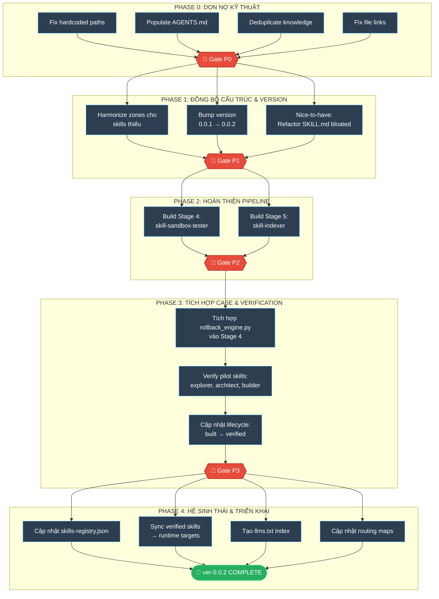

# 🗺️ WASHVN Master Skill Suite — ROADMAP ver-0.0.2

> **Version:** 0.0.2 | **Created:** 2026-06-17
> **Source of Truth:** [skills/ver-0.0.2/](file:///home/stveve/Documents/washvn/WASHVN/skills/ver-0.0.2)
> **Architecture:** [architecture.md](file:///home/stveve/Documents/washvn/WASHVN/architecture.md) | **Standards:** [standards.md](file:///home/stveve/Documents/washvn/WASHVN/standards.md)

<instructions>
Roadmap này là tài liệu điều hướng cho quá trình nâng cấp ver-0.0.2.
Mỗi phase có quality gate — phase sau bị block nếu gate trước chưa pass.
Cập nhật Tracking Matrix (Section 5) mỗi khi hoàn thành một phase.
</instructions>

---

## 1. Tại sao cần ver-0.0.2

Ver-0.0.1 triển khai không triệt để vì roadmap chỉ mô tả ý định mà thiếu cơ chế kiểm chứng. 11 skills đã được build nhưng không skill nào được verified. Pipeline thiếu 2 stages cuối (Stage 4: Sandbox Tester, Stage 5: Indexer) nên vòng đời skill bị đứt gãy tại `built` — không thể tiến sang `verified` hay `installed`.

### Gap Analysis

| ID | Vấn đề | Mức độ |
|----|--------|--------|
| G1 | Pipeline thiếu Stage 4 (Sandbox Tester) và Stage 5 (Indexer) | 🔴 Critical |
| G2 | 11/11 skills stuck ở phase `built`, 0 skills `verified` | 🔴 Critical |
| G3 | Cấu trúc zones không đồng nhất giữa các skills | 🟡 Medium |
| G4 | Paths hardcoded, skills/AGENTS.md rỗng, duplicate knowledge | 🟡 Medium |
| G5 | Một số SKILL.md chứa quá nhiều nội dung inline | 🟢 Nice-to-have |

---

## 2. Sơ đồ Lộ trình



---

## 3. Chi tiết các Phase

### PHASE 0: Dọn nợ kỹ thuật

Sửa lỗi cơ sở hạ tầng thừa kế từ ver-0.0.1. Không phát triển tính năng mới.

<context>
Hiện trạng: CLAUDE.md trong skills/ chứa paths dạng `/home/steve/Work-space/` (sai).
skills/AGENTS.md tồn tại nhưng 0 bytes. case-system.md bị duplicate giữa skill-planner và _shared.
</context>

| Task | Trace | Mô tả |
|------|-------|-------|
| P0.1 | [G4] | Fix hardcoded paths trong `skills/CLAUDE.md` và các file tham chiếu |
| P0.2 | [G4] | Viết content cho `skills/AGENTS.md` — routing guide cho ver-0.0.2 |
| P0.3 | [G4] | Deduplicate `case-system.md` — skill-planner link về `_shared/` thay vì giữ bản copy |
| P0.4 | [G4] | Fix `file:///` links trong root `ROADMAP.md` và `workspce_tree.md` |

```yaml
gate_P0:
  acceptance_criteria:
    - "grep -r '/home/steve/Work-space' skills/ver-0.0.2/ trả 0 kết quả"
    - "skills/AGENTS.md có content (≥ 200 bytes)"
    - "Chỉ 1 bản case-system.md tồn tại trong _shared/knowledge/"
  evidence: ".skill-context/ver-0.0.2/phase0-gate-report.md"
```

---

### PHASE 1: Đồng bộ cấu trúc & version

Đảm bảo tất cả skills có minimum viable zone structure và bump version sang `0.0.2`.

<context>
3 skills đang thiếu zones: skill-knowledge-miner (chỉ 2 zones), skill-security-reviewer (thiếu scripts/policy), ba-synthesizer (content mỏng).
Tất cả 11 skills hiện đang ở version: 0.0.1.
</context>

**Minimum Zone Matrix:**

| Zone | Pipeline Skills | BA Skills | Security |
|------|----------------|-----------|----------|
| `knowledge/` | ✅ Required | ✅ Required | ✅ Required |
| `policy/` | ✅ Required | 🟡 Optional | ✅ Required |
| `scripts/` | ✅ Required | 🟡 Optional | ✅ Required |
| `templates/` | ✅ Required | ✅ Required | 🟡 Optional |
| `loop/` | ✅ Required | ✅ Required | ✅ Required |

| Task | Trace | Mô tả |
|------|-------|-------|
| P1.1 | [G3] | Bổ sung zones thiếu cho skill-knowledge-miner, skill-security-reviewer, ba-synthesizer |
| P1.2 | — | Bump YAML frontmatter `version: 0.0.1 → 0.0.2` cho tất cả 11 skills |
| P1.3 | [G5] | **Nice-to-have:** Tách nội dung inline nặng từ SKILL.md sang policy/ hoặc knowledge/ cho các skills có SKILL.md lớn |

> [!TIP]
> Task P1.3 là cải thiện chất lượng, không phải blocker. Thực hiện khi có thời gian hoặc khi refactor skill cụ thể. Token budget trong [standards.md](file:///home/stveve/Documents/washvn/WASHVN/standards.md) §6 là vùng vận hành khuyến nghị — không phải hard limit.

```yaml
gate_P1:
  acceptance_criteria:
    - "ALL pipeline skills có ≥ 5 zones populated"
    - "ALL 11 skills có version: 0.0.2 trong YAML frontmatter"
    - "validate_suite_integrity.py PASS"
  nice_to_have:
    - "SKILL.md bloated được refactor (skill-planner, skill-builder)"
  evidence: ".skill-context/ver-0.0.2/phase1-gate-report.md"
```

---

### PHASE 2: Hoàn thiện Pipeline

Đóng kín 8-stage pipeline bằng cách tạo 2 skills còn thiếu: Stage 4 (Sandbox Tester) và Stage 5 (Indexer). Đây là gap lớn nhất khiến ver-0.0.1 không thể verify bất kỳ skill nào.

Mỗi skill mới phải đi qua: `design.md → criteria.md → build`. Khởi tạo luôn ở `version: 0.0.2`.

#### Stage 4: Sandbox Tester

```yaml
skill_sandbox_tester:
  name: "skill-sandbox-tester"
  version: "0.0.2"
  stage: 4
  location: "skills/ver-0.0.2/skill-sandbox-tester/"
  purpose: "Chạy test thực tế trong Docker/gVisor, output verification.md"
  input:
    - "review-report.md (từ Stage 3.5)"
    - "criteria.md (từ Stage 0)"
    - "Runtime Physical Skills (từ Stage 3)"
  output:
    - "verification.md (PASS/FAIL với evidence)"
    - "rollback_request.yaml (nếu FAIL → trigger CASE)"
  zones: [knowledge, scripts, policy, templates, loop]
```

#### Stage 5: Indexer

```yaml
skill_indexer:
  name: "skill-indexer"
  version: "0.0.2"
  stage: 5
  location: "skills/ver-0.0.2/skill-indexer/"
  purpose: "Đăng ký skill vào llms.txt, README.md, skills-registry.json"
  input:
    - "verification.md (PASS từ Stage 4)"
    - "SKILL.md metadata"
  output:
    - "Updated llms.txt"
    - "Updated README.md"
    - "Updated skills-registry.json"
  zones: [knowledge, scripts, templates, loop]
```

```yaml
gate_P2:
  acceptance_criteria:
    - "skill-sandbox-tester/SKILL.md exists với version: 0.0.2"
    - "skill-indexer/SKILL.md exists với version: 0.0.2"
    - "Cả 2 skills có design.md + criteria.md evidence"
    - "validate_suite_integrity.py PASS cho 13 skills"
  evidence: ".skill-context/ver-0.0.2/phase2-gate-report.md"
```

---

### PHASE 3: Tích hợp CASE & Verification

Kích hoạt vòng lặp verification thực tế. Chạy pilot verification cho 3 skills để chứng minh pipeline hoạt động end-to-end.

<context>
rollback_engine.py (4.3KB) đã tồn tại trong _shared/validators/ nhưng chưa được tích hợp vào Stage 4 workflow.
Pilot skills đề xuất: skill-explorer (Stage 0), skill-architect (Stage 1), skill-builder (Stage 3) — đại diện đầu, giữa, cuối pipeline.
</context>

| Task | Trace | Mô tả |
|------|-------|-------|
| P3.1 | [G2] | Tích hợp `rollback_engine.py` vào Stage 4 — tự tạo rollback_request.yaml khi FAIL |
| P3.2 | [G2] | Chạy verification cho pilot skills: `skill-explorer`, `skill-architect`, `skill-builder` |
| P3.3 | [G2] | Cập nhật lifecycle: `built → verified` trong skills-registry.json |
| P3.4 | [G2] | Document CASE recovery flow với real trace evidence |

```yaml
gate_P3:
  acceptance_criteria:
    - "≥ 3 skills có verification.md với PASS"
    - "rollback_engine.py đã được invoke ≥ 1 lần (có evidence log)"
    - "skills-registry.json phản ánh lifecycle_phase = verified cho pilot skills"
  evidence: ".skill-context/ver-0.0.2/phase3-gate-report.md"
```

---

### PHASE 4: Hệ sinh thái & Triển khai

Hoàn thiện ecosystem registry, sync verified skills sang runtime targets, tạo chỉ mục khám phá.

| Task | Mô tả |
|------|-------|
| P4.1 | Cập nhật `skills-registry.json` — 13 entries, full metadata (name, stage, version, lifecycle_phase, src_path, inputs, outputs) |
| P4.2 | Sync verified skills → `.claude/skills/` và `.agents/skills/` |
| P4.3 | Tạo `llms.txt` index cho verified skills |
| P4.4 | Cập nhật `workspce_tree.md` phản ánh 13 skills + 2 stages mới |
| P4.5 | Cập nhật root `ROADMAP.md` tham chiếu đến bản roadmap này |

```yaml
gate_P4:
  acceptance_criteria:
    - "skills-registry.json: valid JSON, 13 entries, ALL version: 0.0.2"
    - "llms.txt lists ≥ 3 verified skills"
    - "workspce_tree.md paths match filesystem thực tế"
  evidence: ".skill-context/ver-0.0.2/phase4-final-gate-report.md"
```

---

## 4. Quyết định đã xác nhận

```yaml
decisions:
  version_numbering:
    rule: "Bump version theo từng skill khi hoàn thành refactor/harmonization"
    new_skills: "Khởi tạo luôn ở version: 0.0.2"
    constraint: "Chỉ bump sau khi validate_suite_integrity.py PASS"
    decided_by: "Steve"
    date: "2026-06-17"

  roadmap_location:
    path: "skills/ver-0.0.2/ROADMAP.md"
    rule: "File riêng cho mỗi version"
    decided_by: "Steve"
    date: "2026-06-17"

  token_budget:
    stance: "Nice-to-have — khuyến nghị tách SKILL.md nặng, không phải hard gate"
    reference: "standards.md §6: vùng vận hành thực tế, không phải giới hạn lý thuyết"
    decided_by: "Steve"
    date: "2026-06-17"

  pilot_verification_skills:
    list: ["skill-explorer", "skill-architect", "skill-builder"]
    adjustable: true
```

---

## 5. Tracking Matrix

| Phase | Status | Gate Pass | Evidence | Date |
|-------|--------|-----------|----------|------|
| P0: Dọn nợ kỹ thuật | ⬜ NOT STARTED | ⬜ | — | — |
| P1: Đồng bộ cấu trúc & version | ⬜ NOT STARTED | ⬜ | — | — |
| P2: Hoàn thiện pipeline | ⬜ NOT STARTED | ⬜ | — | — |
| P3: CASE & Verification | ⬜ NOT STARTED | ⬜ | — | — |
| P4: Hệ sinh thái & Triển khai | ⬜ NOT STARTED | ⬜ | — | — |

---

<output_contract>

```yaml
output_contract:
  when_phase_completes:
    - Cập nhật Tracking Matrix (Section 5) với status, evidence path, date
    - Tạo gate report tại .skill-context/ver-0.0.2/
    - Báo cáo: summary_of_changes + phases_affected
  when_roadmap_complete:
    - Tất cả 13 skills version: 0.0.2
    - 8-stage pipeline đóng kín
    - ≥ 3 skills verified
    - skills-registry.json + llms.txt + routing maps cập nhật
```

</output_contract>
