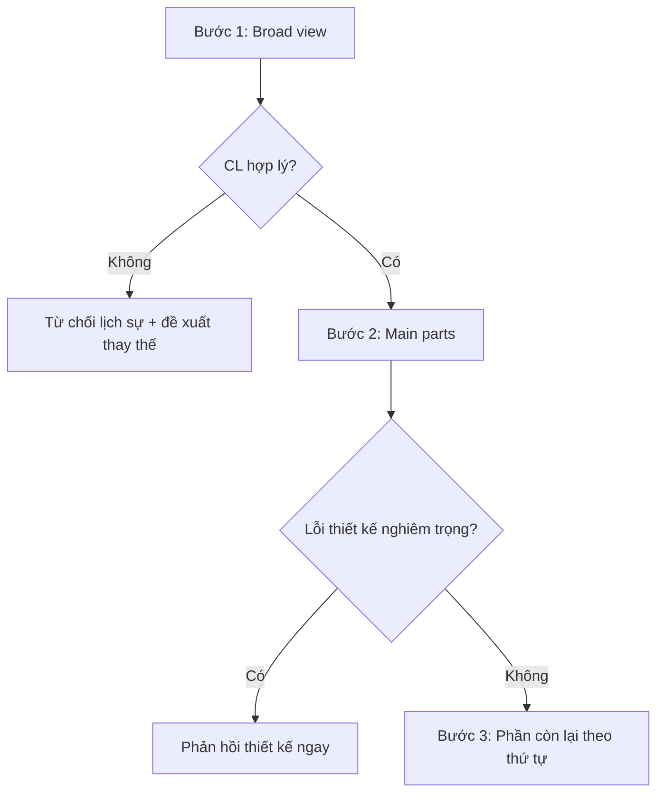

# 03 — Navigating a CL in Review

> Phase 2 flow. Áp dụng khi CL lớn, trải nhiều file.

## Quy trình 3 bước

## Bước 1 — Broad view
* Đọc CL description nắm bối cảnh.
* CL này có nên tồn tại? (Ví dụ: sửa feature sắp bị khai tử → từ chối).

## Bước 2 — Main parts
* Tìm file/cluster trung tâm chứa logic cốt lõi.
* Nếu có lỗi thiết kế lớn → **phản hồi ngay lập tức**, không đọc tiếp file
  phụ trợ vì sẽ phải xóa/viết lại nếu design bị bác.

## Bước 3 — Rest in sequence
* Đọc file còn lại theo thứ tự hợp lý. Có thể đọc test trước để hiểu expected
  output, sau đó mới duyệt source.
