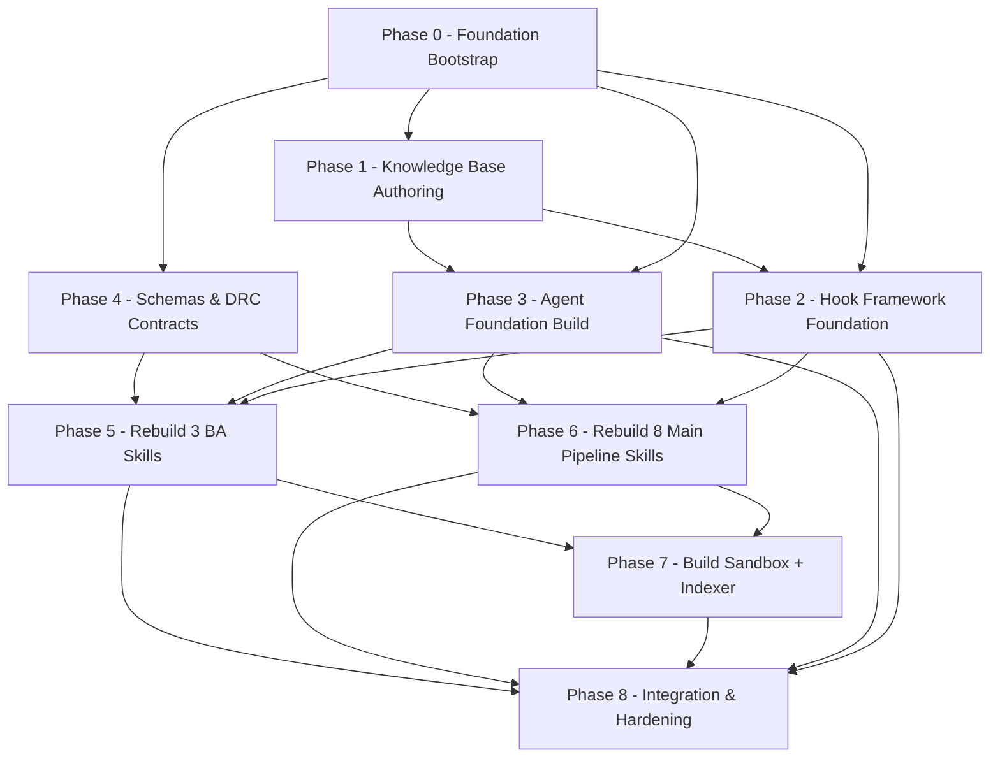

# Master Skill Suite Rebuild — Roadmap Index

> **Version:** 1.1 | **Date:** 2026-07-04 (updated per roadmap evaluation v1)
> **Scope:** Tái xuất bản toàn diện bộ Master Skill Suite theo `Temps/spec/architects/` (P0-P7) kết hợp skills + agents + hooks
> **Khởi điểm runtime:** Claude Code (`.claude/skills/` + `.claude/agents/` + `.claude/hooks/`)
> **Source spec:** Llm-Agent Workflow Design đã được phê bình trong architectural-critic report trước đó

> [!IMPORTANT]
> **Roadmap Evaluation v1 patches incorporated:**
> - Đề xuất 1: Phase 6 split → 6A (discovery cluster: Explorer, Miner, Architect, Gatekeeper) + 6B (execution cluster: Planner, Builder, Reviewer, Security-Reviewer) — verify checkpoint giữa
> - Đề xuất 2: Hysteresis re-eval cap = 1 (skill-explorer Phase 6) — tránh infinite loop Explorer↔Gatekeeper
> - Đề xuất 3: Docker Diagnostics — AC-8 added to Phase 0 (early env check, không phát hiện late tại Phase 7)
> - Đề xuất 4: Escalation depth = 2 → tạo `escalation_report.yaml` structured traceback (không chỉ stderr exit 2)
> - Đề xuất 2 (sub): Phase 8 A6 update — Pruning cứng → Summarization memory-preserving (5 raw + 15 summary lines)

> [!NOTE]
> **Pushback (không incorporate):**
> - Eval v1 đề xuất "toast/IDE notification cho user WARNING" — đây là IDE concern không phải roadmap design. WARNING log + index.md dashboard là đủ.
> - Eval v1 "Race Conditions hook parallel" — overstated; hooks serialized theo Claude Code's tool invocation model. Logged-only as note.

---

## Tóm tắt trạng thái hiện tại

| Thành phần | Đã deploy | Cần rebuild |
|:---|:---:|:---:|
| **Skills runtime** | 1 (`context-before-fix`) | 11 skills (8 main + 3 BA) |
| **Agents runtime** | 1 (`subagent-forge.md`) | ~4 production agents |
| **Hooks standalone** | 0 | ~6 hệ thống hook events (+ 1 post-external-validator added Phase 8) |
| **Knowledge docs** | 0 (knowleages/ trống) | 7 baseline + ~10 phase-specific |
| **Schemas/validators** | 0 | 14 schemas + 2 validator scripts |
| **raw/ver-3/ skill sources** | 0 (đã mất) | Tái tác giả toàn bộ |
| **Roadmap docs** | 0 (trống) | 9 files (index + 8 phase) |
| **Architectural defects đã phát hiện** | 10 chưa resolve | Phải đưa vào milestones (Phase 8 primary, integration per phase) |

---

## Dependency graph giữa 8 phases

**Path phê到现在**: 0 → 1 → 4 → 2 → 3 song song → 5/6 song song (BA trước vì pipelined DAG phụ thuộc BA) → 7 → 8

**Critical path**: Phase 0 → Phase 4 → Phase 6 → Phase 8 (~60% công sức trước Phase 8).

---

## Tổng quan 8 phases

| Phase | Tên | Mục đích chính | Phụ thuộc | Est. số files | Est. công sức |
|:---:|:---|:---|:---|:---:|:---:|
| **0** | [Foundation Bootstrap](00-foundation-bootstrap.md) | Dir structure, canonical schemas, deployment scaffold, fix broken paths | None | ~6 + 7 stubs | S |
| **1** | [Knowledge Base Authoring](01-knowledge-base-authoring.md) | Tác giả 7 baseline docs cho `.claude/knowledge/agents/` mà subagent-forge đang reference không tồn tại | P0 | 7 | M |
| **2** | [Hook Framework Foundation](02-hook-framework.md) | Build standalone dosta `.claude/hooks/` events + shell conventions + exit codes + registry | P0, P1 | ~6 | M |
| **3** | [Agent Foundation Build](03-agent-foundation.md) | Tác giả 4 agents: orchestrator, gatekeeper-aggregate, ba-pipeline-runner, prod-code-reviewer-agent | P0, P1, P2 | 4 | M-L |
| **4** | [Schemas & DRC Contracts](04-skill-pipeline-scaffold.md) | Shared schemas, validators, artifact-registry, Dynamic Routing Contract for 11 skills | P0 | ~10 schemas + 2 scripts | L |
| **5** | [BA Skills Rebuild](05-skill-build-ba-pipeline.md) | 3 skills: ba-elicitor → ba-analyst → ba-synthesizer (DAG upstream cho mọi skill pipeline) | P3, P4 | 3 × ~10 files | L |
| **6A** | [Main Skill Pipeline Rebuild — Discovery Cluster](06-skill-build-main-pipeline.md) | 4 skills: explorer, miner, architect, gatekeeper (Phase 6A sub-phase per eval v1 đề xuất 1) | P3, P4, P5 | 4 × ~12 files | L |
| **6B** | [Main Skill Pipeline Rebuild — Execution Cluster](06-skill-build-main-pipeline.md) | 4 skills: planner, builder, code-reviewer, security-reviewer (Phase 6B sub-phase) | P6A (verify checkpoint ≥80% quality-matrix) | 4 × ~12 files | L |
| **7** | [Sandbox + Indexer Build](07-skill-build-sandbox-indexer.md) | 2 skills: sandbox-tester (Docker/gVisor), indexer (llms.txt + README registration) | P5, P6A+B | 2 × ~8 files | M |
| **8** | [Integration & Hardening](08-integration-tests-hardening.md) | End-to-end integration tests, fix 10 architectural defects, resilience loops bounding, hysteresis at SCS 3.0 | P3-P7 | tests + 4 fix patches | L |

---

## Nguyên tắc áp dụng cho mọi phase

### Nguyên tắc 1 — Progressive Disclosure và Verification-First

Mỗi phase phải thực hiện theo chu trình: **plan → scaffold → author → verify → deploy → re-verify**. Không bao giờ build skill/agent/hook mà không có acceptance criteria được thoả thủ cơ học trước.

### Nguyên tắc 2 — Atomicity có Rollback

Sau mỗi milestone trong phase, tạo một git commit (atomic) để có thể rollback mà không phá hỏng các phase trước. Phase nào không pass verification criterion → rollback về commit trước đó, không tiếp tục.

### Nguyên tắc 3 — Suy yết song song được phép khi dependencies thoả

Nếu graph cho thấy 2 phases không có dependency, có thể chạy song song (e.g., Phase 1 và Phase 4 song song vì cùng phụ thuộc Phase 0). Xem bảng phụ thuộc phía trên.

### Nguyên tắc 4 — Skills + Agents + Hooks tích合 ngay tại thời điểm viết

Skill không được build riêng — mỗi skill build phải xác định:
- Skill triggered bởi agent nào? (`skills:` frontmatter)
- Skill output được валідate bởi hook nào? (`PostToolUse` matcher)
- Skill gọi ngrok tuần tự nào khác (DRC contract) trước khi kết thúc

### Nguyên tắc 5 — قابلНИЕ-mentioned từ architectural-critic report

Mỗi phase phải document trong header chỉ rõ những architectural defects (γ-1 đến γ-7) mà phase address để tránh re-lanç accidentally vào production.

---

## Verification dashboard (v1.1 — updated per eval v1)

| Phase | Acceptance gate | Status column |
|:---:|:---|:---:|
| 0 | `python3 .claude/scripts/validate_suite_integrity.py` trả về exit 0; 11 skill dirs exist; 7 knowledge stubs exist; AC-8 Docker check PASS hoặc PASS_WITH_WARNING (eval v1 đề xuất 3) | `done` |
| 1 | 7 knowledge docs ≥ 100 dòng, path resolution pass, frontmatter hợp lệ, không placeholder | `pending` |
| 2 | 6 hook files exist + executable; exit codes 0/2 tested cho mỗi hook | `pending` |
| 3 | 4 agents deploy; mỗi agent pass subagent-forge 4-evaluator ≥ APPROVED_FOR_REVIEW | `pending` |
| 4 | `schema_validator.py --all` pass; 14 schemas parse; DRC resolver pass; artifact-registry valid | `pending` |
| 5 | 3 BA skills deploy; ≥4 zones populate; pass aggregate-quality-gatekeeper ≥70% | `pending` |
| 6A | 4 discovery skills (explorer, miner, architect, gatekeeper) deploy; pass subagent-forge + aggregate-quality-gatekeeper | `pending` |
| 6B (checkpoint before) | `quality-matrix.yaml` từ 4 skills 6A PASS aggregate score ≥80% — gate to start 6B | `pending` |
| 6B | 4 execution skills (planner, builder, code-reviewer, security-reviewer) deploy; pass all 3 evaluators | `pending` |
| 7 | 2 skills deploy; Docker sandbox pass ≥2 test cases mỗi skill; llms.txt generate | `pending` |
| 8 | E2E test skill pipeline hoàn tất (1 skill mẫu); 10 architectural defects patched (A2 hysteresis cap=1, A4 escalation_report.yaml traceback, A6 summarization — eval v1 patches verified); không còn HIGH severity | `pending` |

---

## Out-of-scope (ƻ không thực hiện trong roadmap này)

- **External integration với Antigravity, Hermes, Codex, OMX/OMC** — roadmap فقط target Claude Code runtime
- **Performance benchmark suite** — chỉ verify correctness, không đo throughput
- **Tích hợp với OpenAI o-series / Anthropic haiku 4** — model selection giữ nguyên với subagent-forge defaults
- **Migration từ `knowleages` → `knowledge`** — siax rename TODO để hậu kỳ quyết định sau khi Phase 0 hoàn tất
- **Re-architecture major** (e.g., thay đổi SCS boundary, xóa Drift Detector) — chỉ patch + bound, không thiết kế lại

---

## Trạng thái roadmap này (this document)

> **State:** initial draft — sống trước khi Phase 0 bắt đầu.
> Để tuân theo cách giữ roadmap fresh, mỗi phase hoàn tất sẽ update "Status" trong dashboard từ `pending` → `in_progress` → `done` friday với timestamp.

Init by: Sisyphus (independent architecture critic planner)
Date: 2026-07-04